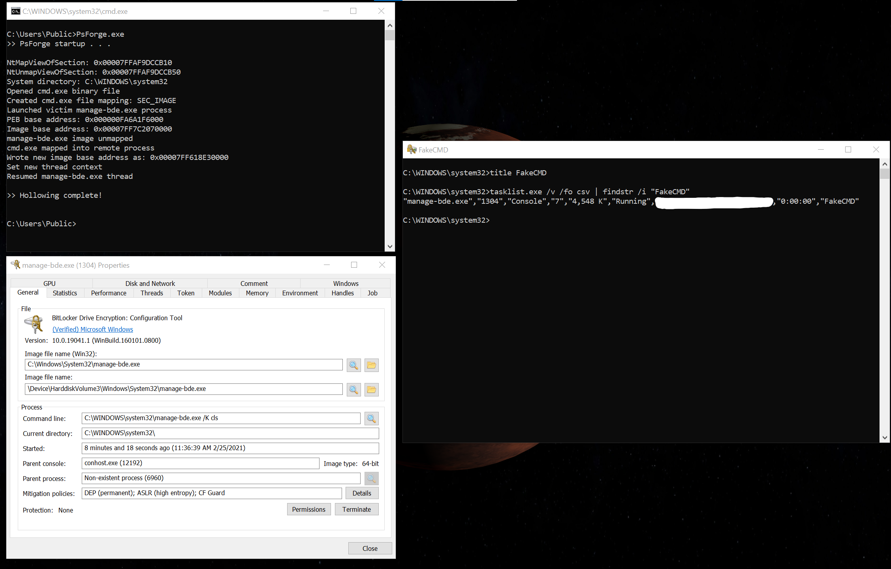

# PsForge — Process Hollowing demo
PsForge is a simple example of process hollowing, an attack used by various malware and other malicious software that attempts to hide itself and its activities on the system to make it less suspicious.

## What Process Hollowing is
Process hollowing, sometimes called RunPE, is a technique used by (usually) malicious software that allows a specific program to execute as if it was another program. As the screenshot above shows, `cmd.exe` is actually running from `manage-bde.exe`, which appears as a valid process, signed and verified by Microsoft.

Process hollowing works by mapping another executable into the address space of another process, and then executing the newly mapped image after removing the original image from the remote address space. This allows you to retain the various information and attributes from the remote process, while you're actually executing something completely different.

This is different from code injection into processes. Code injection is basically allocating memory and injecting shellcode into another process which is already running its appropriate executable, whereas process hollowing modifies the process and replaces its executable image before the process even starts execution; no shellcode is necessary.

## How it works
There are different ways to hollow a process. I followed these steps:
1. Create a section object for the new executable image (`CreateFileMappingW`)
2. Create victim process in its initial suspended state
3. Unmap the victim process's executable image section (it's not a DLL module yet, as no process initialization has occurred yet.)
4. Map new executable image section into the victim process
5. Update PEB `ImageBase` value
6. Update initial suspended thread's `RCX` register to the address of the new executable image's entry point.
7. Resume initial thread. The process initializes with the new executable image and executes its entry point.

## Detection
Detecting hollowed processes is relatively easy. All you need to do is compare the main module of the victim process to its module path. If they're almost the same, the process is not hollowed. If they are significantly different, the process is hollowed and the appropriate actions can be taken.

## Build instructions
- Clone repo
- Open `.sln` solution file in Visual Studio
- Build > Build Solution (Ctrl+Shift+B) as `x64|Release`

## Side notes
- Info about the initial thread's context
  - `RCX` contains the address of the entry point to be executed after initialization is complete
  - `RDX` contains the address of the PEB. I use this instead of querying for the PEB via `NtQueryInformationProcess`
- Info about using internal APIs
-- To map/unmap the file (section object) into remote processes, `MapViewOfFile/UnmapViewOfFile` can't be used as they perform the operation on the calling process
-- I'm using the internal `NtMapViewOfSection/NtUnmapViewOfSection` to overcome this limitation, as they let you specify a process `HANDLE` to perform the operation on
- I developed & tested this on Windows 10 build 19042. I know in previous versions of Windows, different registers were used to hold the information for the initial thread. This technically should work on other versions, but you'll need to update the code & its hardcoded values/offsets to match the version of Windows that you're targeting
