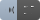
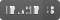
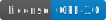
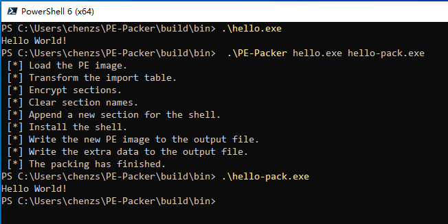
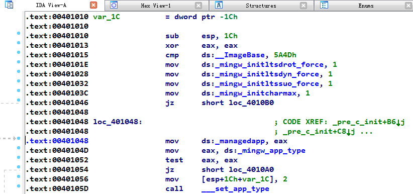
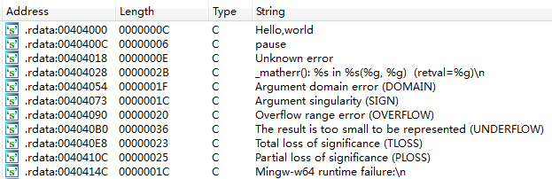
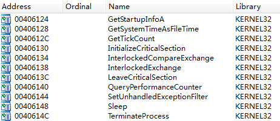
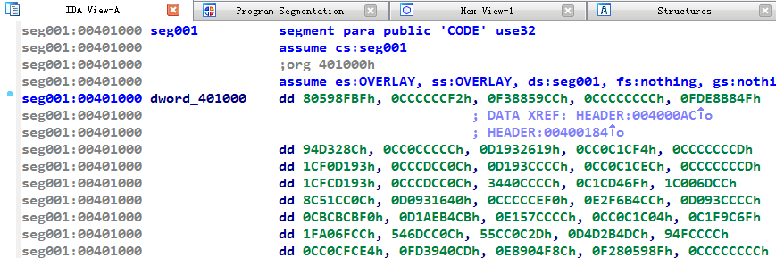
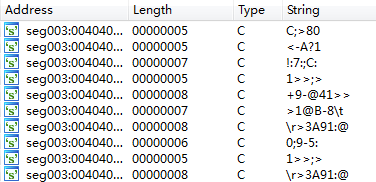
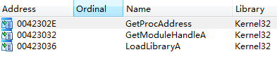

# PE-Packer



[](https://cmake.org)
[](https://www.microsoft.com/en-ie/windows)
[](https://www.gnu.org/licenses/gpl-3.0.html)
[](https://zenodo.org/badge/latestdoi/231357933)

## 翻译

- [English](https://github.com/czs108/PE-Packer/blob/master/README.md)
- [简体中文](https://github.com/czs108/PE-Packer/blob/master/README-CN.md)

## 简介



***PE-Packer***是一款针对**Windows PE**文件的简单加壳程序，加壳后的可执行文件可以对*逆向分析*过程造成干扰。

对PE文件加壳时，程序会进行如下工作：

- 转换导入表结构。
- 加密节区数据。
- 清除节区名称。
- 安装*解密模块*。

加壳后的文件启动时，*解密模块*会加载原始数据及代码：

- 解密节区数据。
- 初始化导入表。
- 重定位。

PE文件加壳前，使用一些反汇编工具可以自动分析其汇编代码及数据，例如[*IDA Pro*](https://www.hex-rays.com/products/ida)。

- 反汇编代码。

  

- 搜索常量字符串。

  

- 分析导入表。

  

加壳后，逆向分析过程会受到干扰。

- 反汇编代码。

  

- 搜索常量字符串。

  

- 分析导入表。

  

### 警告

> 该项目目前仅用于初学者学习*Windows PE格式*和*汇编语言*，其仍存在兼容性问题及其他Bug，尚不能用于实际生产环境。

## 开始

### 前置条件

该项目必须编译为**Windows 32位**版本，目前也只支持针对**32位**`.exe`文件的加壳处理。

- 安装[*MASM32*](http://www.masm32.com)。
- 安装[*MinGW-w64*](https://www.mingw-w64.org)，选择`i686`架构。
- 安装[*CMake*](https://cmake.org)。
- 配置这三个工具的`PATH`环境变量。

### 构建

```bash
mkdir -p build
cd build
cmake .. -D CMAKE_C_COMPILER=gcc -G "MinGW Makefiles"
cmake --build .
```

或直接执行`build.ps1`文件:

```console
PS> .\build.ps1
```

## 使用

对可执行文件加壳时，需要指定其*输入路径*和*输出路径*。

```console
PE-Packer <input-file> <output-file>
```

例如：

```console
PE-Packer hello.exe hello-pack.exe
```

## 文档

可以使用[*Doxygen*](http://www.doxygen.nl)生成项目文档。

为了避免扫描`.md`文件，必须将`*.md`添加至`EXCLUDE_PATTERNS`配置选项。

```
EXCLUDE_PATTERNS = *.md
```

该选项位于“***Expert***” -> “***Input***”界面。

## 参考

[*《加密与解密（第3版）》段钢*](https://book.douban.com/subject/3091212)

[*PE Format - Windows Dev Center*](https://docs.microsoft.com/en-us/windows/win32/debug/pe-format)

## 许可证

使用*GNU General Public*协议，请参考`LICENSE`文件。

## 引用

```tex
@software{chenzs108_2021_4698355,
  author       = {Chen Zhenshuo},
  title        = {czs108/PE-Packer: v1.0.0-beta},
  month        = apr,
  year         = 2021,
  publisher    = {Zenodo},
  version      = {v1.0.0-beta},
  doi          = {10.5281/zenodo.4698355},
  url          = {https://doi.org/10.5281/zenodo.4698355}
}
```

## 作者

***GitHub***：https://github.com/czs108

***E-Mail***：chenzs108@outlook.com

***微信***：chenzs108