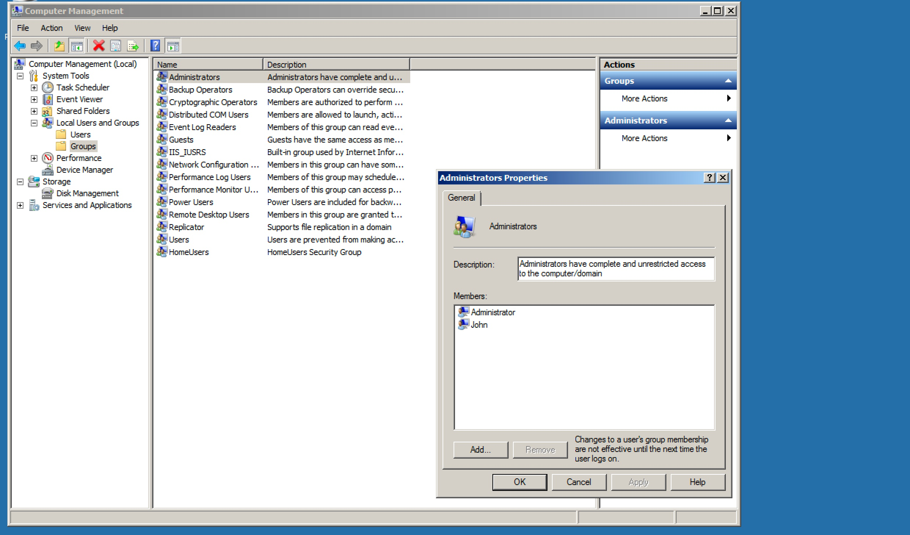

#### 21. Remoting Part 2

###### PowerShell Remoting

- Based on ```WSMAN``` Protocol and uses ```WinRM```
    - Needs port ```5985(HTTP)``` and ```5986(HTTPS)```
    - Alternate ports possible
- Using PowerShell Remoting
    - Trusted Domain (No special requirement)
    - WorkGroup ```(WSMan:\localhost\client\trustedhosts)```
- Running cmdlets which support Remoting
- Changes made for this to work
    - ```WSMan:\localhost\client\trustedhosts``` on local machine
    - User should be part of local ```administrators group``` on the remote machine
    

- ```Local Machine```

```PowerShell
PS C:\Users\Administrator> $env:COMPUTERNAME
WIN-2012-DC
PS C:\Users\Administrator> $env:USERDOMAIN
PFPT
PS C:\Users\Administrator> $env:USERNAME
Administrator
PS C:\Users\Administrator>
```

```PowerShell
PS C:\Users\Administrator> Set-Item WSMan:\localhost\Client\TrustedHosts -Value *

WinRM Security Configuration.
This command modifies the TrustedHosts list for the WinRM client. The computers in the TrustedHosts list might not be authenticated. The client might send credential information to these computers. Are
you sure that you want to modify this list?
[Y] Yes  [N] No  [S] Suspend  [?] Help (default is "Y"): Y
PS C:\Users\Administrator>
```

```PowerShell
PS C:\Users\Administrator> Get-Item WSMan:\localhost\Client\TrustedHosts

   WSManConfig: Microsoft.WSMan.Management\WSMan::localhost\Client

Type            Name                           SourceOfValue   Value
----            ----                           -------------   -----
System.String   TrustedHosts                                   *

PS C:\Users\Administrator>
```

- ```Remote Machine```

```PowerShell
PS C:\Windows\system32> $env:COMPUTERNAME
JOHN-PC
PS C:\Windows\system32> $env:USERDOMAIN
John-PC
PS C:\Windows\system32> $env:USERNAME
John
PS C:\Windows\system32>
```

```PowerShell
PS C:\Windows\system32> Set-Item WSMan:\localhost\Client\TrustedHosts -Value *

WinRM Security Configuration.
This command modifies the TrustedHosts list for the WinRM client. The computers in the TrustedHosts list might not be
authenticated. The client might send credential information to these computers. Are you sure that you want to modify
this list?
[Y] Yes  [N] No  [S] Suspend  [?] Help (default is "Y"): Y
PS C:\Windows\system32>
```

```PowerShell
PS C:\Windows\system32> Get-Item WSMan:\localhost\Client\TrustedHosts

   WSManConfig: Microsoft.WSMan.Management\WSMan::localhost\Client

Name                      Value                                                             Type
----                      -----                                                             ----
TrustedHosts              *                                                                 System.String

PS C:\Windows\system32>
```

- ```Invoke-Command``` Cmdlet

```PowerShell
PS C:\Users\Administrator> Get-Help Invoke-Command

NAME
    Invoke-Command

SYNOPSIS
    Runs commands on local and remote computers.


SYNTAX
    Invoke-Command [-ScriptBlock] <ScriptBlock> [-ArgumentList <Object[]>] [-InputObject <PSObject>] [-NoNewScope] [<CommonParameters>]

    Invoke-Command [[-ConnectionUri] <Uri[]>] [-ScriptBlock] <ScriptBlock> [-AllowRedirection] [-ArgumentList <Object[]>] [-AsJob] [-Authentication <AuthenticationMechanism>] [-CertificateThumbprint
    <String>] [-ConfigurationName <String>] [-Credential <PSCredential>] [-EnableNetworkAccess] [-HideComputerName] [-InDisconnectedSession] [-InputObject <PSObject>] [-JobName <String>]
    [-SessionOption <PSSessionOption>] [-ThrottleLimit <Int32>] [<CommonParameters>]

    Invoke-Command [[-ConnectionUri] <Uri[]>] [-FilePath] <String> [-AllowRedirection] [-ArgumentList <Object[]>] [-AsJob] [-Authentication <AuthenticationMechanism>] [-ConfigurationName <String>]
    [-Credential <PSCredential>] [-EnableNetworkAccess] [-HideComputerName] [-InDisconnectedSession] [-InputObject <PSObject>] [-JobName <String>] [-SessionOption <PSSessionOption>] [-ThrottleLimit
    <Int32>] [<CommonParameters>]

    Invoke-Command [[-ComputerName] <String[]>] [-FilePath] <String> [-ApplicationName <String>] [-ArgumentList <Object[]>] [-AsJob] [-Authentication <AuthenticationMechanism>] [-ConfigurationName
    <String>] [-Credential <PSCredential>] [-EnableNetworkAccess] [-HideComputerName] [-InDisconnectedSession] [-InputObject <PSObject>] [-JobName <String>] [-Port <Int32>] [-SessionName <String[]>]
    [-SessionOption <PSSessionOption>] [-ThrottleLimit <Int32>] [-UseSSL] [<CommonParameters>]

    Invoke-Command [[-ComputerName] <String[]>] [-ScriptBlock] <ScriptBlock> [-ApplicationName <String>] [-ArgumentList <Object[]>] [-AsJob] [-Authentication <AuthenticationMechanism>]
    [-CertificateThumbprint <String>] [-ConfigurationName <String>] [-Credential <PSCredential>] [-EnableNetworkAccess] [-HideComputerName] [-InDisconnectedSession] [-InputObject <PSObject>] [-JobName
    <String>] [-Port <Int32>] [-SessionName <String[]>] [-SessionOption <PSSessionOption>] [-ThrottleLimit <Int32>] [-UseSSL] [<CommonParameters>]

    Invoke-Command [[-Session] <PSSession[]>] [-FilePath] <String> [-ArgumentList <Object[]>] [-AsJob] [-HideComputerName] [-InputObject <PSObject>] [-JobName <String>] [-ThrottleLimit <Int32>]
    [<CommonParameters>]

    Invoke-Command [[-Session] <PSSession[]>] [-ScriptBlock] <ScriptBlock> [-ArgumentList <Object[]>] [-AsJob] [-HideComputerName] [-InputObject <PSObject>] [-JobName <String>] [-ThrottleLimit <Int32>]
    [<CommonParameters>]


DESCRIPTION
    The Invoke-Command cmdlet runs commands on a local or remote computer and returns all output from the commands, including errors. With a single Invoke-Command command, you can run commands on
    multiple computers.

    To run a single command on a remote computer, use the ComputerName parameter. To run a series of related commands that share data, use the New-PSSession cmdlet to create a PSSession (a persistent
    connection) on the remote computer, and then use the Session parameter of Invoke-Command to run the command in the PSSession. To run a command in a disconnected session, use the
    InDisconnectedSession parameter. To run a command in a background job, use the AsJob parameter.

    You can also use Invoke-Command on a local computer to evaluate or run a string in a script block as a command. Windows PowerShell converts the script block to a command and runs the command
    immediately in the current scope, instead of just echoing the string at the command line.

    To start an interactive session with a remote computer, use the Enter-PSSession cmdlet. To establish a persistent connection to a remote computer, use the New-PSSession cmdlet.

    Before using Invoke-Command to run commands on a remote computer, read about_Remote (http://go.microsoft.com/fwlink/?LinkID=135182).


RELATED LINKS
    Online Version: http://go.microsoft.com/fwlink/p/?linkid=289592
    Enter-PSSession
    Exit-PSSession
    Get-PSSession
    Invoke-Item
    New-PSSession
    Remove-PSSession
    WSMan Provider
    about_PSSessions
    about_Remote
    about_Remote_Disconnected_Sessions
    about_Remote_Variables
    about_Scopes

REMARKS
    To see the examples, type: "get-help Invoke-Command -examples".
    For more information, type: "get-help Invoke-Command -detailed".
    For technical information, type: "get-help Invoke-Command -full".
    For online help, type: "get-help Invoke-Command -online"


PS C:\Users\Administrator>
```

```PowerShell
PS C:\Users\Administrator> Get-Help Invoke-Command -ShowWindow
```


```PowerShell
PS C:\Users\Administrator> Invoke-Command -ScriptBlock {$env:COMPUTERNAME} -ComputerName JOHN-PC -Credential John-PC\John
JOHN-PC
PS C:\Users\Administrator>
```

```PowerShell
PS C:\Users\Administrator> Invoke-Command -ScriptBlock {Get-Process} -ComputerName JOHN-PC -Credential John-PC\John

Handles  NPM(K)    PM(K)      WS(K) VM(M)   CPU(s)     Id ProcessName                                                              PSComputerName
-------  ------    -----      ----- -----   ------     -- -----------                                                              --------------
     23       2     1756       2156    30     0.00   1288 cmd                                                                      JOHN-PC
     40       3      708       3240    42     0.04   1220 conhost                                                                  JOHN-PC
     39       3     1448       4024    43     0.05   2496 conhost                                                                  JOHN-PC
    402       5     1112       2504    33     0.09    352 csrss                                                                    JOHN-PC
    181       6     1092       3592    32     0.26    408 csrss                                                                    JOHN-PC
     79       3      852       3156    20     0.03   3256 dllhost                                                                  JOHN-PC
     66       3      892       3260    38     0.02    912 dwm                                                                      JOHN-PC
    664      21    17020      26036   166     0.79    696 explorer                                                                 JOHN-PC
      0       0        0         12     0               0 Idle                                                                     JOHN-PC
    728      12     2864       7396    32     0.59    492 lsass                                                                    JOHN-PC
    195       5     1604       3744    23     0.05    500 lsm                                                                      JOHN-PC
     56       3      804       4056    57     0.05   3160 notepad                                                                  JOHN-PC
    501      12    23192      35896   165     0.49   2476 powershell                                                               JOHN-PC
    134       5     6272       9764    63     0.12   2924 python                                                                   JOHN-PC
    609      15    16336      10160    83     0.31   1664 SearchIndexer                                                            JOHN-PC
    185       7     3788       5588    34     0.62    476 services                                                                 JOHN-PC
     29       1      216        572     4     0.06    272 smss                                                                     JOHN-PC
    282       9     4356       5960    58     0.02   1356 spoolsv                                                                  JOHN-PC
    347       7     2436       5236    34     0.26    624 svchost                                                                  JOHN-PC
    261       8     2104       4396    26     0.22    736 svchost                                                                  JOHN-PC
    546      13    14104      11804    77     0.31    788 svchost                                                                  JOHN-PC
    523      13    21164      26988    99     1.93    872 svchost                                                                  JOHN-PC
   1069      27    13456      22276   102     1.15    960 svchost                                                                  JOHN-PC
    472      17     5964       9996    55     0.32   1124 svchost                                                                  JOHN-PC
    683      25    11148      11708    79     0.29   1232 svchost                                                                  JOHN-PC
    305      24    10576       9060    48     0.45   1392 svchost                                                                  JOHN-PC
    349      15     4768       9200    66     0.14   1500 svchost                                                                  JOHN-PC
    372      36   147480      18128   213    10.30   1956 svchost                                                                  JOHN-PC
    347      13     7864       9624    64     0.35   2772 svchost                                                                  JOHN-PC
    548       0       44        548     2               4 System                                                                   JOHN-PC
    138       8     1972       4452    38     0.05   1292 taskhost                                                                 JOHN-PC
    115       5     1436       3420    44     0.07    684 VBoxService                                                              JOHN-PC
    138       5     1236       4392    61     0.03   2104 VBoxTray                                                                 JOHN-PC
     74       5      780       2748    32     0.23    400 wininit                                                                  JOHN-PC
    113       4     1492       3740    39     0.27    448 winlogon                                                                 JOHN-PC
    414      15     7332       4444   107     0.29    556 wmpnetwk                                                                 JOHN-PC
    210      10    27708      35636   139     1.03   2640 wsmprovhost                                                              JOHN-PC

PS C:\Users\Administrator>
```