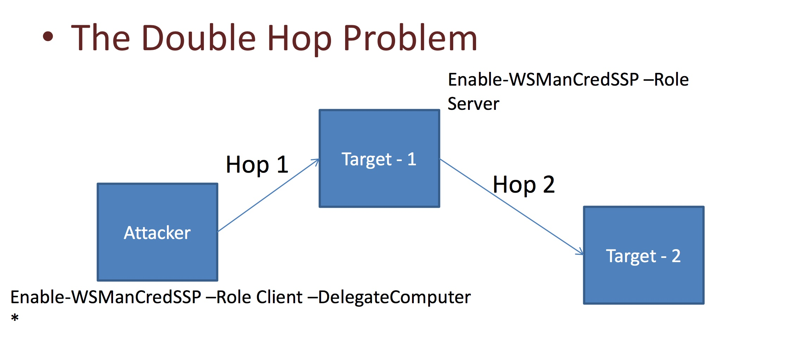

#### 25. Powershell Remoting Part 6

###### The Double Hop Problem



- ```Target 1``` - ```Windows Client``` - ```Part of a Domain```
- ```Target 2``` - ```Windows Server``` - ```Domain Controller```

- On ```Attacker```

```PowerShell
PS C:\Windows\system32> Enable-WSManCredSSP -Role Client -DelegateComputer *

CredSSP Authentication Configuration for WS-Management
CredSSP authentication allows the user credentials on this computer to be sent to a remote computer. If you use CredSSP
 authentication for a connection to a malicious or compromised computer, that computer will have access to your user
name and password. For more information, see the Enable-WSManCredSSP Help topic.
Do you want to enable CredSSP authentication?
[Y] Yes  [N] No  [S] Suspend  [?] Help (default is "Y"): Y

cfg         : http://schemas.microsoft.com/wbem/wsman/1/config/client/auth
lang        : en-US
Basic       : true
Digest      : true
Kerberos    : true
Negotiate   : true
Certificate : true
CredSSP     : true

PS C:\Windows\system32> 
```

```PowerShell
PS C:\Windows\system32> Get-WSManCredSSP
The machine is configured to allow delegating fresh credentials to the following target(s): wsman/*
This computer is not configured to receive credentials from a remote client computer.
PS C:\Windows\system32>
```

- ```Enter-PSSession``` from ```Attacker``` machine on ```Target 1```

```PowerShell
PS C:\Users\Windows7-64> Enter-PSSession -ComputerName JOHN-PC -Credential PFPT\Administrator
[john-pc]: PS C:\Users\Administrator\Documents> whoami
pfpt\administrator
[john-pc]: PS C:\Users\Administrator\Documents> Enable-WSManCredSSP -Role Server
[john-pc]: PS C:\Users\Administrator\Documents> Get-WSManCredSSP
[john-pc]: PS C:\Users\Administrator\Documents> exit
```

- ```Enter-PSSession``` from ```Attacker``` machine on ```Target 1``` using ```Authentication``` as ```CredSSP```

```PowerShell
PS C:\Users\Windows7-64> Enter-PSSession -ComputerName JOHN-PC -Credential PFPT\Administrator -Authentication CredSSP
```

- Access remote resources on the ```Domain Controller``` i.e. ```Target 2```

```PowerShell
PS C:\Users\Windows7-64> Enter-PSSession -ComputerName JOHN-PC -Credential PFPT\Administrator -Authentication CredSSP
[john-pc]: PS C:\Users\Administrator\Documents> ls \\pfpt\sysvol


    Directory: \\pfpt\sysvol


Mode                LastWriteTime     Length Name
----                -------------     ------ ----
d----          7/9/2017  12:59 PM            pfpt.com


PS C:\Users\Administrator>
```

###### ADIS Type Accelerators

- ADSI

```Active Directory Service Interfaces``` is a set of COM interfaces used to access the features of directory services from different network providers.

- Query the members of ```Domain Admin``` group

```
([ADSI]"LDAP://cn=Domain Admins,cn=Users,dc=<DOMAIN_NAME>,dc=Com").Member
```

```PowerShell
PS C:\Users\Administrator> ([ADSI]"LDAP://cn=Domain Admins,cn=Users,dc=pfpt,dc=Com").Member
CN=Administrator,CN=Users,DC=pfpt,DC=com
PS C:\Users\Administrator>
```

- Query the ```DC``` for a ```user``` to determine the ```groups``` he is a member of

```
([ADSI]"LDAP://cn=<USER>,cn=Users,dc=<DOMAIN_NAME>,dc=Com").MemberOf
```

```PowerShell
PS C:\Users\Administrator> ([ADSI]"LDAP://cn=Administrator,cn=Users,dc=pfpt,dc=Com").MemberOf
CN=Group Policy Creator Owners,CN=Users,DC=pfpt,DC=com
CN=Domain Admins,CN=Users,DC=pfpt,DC=com
CN=Enterprise Admins,CN=Users,DC=pfpt,DC=com
CN=Schema Admins,CN=Users,DC=pfpt,DC=com
CN=Administrators,CN=Builtin,DC=pfpt,DC=com
PS C:\Users\Administrator>
```