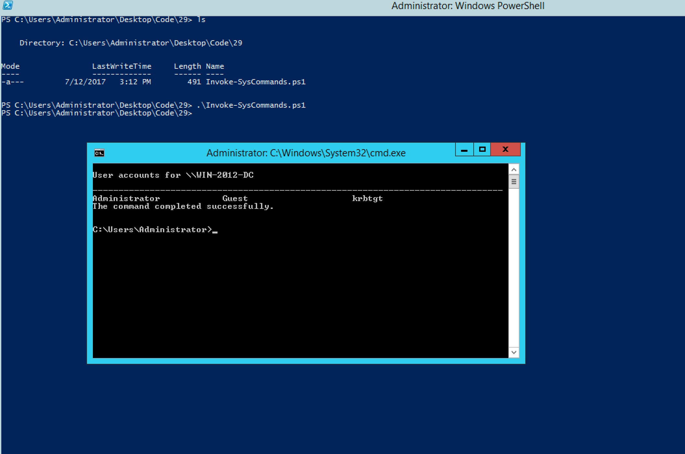

#### 29. Using .NET in Powershell Part 3


###### Add-Type

- Use ```Add-Type``` with ```-FromSource```
- ```New-Object```

```Invoke-SysCommands.ps1```

```PowerShell
$DotnetCode = @"
public class SysCommands
{

    public static void lookup(string domainname)
    {
        System.Diagnostics.Process.Start("nslookup.exe",domainname);
    }

    public void netcmd (string cmd)
    {
        string cmdstring = "/k net.exe " + cmd;
        System.Diagnostics.Process.Start("cmd.exe",cmdstring);
    }

}
"@

Add-Type -TypeDefinition $DotnetCode
#[SysCommands]::lookup("google.com")

$obj = New-Object SysCommands
$obj.netcmd("user")
```

