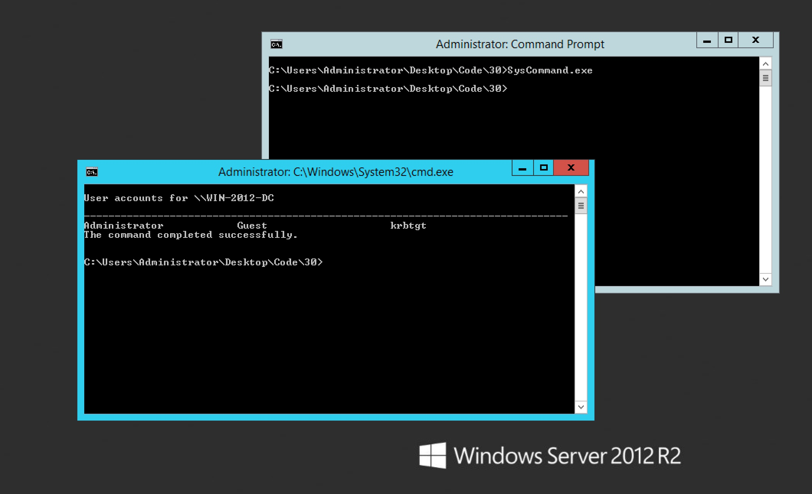

#### 30. Using .NET in Powershell Part 4

###### Add-Type

- Use ```Add-Type``` with ```-FromPath``` 

```Invoke-SysCommandsDLL.ps1```

```PowerShell
$DotnetCode = @"
public class SysCommands
{
    public static void lookup (string domainname)
    {
        System.Diagnostics.Process.Start("nslookup.exe",domainname);
    }

    public void netcmd (string cmd)
    {
        string cmdstring = "/k net.exe " + cmd;
        System.Diagnostics.Process.Start("cmd.exe",cmdstring);

    }

    public static void Main()
    {
        string cmdstring = "/k net.exe " + "user";
        System.Diagnostics.Process.Start("cmd.exe",cmdstring);
    }
}

"@

#Add-Type -TypeDefinition $DotnetCode -OutputType Library -OutputAssembly C:\Users\Administrator\Desktop\SysCommands.dll
Add-Type -TypeDefinition $DotnetCode -OutputType ConsoleApplication -OutputAssembly C:\Users\Administrator\Desktop\SysCommand.exe

<##[SysCommands]::lookup("google.com")

$obj = New-Object SysCommands
$obj.netcmd("user")#>
```

```PowerShell
$DotnetCode = @"
public class SysCommands
{
    public static void lookup (string domainname)
    {
        System.Diagnostics.Process.Start("nslookup.exe",domainname);
    }

    public void netcmd (string cmd)
    {
        string cmdstring = "/k net.exe " + cmd;
        System.Diagnostics.Process.Start("cmd.exe",cmdstring);

    }

    public static void Main()
    {
        string cmdstring = "/k net.exe " + "user";
        System.Diagnostics.Process.Start("cmd.exe",cmdstring);
    }
}

"@

Add-Type -TypeDefinition $DotnetCode -OutputType Library -OutputAssembly C:\Users\Administrator\Desktop\SysCommands.dll
#Add-Type -TypeDefinition $DotnetCode -OutputType ConsoleApplication -OutputAssembly C:\Users\Administrator\Desktop\SysCommand.exe

<##[SysCommands]::lookup("google.com")

$obj = New-Object SysCommands
$obj.netcmd("user")#>
```

- Compiling ```DLLs``` / ```ConsoleApps```

```PowerShell
PS C:\Users\Administrator\Desktop\Code\30> .\Invoke-SysCommandsDLL.ps1
```

```PowerShell
PS C:\Users\Administrator\Desktop> ls SysComm*


    Directory: C:\Users\Administrator\Desktop


Mode                LastWriteTime     Length Name
----                -------------     ------ ----
-a---         7/12/2017   3:28 PM       4096 SysCommand.exe
-a---         7/12/2017   3:27 PM       3584 SysCommands.dll


PS C:\Users\Administrator\Desktop>
```

- Using ```EXE```



- Using ```DLLs```

```PowerShell
PS C:\Users\Administrator\Desktop> $obj = Add-Type -Path .\SysCommands.dll -PassThru
```

```PowerShell
PS C:\Users\Administrator\Desktop> [SysCommands]::lookup("google.com")
```

```PowerShell
PS C:\Users\Administrator\Desktop> $obj | Get-Member

   TypeName: System.RuntimeType

Name                           MemberType Definition
----                           ---------- ----------
AsType                         Method     type AsType()
Clone                          Method     System.Object Clone(), System.Object ICloneable.Clone()
Equals                         Method     bool Equals(System.Object obj), bool Equals(type o), bool _MemberInfo.Equals(System.Object other), bool _Type.Equals(System.Object other), bool _Type.Equals(...
FindInterfaces                 Method     type[] FindInterfaces(System.Reflection.TypeFilter filter, System.Object filterCriteria), type[] _Type.FindInterfaces(System.Reflection.TypeFilter filter, Sy...
FindMembers                    Method     System.Reflection.MemberInfo[] FindMembers(System.Reflection.MemberTypes memberType, System.Reflection.BindingFlags bindingAttr, System.Reflection.MemberFilt...
GetArrayRank                   Method     int GetArrayRank(), int _Type.GetArrayRank()
GetConstructor                 Method     System.Reflection.ConstructorInfo GetConstructor(System.Reflection.BindingFlags bindingAttr, System.Reflection.Binder binder, System.Reflection.CallingConven...
GetConstructors                Method     System.Reflection.ConstructorInfo[] GetConstructors(System.Reflection.BindingFlags bindingAttr), System.Reflection.ConstructorInfo[] GetConstructors(), Syste...
GetCustomAttributes            Method     System.Object[] GetCustomAttributes(bool inherit), System.Object[] GetCustomAttributes(type attributeType, bool inherit), System.Object[] ICustomAttributePro...
GetCustomAttributesData        Method     System.Collections.Generic.IList[System.Reflection.CustomAttributeData] GetCustomAttributesData()
GetDeclaredEvent               Method     System.Reflection.EventInfo GetDeclaredEvent(string name)
GetDeclaredField               Method     System.Reflection.FieldInfo GetDeclaredField(string name)
GetDeclaredMethod              Method     System.Reflection.MethodInfo GetDeclaredMethod(string name)
GetDeclaredMethods             Method     System.Collections.Generic.IEnumerable[System.Reflection.MethodInfo] GetDeclaredMethods(string name)
GetDeclaredNestedType          Method     System.Reflection.TypeInfo GetDeclaredNestedType(string name)
GetDeclaredProperty            Method     System.Reflection.PropertyInfo GetDeclaredProperty(string name)
GetDefaultMembers              Method     System.Reflection.MemberInfo[] GetDefaultMembers(), System.Reflection.MemberInfo[] _Type.GetDefaultMembers()
GetElementType                 Method     type GetElementType(), type _Type.GetElementType()
GetEnumName                    Method     string GetEnumName(System.Object value)
GetEnumNames                   Method     string[] GetEnumNames()
GetEnumUnderlyingType          Method     type GetEnumUnderlyingType()
GetEnumValues                  Method     array GetEnumValues()
GetEvent                       Method     System.Reflection.EventInfo GetEvent(string name, System.Reflection.BindingFlags bindingAttr), System.Reflection.EventInfo GetEvent(string name), System.Refl...
GetEvents                      Method     System.Reflection.EventInfo[] GetEvents(System.Reflection.BindingFlags bindingAttr), System.Reflection.EventInfo[] GetEvents(), System.Reflection.EventInfo[]...
GetField                       Method     System.Reflection.FieldInfo GetField(string name, System.Reflection.BindingFlags bindingAttr), System.Reflection.FieldInfo GetField(string name), System.Refl...
GetFields                      Method     System.Reflection.FieldInfo[] GetFields(System.Reflection.BindingFlags bindingAttr), System.Reflection.FieldInfo[] GetFields(), System.Reflection.FieldInfo[]...
GetGenericArguments            Method     type[] GetGenericArguments()
GetGenericParameterConstraints Method     type[] GetGenericParameterConstraints()
GetGenericTypeDefinition       Method     type GetGenericTypeDefinition()
GetHashCode                    Method     int GetHashCode(), int _MemberInfo.GetHashCode(), int _Type.GetHashCode()
GetIDsOfNames                  Method     void _MemberInfo.GetIDsOfNames([ref] guid riid, System.IntPtr rgszNames, uint32 cNames, uint32 lcid, System.IntPtr rgDispId), void _Type.GetIDsOfNames([ref] ...
GetInterface                   Method     type GetInterface(string fullname, bool ignoreCase), type GetInterface(string name), type _Type.GetInterface(string name, bool ignoreCase), type _Type.GetInt...
GetInterfaceMap                Method     System.Reflection.InterfaceMapping GetInterfaceMap(type ifaceType), System.Reflection.InterfaceMapping _Type.GetInterfaceMap(type interfaceType)
GetInterfaces                  Method     type[] GetInterfaces(), type[] _Type.GetInterfaces()
GetMember                      Method     System.Reflection.MemberInfo[] GetMember(string name, System.Reflection.MemberTypes type, System.Reflection.BindingFlags bindingAttr), System.Reflection.Memb...
GetMembers                     Method     System.Reflection.MemberInfo[] GetMembers(System.Reflection.BindingFlags bindingAttr), System.Reflection.MemberInfo[] GetMembers(), System.Reflection.MemberI...
GetMethod                      Method     System.Reflection.MethodInfo GetMethod(string name, System.Reflection.BindingFlags bindingAttr, System.Reflection.Binder binder, System.Reflection.CallingCon...
GetMethods                     Method     System.Reflection.MethodInfo[] GetMethods(System.Reflection.BindingFlags bindingAttr), System.Reflection.MethodInfo[] GetMethods(), System.Reflection.MethodI...
GetNestedType                  Method     type GetNestedType(string fullname, System.Reflection.BindingFlags bindingAttr), type GetNestedType(string name), type _Type.GetNestedType(string name, Syste...
GetNestedTypes                 Method     type[] GetNestedTypes(System.Reflection.BindingFlags bindingAttr), type[] GetNestedTypes(), type[] _Type.GetNestedTypes(System.Reflection.BindingFlags bindin...
GetObjectData                  Method     void GetObjectData(System.Runtime.Serialization.SerializationInfo info, System.Runtime.Serialization.StreamingContext context), void ISerializable.GetObjectD...
GetProperties                  Method     System.Reflection.PropertyInfo[] GetProperties(System.Reflection.BindingFlags bindingAttr), System.Reflection.PropertyInfo[] GetProperties(), System.Reflecti...
GetProperty                    Method     System.Reflection.PropertyInfo GetProperty(string name, System.Reflection.BindingFlags bindingAttr, System.Reflection.Binder binder, type returnType, type[] ...
GetType                        Method     type GetType(), type _MemberInfo.GetType(), type _Type.GetType()
GetTypeInfo                    Method     void _MemberInfo.GetTypeInfo(uint32 iTInfo, uint32 lcid, System.IntPtr ppTInfo), void _Type.GetTypeInfo(uint32 iTInfo, uint32 lcid, System.IntPtr ppTInfo), S...
GetTypeInfoCount               Method     void _MemberInfo.GetTypeInfoCount([ref] uint32 pcTInfo), void _Type.GetTypeInfoCount([ref] uint32 pcTInfo)
Invoke                         Method     void _MemberInfo.Invoke(uint32 dispIdMember, [ref] guid riid, uint32 lcid, int16 wFlags, System.IntPtr pDispParams, System.IntPtr pVarResult, System.IntPtr p...
InvokeMember                   Method     System.Object InvokeMember(string name, System.Reflection.BindingFlags bindingFlags, System.Reflection.Binder binder, System.Object target, System.Object[] p...
IsAssignableFrom               Method     bool IsAssignableFrom(System.Reflection.TypeInfo typeInfo), bool IsAssignableFrom(type c), bool _Type.IsAssignableFrom(type c)
IsDefined                      Method     bool IsDefined(type attributeType, bool inherit), bool ICustomAttributeProvider.IsDefined(type attributeType, bool inherit), bool _MemberInfo.IsDefined(type ...
IsEnumDefined                  Method     bool IsEnumDefined(System.Object value)
IsEquivalentTo                 Method     bool IsEquivalentTo(type other)
IsInstanceOfType               Method     bool IsInstanceOfType(System.Object o), bool _Type.IsInstanceOfType(System.Object o)
IsSubclassOf                   Method     bool IsSubclassOf(type type), bool _Type.IsSubclassOf(type c)
MakeArrayType                  Method     type MakeArrayType(), type MakeArrayType(int rank)
MakeByRefType                  Method     type MakeByRefType()
MakeGenericType                Method     type MakeGenericType(Params type[] instantiation)
MakePointerType                Method     type MakePointerType()
ToString                       Method     string ToString(), string _MemberInfo.ToString(), string _Type.ToString()
Assembly                       Property   System.Reflection.Assembly Assembly {get;}
AssemblyQualifiedName          Property   string AssemblyQualifiedName {get;}
Attributes                     Property   System.Reflection.TypeAttributes Attributes {get;}
BaseType                       Property   type BaseType {get;}
ContainsGenericParameters      Property   bool ContainsGenericParameters {get;}
CustomAttributes               Property   System.Collections.Generic.IEnumerable[System.Reflection.CustomAttributeData] CustomAttributes {get;}
DeclaredConstructors           Property   System.Collections.Generic.IEnumerable[System.Reflection.ConstructorInfo] DeclaredConstructors {get;}
DeclaredEvents                 Property   System.Collections.Generic.IEnumerable[System.Reflection.EventInfo] DeclaredEvents {get;}
DeclaredFields                 Property   System.Collections.Generic.IEnumerable[System.Reflection.FieldInfo] DeclaredFields {get;}
DeclaredMembers                Property   System.Collections.Generic.IEnumerable[System.Reflection.MemberInfo] DeclaredMembers {get;}
DeclaredMethods                Property   System.Collections.Generic.IEnumerable[System.Reflection.MethodInfo] DeclaredMethods {get;}
DeclaredNestedTypes            Property   System.Collections.Generic.IEnumerable[System.Reflection.TypeInfo] DeclaredNestedTypes {get;}
DeclaredProperties             Property   System.Collections.Generic.IEnumerable[System.Reflection.PropertyInfo] DeclaredProperties {get;}
DeclaringMethod                Property   System.Reflection.MethodBase DeclaringMethod {get;}
DeclaringType                  Property   type DeclaringType {get;}
FullName                       Property   string FullName {get;}
GenericParameterAttributes     Property   System.Reflection.GenericParameterAttributes GenericParameterAttributes {get;}
GenericParameterPosition       Property   int GenericParameterPosition {get;}
GenericTypeArguments           Property   type[] GenericTypeArguments {get;}
GenericTypeParameters          Property   type[] GenericTypeParameters {get;}
GUID                           Property   guid GUID {get;}
HasElementType                 Property   bool HasElementType {get;}
ImplementedInterfaces          Property   System.Collections.Generic.IEnumerable[type] ImplementedInterfaces {get;}
IsAbstract                     Property   bool IsAbstract {get;}
IsAnsiClass                    Property   bool IsAnsiClass {get;}
IsArray                        Property   bool IsArray {get;}
IsAutoClass                    Property   bool IsAutoClass {get;}
IsAutoLayout                   Property   bool IsAutoLayout {get;}
IsByRef                        Property   bool IsByRef {get;}
IsClass                        Property   bool IsClass {get;}
IsCOMObject                    Property   bool IsCOMObject {get;}
IsConstructedGenericType       Property   bool IsConstructedGenericType {get;}
IsContextful                   Property   bool IsContextful {get;}
IsEnum                         Property   bool IsEnum {get;}
IsExplicitLayout               Property   bool IsExplicitLayout {get;}
IsGenericParameter             Property   bool IsGenericParameter {get;}
IsGenericType                  Property   bool IsGenericType {get;}
IsGenericTypeDefinition        Property   bool IsGenericTypeDefinition {get;}
IsImport                       Property   bool IsImport {get;}
IsInterface                    Property   bool IsInterface {get;}
IsLayoutSequential             Property   bool IsLayoutSequential {get;}
IsMarshalByRef                 Property   bool IsMarshalByRef {get;}
IsNested                       Property   bool IsNested {get;}
IsNestedAssembly               Property   bool IsNestedAssembly {get;}
IsNestedFamANDAssem            Property   bool IsNestedFamANDAssem {get;}
IsNestedFamily                 Property   bool IsNestedFamily {get;}
IsNestedFamORAssem             Property   bool IsNestedFamORAssem {get;}
IsNestedPrivate                Property   bool IsNestedPrivate {get;}
IsNestedPublic                 Property   bool IsNestedPublic {get;}
IsNotPublic                    Property   bool IsNotPublic {get;}
IsPointer                      Property   bool IsPointer {get;}
IsPrimitive                    Property   bool IsPrimitive {get;}
IsPublic                       Property   bool IsPublic {get;}
IsSealed                       Property   bool IsSealed {get;}
IsSecurityCritical             Property   bool IsSecurityCritical {get;}
IsSecuritySafeCritical         Property   bool IsSecuritySafeCritical {get;}
IsSecurityTransparent          Property   bool IsSecurityTransparent {get;}
IsSerializable                 Property   bool IsSerializable {get;}
IsSpecialName                  Property   bool IsSpecialName {get;}
IsUnicodeClass                 Property   bool IsUnicodeClass {get;}
IsValueType                    Property   bool IsValueType {get;}
IsVisible                      Property   bool IsVisible {get;}
MemberType                     Property   System.Reflection.MemberTypes MemberType {get;}
MetadataToken                  Property   int MetadataToken {get;}
Module                         Property   System.Reflection.Module Module {get;}
Name                           Property   string Name {get;}
Namespace                      Property   string Namespace {get;}
ReflectedType                  Property   type ReflectedType {get;}
StructLayoutAttribute          Property   System.Runtime.InteropServices.StructLayoutAttribute StructLayoutAttribute {get;}
TypeHandle                     Property   System.RuntimeTypeHandle TypeHandle {get;}
TypeInitializer                Property   System.Reflection.ConstructorInfo TypeInitializer {get;}
UnderlyingSystemType           Property   type UnderlyingSystemType {get;}

PS C:\Users\Administrator\Desktop>
```

```PowerShell
PS C:\Users\Administrator\Desktop> $obj | Get-Member -Static

   TypeName: SysCommands

Name            MemberType Definition
----            ---------- ----------
Equals          Method     static bool Equals(System.Object objA, System.Object objB)
lookup          Method     static void lookup(string domainname)
Main            Method     static void Main()
ReferenceEquals Method     static bool ReferenceEquals(System.Object objA, System.Object objB)

PS C:\Users\Administrator\Desktop>
```

```PowerShell
PS C:\Users\Administrator\Desktop> $obj.GetMethods() | Where-Object {$_.Name -eq "netcmd"}

Name                       : netcmd
DeclaringType              : SysCommands
ReflectedType              : SysCommands
MemberType                 : Method
MetadataToken              : 100663298
Module                     : SysCommands.dll
IsSecurityCritical         : True
IsSecuritySafeCritical     : False
IsSecurityTransparent      : False
MethodHandle               : System.RuntimeMethodHandle
Attributes                 : PrivateScope, Public, HideBySig
CallingConvention          : Standard, HasThis
ReturnType                 : System.Void
ReturnTypeCustomAttributes : Void
ReturnParameter            : Void
IsGenericMethod            : False
IsGenericMethodDefinition  : False
ContainsGenericParameters  : False
MethodImplementationFlags  : IL
IsPublic                   : True
IsPrivate                  : False
IsFamily                   : False
IsAssembly                 : False
IsFamilyAndAssembly        : False
IsFamilyOrAssembly         : False
IsStatic                   : False
IsFinal                    : False
IsVirtual                  : False
IsHideBySig                : True
IsAbstract                 : False
IsSpecialName              : False
IsConstructor              : False
CustomAttributes           : {}

PS C:\Users\Administrator\Desktop>
```
