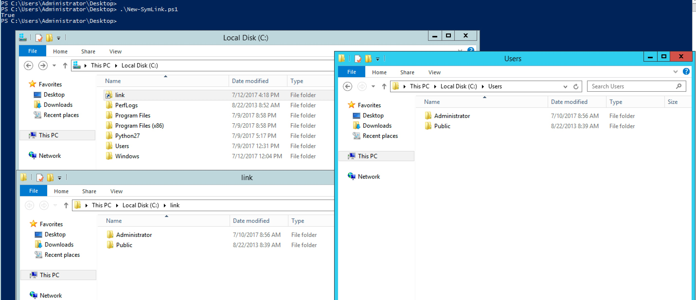

#### 31. Using .NET in Powershell Part 5

###### Add-Type

- Use ```Add-Type``` with ```-MemberDefinition```
- Making ```Windows API calls```
    - Get Signature (```pinvoke.net``` recommended)
    - Make the ```method declarations public```
    - Use the modified signature in ```Add-Type -MemberDefinition```

- [Creating a Symbolic Link using PowerShell](https://learn-powershell.net/2013/07/16/creating-a-symbolic-link-using-powershell/)
- [CreateSymbolicLink](http://pinvoke.net/default.aspx/kernel32/CreateSymbolicLink.html)

- ```New-SymLink.ps1```

```PowerShell
$ApiCode = @"

[DllImport("kernel32.dll")]
public static extern bool CreateSymbolicLink(string lpSymlinkFileName, string lpTargetFileName, int dwFlags);

"@

$SymLink = Add-Type -MemberDefinition $ApiCode -Name Symlink  -Namespace CreatSymLink -PassThru
$SymLink::CreateSymbolicLink('C:\test\link', 'C:\Users\', 1)
```

```PowerShell
PS C:\Users\Administrator\Desktop> .\New-SymLink.ps1
True
PS C:\Users\Administrator\Desktop>
```

