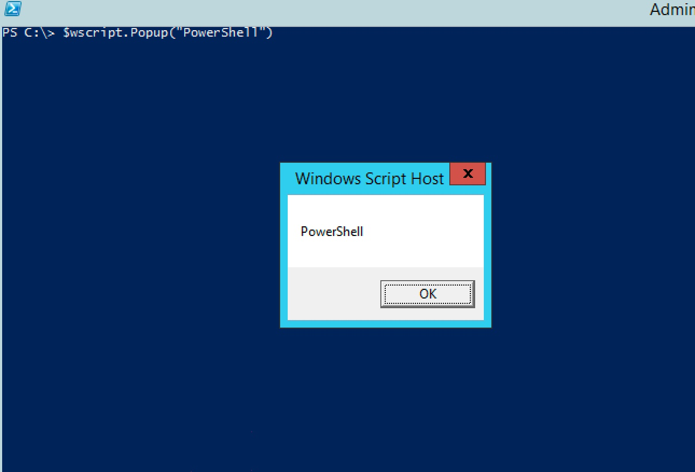
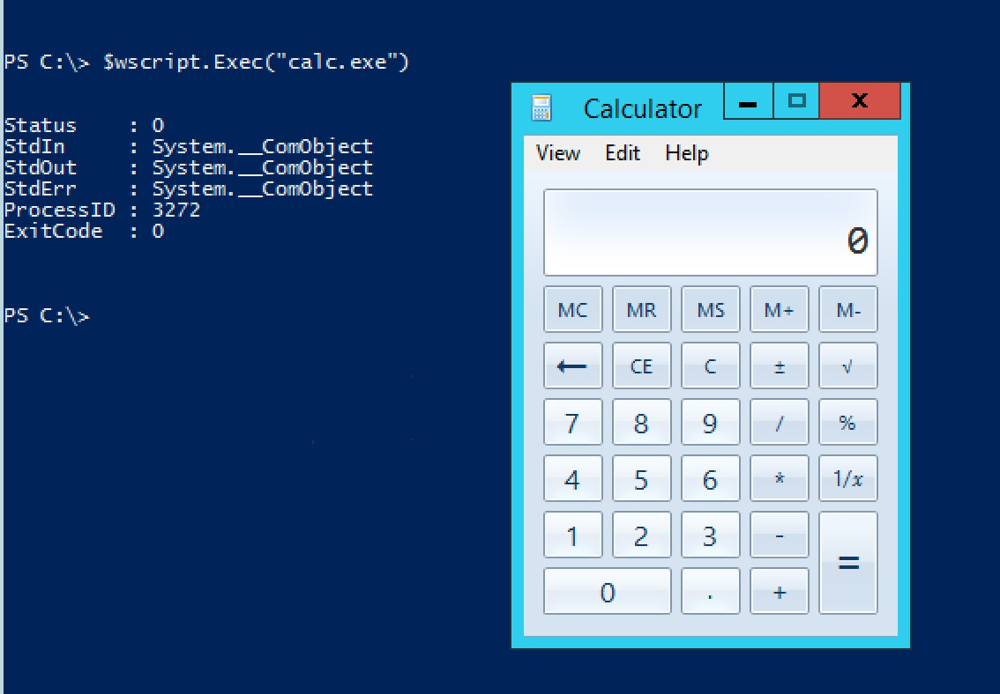
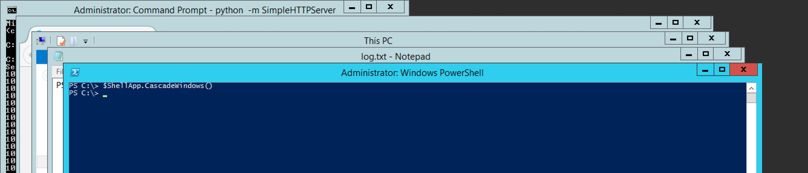
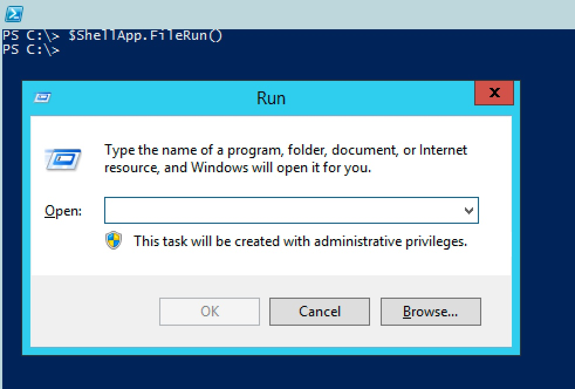
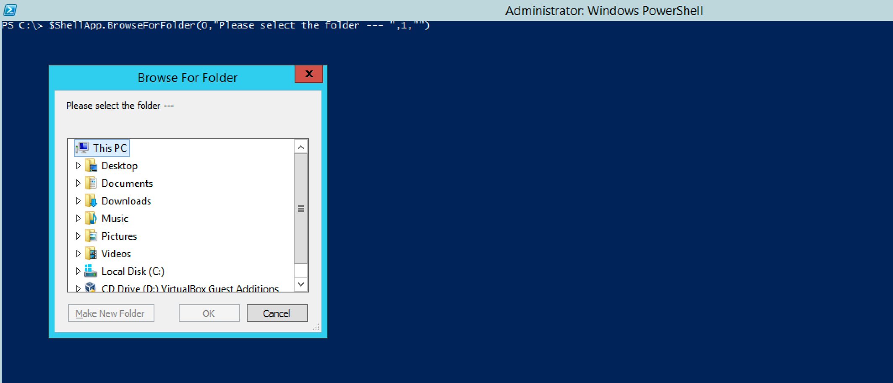
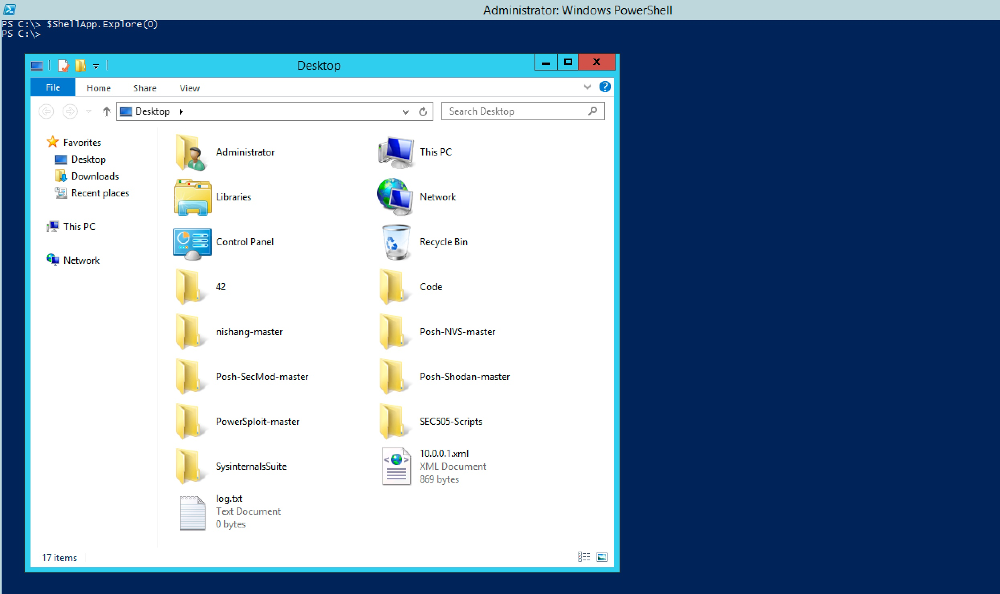
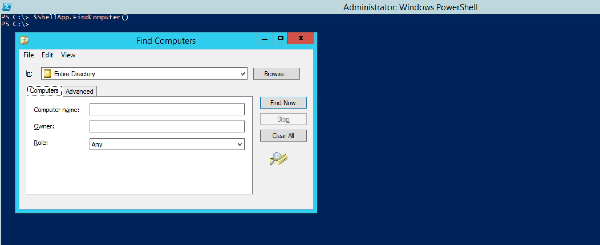

#### 35. COM and Powershell

###### Exploring COM objects

```COM Objects``` are ```interfaces``` to various ```Windows Applications```

- List all ```COM objects```

```PowerShell
PS C:\> Get-ChildItem REGISTRY::HKEY_CLASSES_ROOT\CLSID -Include PROGID -Recurse | foreach {$_.GetValue("")}
file
StaticMetafile
StaticDib
clsid
objref
ADODB.Command.6.0
ADODB.Parameter.6.0
ADODB.Connection.6.0
ADODB.Recordset.6.0
ADODB.Error.6.0
ADODB.ErrorLookup.6.0
ADODB.Record.6.0
ADODB.Stream.6.0
ADOX.Catalog.6.0
ADOX.Table.6.0
ADOX.Group.6.0
ADOX.User.6.0
ADOX.Column.6.0
ADOX.Index.6.0
ADOX.Key.6.0
lnkfile
InternetExplorer.Application.1
PBrush
IMsiServer
WindowsInstaller.Message
WindowsInstaller.Installer
IMEAPI.CImeProductObjectJK.15
System.Security.Cryptography.HMACSHA1
DXImageTransform.Microsoft.CrBlinds.1
MSIME.Japan.FEDict.15
IAS.PostEapRestrictions.1
CEIPLuaElevationHelper
Propshts.apmSheetEnvironment.1
CertificateAuthority.EncodeCRLDistInfo.1
System.Runtime.Remoting.Metadata.SoapMethodAttribute
System.Collections.SortedList
PLA.TraceDataProviderCollection.1
PLA.TraceDataProvider.1
PLA.TraceSession.1
PLA.DataCollectorSet.1
PLA.DataCollectorSetCollection.1
PLA.LegacyDataCollectorSet.1
PLA.LegacyDataCollectorSetCollection.1
PLA.LegacyTraceSession.1
PLA.LegacyTraceSessionCollection.1
PLA.TraceSessionCollection.1
PLA.ServerDataCollectorSet.1
PLA.ServerDataCollectorSetCollection.1
PLA.BootTraceSession.1
PLA.BootTraceSessionCollection.1
PLA.SystemDataCollectorSet.1
PLA.SystemDataCollectorSetCollection.1
CImeDictAPILocalWordComment.15
Propshts.apmPageEnvironment.1
ComPlusDebug.CorpubPublish.1
DXImageTransform.Microsoft.Iris.1
Propshts.apmPageFolderGenAdvanced.1
certocm.CertSrvUpgrade.1
Scriptlet.Context
Scriptlet.Constructor
Scriptlet.Factory
script
Scriptlet.HostEncode
Scriptlet.TypeLib
ScriptletHandler.Automation
ScriptletHandler.Event
ScriptletHandler.ASP
ScriptletHandler.Behavior
SAPI.SpLexicon.1
KSGenerator.KeystrokeGenerator.1
Wired.Snapin.1
System.Security.Policy.AllMembershipCondition
Msxml2.SAXXMLReader
PenIMC.PimcSurrogate.4
System.Runtime.InteropServices.COMException
Pathname
System.ObsoleteAttribute
Propshts.apmPagePerformEffects.1
tsuserex.interfaces.1
WScript.Network.1
MMCListPadInfo.MMCListPadInfo.1
Propshts.apmSheetExtension.1
System.Runtime.Remoting.Metadata.W3cXsd2001.SoapInteger
SppComApi.TokenActivation.1
CorSymBinder_SxS
CorSymReader_SxS
SKBMonitor.KeyStrokeMonitor.1
CorSymWriter_SxS
VSMGMT.VssSnapshotMgmt.1
FormHost.FormHost.1
GPOAdminCustom.SiteCtrl.1
StdFont
StdPicture
SSPWorkspace.1
DXImageTransform.Microsoft.AlphaImageLoader.1
SQLOLEDB.1
GPOAdminCustom.WMICollectionCtrl.1
HNetCfg.FwOpenPort
HTML.HostEncode
ASP.HostEncode
System.Reflection.TargetException
Scripting.FileSystemObject
System.Collections.Generic.KeyNotFoundException
SAPI.SpShortcut.1
polmkr.apmGpeApplications.1
GPOAdminCustom.GPOCollectionCtrl.1
Microsoft.JScript.JSAuthor
System.Runtime.Remoting.Metadata.W3cXsd2001.SoapNormalizedString
ERCLuaSupport.1
Schedule.Service.1
SAPI.SpTextSelectionInformation.1
SeVA.SeVAEngine.1
System.MemberAccessException
PeerDraw.PeerDraw.1
Propshts.apmPageRegionalDate.1
System.TypeLoadException
System.OperationCanceledException
System.Runtime.Remoting.Proxies.ProxyAttribute
GPOAdminCustom.GPOCtrl.1
X509Enrollment.CX509EndorsementKey.1
Microsoft.DirectSoundParamEqDMO.1
polmkr.apmGpeUserControl.1
SoftwareDistribution.VistaWebControl.1
SAPI.SpITNProcessor.1
X509Enrollment.CCertificateAttestationChallenge.1
Microsoft.Update.UpdateColl.1
Shell.Application.1
System.Collections.Hashtable
System.Globalization.NumberFormatInfo
System.Diagnostics.StackFrame
System.Runtime.Remoting.Metadata.W3cXsd2001.SoapNmtokens
Propshts.apmSheetStartVista.1
polmkr.apmGpeDataSources.1
DXImageTransform.Microsoft.RadialWipe.1
Propshts.apmSheetShortcut.1
DXImageTransform.Microsoft.Fade.1
DXImageTransform.Microsoft.BasicImage.1
JScript
WINMGMTS.1
SppComApi.SPPLUAObject.1
ImeCommonAPIClassFactory2052.15
Propshts.apmSheetPowerSchemes.1
polmkr.apmGpeCompControl.1
SeVA.SeVAResults.1
IMEAPI.CImeCommonAPI.15
UPnP.UPnPDeviceFinderEx.1
htmlfile
Catsrv.CatalogServer
System.Runtime.Serialization.OnDeserializedAttribute
GPOAdminCustom.TemplateCtrl.1
CertificateAuthority.EncodeStringArray.1
WorkspaceBroker.WorkspaceBroker.1
Propshts.apmPageFolderGen.1
System.Globalization.KoreanCalendar
polmkr.apmGpeDevices.1
System.Diagnostics.DebuggerStepperBoundaryAttribute
Propshts.apmPageDesktop.1
Propshts.apmPageRegional.1
IMEPad.SKF.TCIME.15
Propshts.apmPageCommon.1
Propshts.apmPageImdTaskSettings.1
CImeDictAPIDictionaryList.15
WindowsMail.MimeEdit.1
System.Runtime.Serialization.OptionalFieldAttribute
certocm.CertEnrollUpgrade.1
CertificateAuthority.EncodeAltName.1
System.Runtime.Hosting.ApplicationActivator
CompatContextMenu.CompatContextMenu.1
UPnP.DescriptionDocument.1
Propshts.apmPageStartClassic.1
DXTransform.Microsoft.DXLUTBuilder.1
CLRMetaData.CorMetaDataDispenserRuntime.2
System.Security.Cryptography.DSASignatureDeformatter
ScriptedDiag.Engine.1
System.Security.Cryptography.RijndaelManaged
dtsh.DetectionAndSharing.1
Microsoft.WINDOWS.SQLLITE.Engine.4.0
System.Security.Cryptography.HMACRIPEMD160
RowPosition.RowPosition.1
System.Runtime.InteropServices.PreserveSigAttribute
WinHttp.WinHttpRequest.5.1
ImeCommonAPI1042.15
TAPI.TAPI.1
System.Runtime.Remoting.ObjRef
MSDASC.MSDAINITIALIZE.1
DataLinks
MSDASCErrorLookup.1
System.Globalization.HebrewCalendar
ImeCommonAPIClassFactory1042.15
ADOMD.Catalog.6.0
ADOMD.Cellset.6.0
LDAP
LDAPNamespace
ADsNamespaces
DXImageTransform.Microsoft.ZigZag.1
System.Runtime.Remoting.RemotingException
System.Runtime.Remoting.Messaging.RemotingSurrogateSelector
WinNTNamespace
htmlfile
htmlfile_FullWindowEmbed
IMAPI2.MsftRawCDImageCreator.1
GPOAdminCustom.OUCtrl.1
ImeCommonAPIClassFactory1028.15
MSIME.Japan.SDDS.15
MS Remote.1
IMAPI2.MsftStreamInterleave.1
IMAPI2.MsftStreamConcatenate.1
IMAPI2.MsftStreamPrng001.1
IMAPI2.MsftStreamZero.1
IMAPI2.MsftDiscFormat2RawCD.1
IMAPI2.MsftDiscFormat2TrackAtOnce.1
IMAPI2.MsftDiscFormat2Data.1
IMAPI2.MsftDiscFormat2Erase.1
IMAPI2.MsftWriteEngine2.1
IMAPI2.MsftDiscRecorder2.1
IMAPI2.MsftDiscMaster2.1
NameTranslate
System.Runtime.Remoting.Metadata.W3cXsd2001.SoapIdrefs
Microsoft.Windows.Diagnosis.ManagedHost
COMSNAP.CPartitionPropPages.1
System.Threading.ThreadInterruptedException
System.IO.StringWriter
System.Reflection.AmbiguousMatchException
ListPad.ListPad.1
Propshts.apmSheetServerManagement.1
ReplProv1.RpcReplProv.1
Microsoft.XMLDOM.1.0
Microsoft.FreeThreadedXMLDOM.1.0
Msxml2.XSLTemplate
System.Diagnostics.DebuggerNonUserCodeAttribute
Propshts.apmSheetOfflineFiles.1
System.Security.Permissions.GacIdentityPermission
System.CannotUnloadAppDomainException
SymReader.dia
NCProv.NCProvider.1
MTxSpm.SharedPropertyGroupManager.1
bidispl.bidispl.1
EapMschapv2Cfg.EapMschapv2Cfg.1
System.Runtime.Remoting.Metadata.W3cXsd2001.SoapNonPositiveInteger
DXImageTransform.Microsoft.Convolution.1
System.Security.Cryptography.HMACSHA256
COMEXPS.CTrkEvntListener
HNetCfg.FwRule
GPOAdminCustom.DomainCollectionCtrl.1
IMAPI2FS.MsftFileSystemImage.1
IMAPI2FS.BootOptions.1
MMC.WaitDialog.1
Propshts.apmPageFolderGenAdvancedVista.1
System.Runtime.InteropServices.SafeArrayTypeMismatchException
Wireless.Snapin.1
System.Runtime.Remoting.Metadata.W3cXsd2001.SoapDate
MSExtLocality
Theme.Manager.1
DXImageTransform.Microsoft.RandomBars.1
polmkr.apmGpeDrives.1
GPOAdminCustom.PlanningCtrl.1
MsRDP.MsRDP.9
CertificateAuthority.EncodeDateArray.1
HNetCfg.FwMgr
IImgCtx
mhtmlfile
PeerFactory.PeerFactory.1
htafile
HtmlDlgHelper.HtmlDlgHelper.1
Trident.HTMLEditor.1
DownloadBehavior.DownloadBehavior.1
LayoutRect.LayoutRect.1
TemplatePrinter.TemplatePrinter.1
DeviceRect.DeviceRect.1
HtmlDlgSafeHelper.HtmlDlgSafeHelper.1
IMEFILES.CImeDictionaryFileCopier.15
svgfile
xhtmlfile
System.Runtime.Serialization.OnDeserializingAttribute
ImgUtil.CoMapMIMEToCLSID.1
Msxml2.SAXXMLReader.3.0
Microsoft.Update.InstallationAgent.1
System.Globalization.StringInfo
System.EnterpriseServices.Internal.ServerWebConfig
LayoutFolder
cttunesvr.CtTuner.1
Rdpvcomapi.RDPViewer.1
Scripting.Encoder
PrintConfig.PrinterExtensionManager
TDCCtl.TDCCtl.1
DNWithString
UPnP.UPnPDescriptionDocumentEx.1
browser_dll.ctlMsiComponentBrowser.2
MSDataShape.1
System.EnterpriseServices.Internal.SoapClientImport
System.ParamArrayAttribute
JScript9 Author
CImeCommentServerPlugInLocal.15
polmkr.apmGpeEnvironment.1
MsTscAx.MsTscAx.3
System.Collections.CaseInsensitiveComparer
Propshts.apmPageFileTransfer.1
WebEnrlServer.WebEnrlServer.1
System.EnterpriseServices.RegistrationConfig
GPMGMT.GPMAsyncCancel.1
CertificateAuthority.Config.1
Msxml2.XMLSchemaCache
System.Globalization.JapaneseCalendar
CertificateAuthority.Admin.1
Microsoft.ActiveDirectory.TRLParserInterop.RulesLanguageParserInterop
certocm.CertSrvSetupKeyInformation.1
Object.Microsoft.DXTFilter.1
Wired.About.1
System.Security.Policy.GacMembershipCondition
SAPI.SpObjectTokenEnum.1
HyperV.AppHealthMonitor
System.Security.Cryptography.MACTripleDES
DXImageTransform.Microsoft.MaskFilter.1
browser.apmBrowser.2
IMECheckDefaultInputProfile.Japan.15
Microsoft.WINDOWS.SQLLITE.OLEDB.4.0
components.apmPropertySheetObject.1
System.EnterpriseServices.Internal.ComManagedImportUtil
DFSRHelper.ServerHealthReport.1
polmkr.apmGpeFiles.1
System.ArgumentNullException
Sapi.SpSharedRecognizer.1
polmkr.apmGpeExplorer.1
NODEMGR.MMCProtocol.1
System.Text.UTF7Encoding
System.Runtime.Remoting.RemotingTimeoutException
MMCTask.MMCTask.1
System.Security.Cryptography.RIPEMD160Managed
Tsmmc.Compdata.1
Msxml2.MXXMLWriter.3.0
System.Security.Policy.ApplicationDirectoryMembershipCondition
OlePrn.AspHelp.1
System.Threading.ThreadStateException
Msxml2.SAXAttributes.3.0
System.AppDomainSetup
polmkr.apmGpeFolders.1
components.apmPropertyPageObject.1
Propshts.apmSheetPowerOptions.1
CCWU.ComCallWrapper.1
System.Reflection.AssemblyNameProxy
VBScript.RegExp
Propshts.apmPageTask.1
DXImageTransform.Microsoft.CrIris.1
ScwAuditExt.Audit.1
System.Security.Cryptography.SignatureDescription
System.EventArgs
System.ArgumentException
FX.Rowset.1
System.Security.Cryptography.RNGCryptoServiceProvider
System.Diagnostics.StackTrace
System.Diagnostics.SymbolStore.SymDocumentType
COMSNAP.COMNSView.1
System.Diagnostics.DebuggerHiddenAttribute
Internet.HHCtrl.1
Sapi.SpInprocRecognizer.1
Search.XmlContentFilter.1
ScwSceExt.SCE.1
DXImageTransform.Microsoft.Chroma.1
System.SystemException
Microsoft.GroupPolicy.Targeting.GPMTargetingEditor
DXImageTransform.Microsoft.CrRadialWipe.1
System.OverflowException
NODEMGR.NodeInitObject.1
device.1
Microsoft.JScript.DebugConvert
System.Runtime.Remoting.Metadata.W3cXsd2001.SoapIdref
OlePrn.DSPrintQueue.1
System.Version
System.Security.Cryptography.SHA256Managed
components.apmPropertySheetObjectVistaTasks.1
System.IO.IsolatedStorage.IsolatedStorageException
ATL.Registrar
Control.TaskSymbol.1
browser_dll.ctlDeviceBrowser.2
PTRegTerminal.Class
Propshts.apmSheetFileTransfer.1
SAPI.SpNullPhoneConverter.1
System.EnterpriseServices.Internal.AssemblyLocator
Propshts.apmPageTaskSchedule.1
System.Collections.Stack
polmkr.apmComponentData.1
Propshts.apmPageIniEdit.1
System.Runtime.CompilerServices.CallConvThiscall
System.Runtime.Remoting.Metadata.W3cXsd2001.SoapMonthDay
Vss.VSSShellExt.1
ITIR.WordWheelBuild.4
ITIR.Query.4
ITIR.ResultSet.4
ITIR.LocalWordWheel.4
ITIR.LocalDatabase.4
ITIR.LocalCatalog.4
ITIR.LocalGroup.4
ITIR.LocalGroupArray.4
ITIR.IndexSearch.4
ITIR.PropertyList.4
ITIR.StdWordBreaker.4
HHCtrl.SystemSort.666
ITIR.SystemSort.4
OldFont
MSIME.Japan.FELang.15
System.DllNotFoundException
SAPI.SpSharedRecoContext.1
ADs
System.Runtime.InteropServices.RegistrationServices
System.Security.Cryptography.HMACSHA512
System.Collections.CaseInsensitiveHashCodeProvider
polmkr.apmDataObject.1
WbemScripting.SWbemDateTime.1
xmlfile
AzRoles.AzPrincipalLocator.1
System.Runtime.Remoting.Channels.TransportHeaders
System.Threading.SynchronizationLockException
System.Runtime.Remoting.Metadata.W3cXsd2001.SoapDateTime
System.IO.FileNotFoundException
System.Runtime.CompilerServices.MethodImplAttribute
IAS.IASDataStoreComServer.1
MMC20.Application.1
Theme.ThemeThumbnail.1
browser_dll.apmUserUpdater.2
Propshts.apmPageVpnOptions.1
DXImageTransform.Microsoft.Spiral.1
MMC.SnapInFailureReporter.1
DXImageTransform.Microsoft.Matrix.1
Mts.MtsGrp
System.Runtime.CompilerServices.CompilerGlobalScopeAttribute
ERCLuaElevationHelper
System.Runtime.InteropServices.SafeArrayRankMismatchException
System.AccessViolationException
CertificateAuthority.ServerExit.1
ScwServiceExt.Service.1
System.Security.Cryptography.X509Certificates.X509Certificate
imkrhjd.hanjadic.15
FilePlaybackTerminal.FilePlaybackTerminal.1
Microsoft.Update.Session.1
DXImageTransform.Microsoft.Pixelate.1
System.Security.Cryptography.RSAOAEPKeyExchangeDeformatter
Msxml2.SAXAttributes
MSP.MSP.2
MSExtUser
CertificateAuthority.EncodeLongArray.1
EventSystem.EventSystem.1
System.Runtime.Remoting.Metadata.W3cXsd2001.SoapName
System.Random
Propshts.apmPagePowerAdvancedVista.1
MsTscAx.MsTscAx.6
MsRDP.MsRDP.5
MsRDP.MsRDP.4
WorkspaceRuntime.Workspace.1
System.Runtime.Serialization.ObjectIDGenerator
OlePrn.OleSNMP.1
ImePlugInDictDictionaryList1041.15
Propshts.apmPageMachineSelect.1
System.Runtime.Serialization.Formatters.Binary.BinaryFormatter
ImeLmTestApi1041.15
System.STAThreadAttribute
ADSystemInfo
Propshts.apmPageRegistryBrowser.1
Propshts.apmPageTaskActionsVista.1
Propshts.apmPageTaskConditionsVista.1
Propshts.apmPageTaskGeneralVista.1
Propshts.apmPageTaskSettingsVista.1
Propshts.apmPageTaskTriggersVista.1
Propshts.apmPageFolderOffFiles.1
browser_dll.ctlVPNBrowser.2
polmkr.apmGpeIniFile.1
IMAPI.MSDiscRecorderObj.1
IMAPI.MSDiscMasterObj.1
License.Manager.1
xmlfile
Internet.HHCtrl.1
System.Runtime.Remoting.InternalRemotingServices
polmkr.apmGpeCompRoot.1
MMCCtrl.MMCCtrl.1
Propshts.apmPageSecurity.1
ADsDSOObject
Propshts.apmPageStart.1
MDACVer.Version.6.0
MsRDP.MsRDP.4.a
MsTscAx.MsTscAx.8
Microsoft.XMLDSO.1.0
ShellNameSpace.ShellNameSpace.1
System.Runtime.Remoting.Contexts.SynchronizationAttribute
SMEF.SMEFRegistrar.1
System.Security.AllowPartiallyTrustedCallersAttribute
WSHController
Microsoft.WINDOWS.SQLLITE.Params.4.0
System.Runtime.Serialization.SerializationException
Propshts.apmPageSecurityAuditing.1
WbemScripting.SWbemObjectPath.1
RdpCoreTS.WRdsProtocolManager.1
System.MissingMethodException
System.IO.EndOfStreamException
FX.Rowset.1
System.Runtime.CompilerServices.IUnknownConstantAttribute
System.Diagnostics.SymbolStore.SymLanguageType
Propshts.apmSheetImdTask.1
CImeDictAPIBlockBinder.15
Search.SettingContentFilter.1
DXImageTransform.Microsoft.Wheel.1
System.Runtime.Remoting.Metadata.SoapFieldAttribute
polmkr.apmGpeUserRoot.1
Microsoft.Update.Downloader.1
GPOAdminCustom.SiteCollectionCtrl.1
Propshts.apmSheetDataSource.1
AzRoles.AzBizRuleContext.1
System.Runtime.Remoting.Channels.ServerChannelSinkStack
System.Globalization.JulianCalendar
HNetCfg.HNetShare.1
WMICntl.WMISnapin.1
WMISnapinAbout.1
polmkr.apmGpeInternet.1
System.IndexOutOfRangeException
TxCTx.TransactionContextEx
MSITFS1.0
System.Security.Cryptography.ToBase64Transform
MsRDP.MsRDP.8
System.EnterpriseServices.Internal.SoapUtility
SAPI.SpMemoryStream.1
SSR.SsrLog.1
ICOFilter.CoICOFilter.1
AccServerDocMgr.AccServerDocMgr.1
ImeBrokerClient1028.1
System.AppDomainUnloadedException
Windows.Contact.1
DXImageTransform.Microsoft.Gradient.1
System.Security.Policy.Evidence
IMESingleKanjiDict.15
System.Security.Cryptography.RC2CryptoServiceProvider
System.Runtime.InteropServices.ComRegisterFunctionAttribute
statemodel.StateController.1
DXImageTransform.Microsoft.Strips.1
GPOAdminCustom.TemplateCollectionCtrl.1
System.ArithmeticException
Behavior.Microsoft.DXTFilterBehavior.1
Shell.UIHelper.1
Microsoft.Update.WebProxy.1
JobObjLimitInfoProv.JobObjLimitInfoProv.1
OlePrn.OleCvt.1
AccDictionary.AccDictionary.1
WinNTSystemInfo
DFSRHelper.HealthReport.1
System.FlagsAttribute
System.Security.Cryptography.DSACryptoServiceProvider
System.ArrayTypeMismatchException
QAgent.CNapElevated
System.ApplicationException
System.Runtime.Remoting.Metadata.W3cXsd2001.SoapNonNegativeInteger
CertificateAuthority.PolicyManage.1
System.Collections.ArrayList
System.Globalization.GregorianCalendar
ActiveSockets.ActiveSocketsHandler.1
Propshts.apmSheetDialUp.1
WcsPlugInService.WcsPlugInService.1
Propshts.apmPageStartClassicVista.1
SSR.SsrActionData.1
ImgUtil.CoSniffStream.1
Microsoft.JScript.COMPropertyInfo
Propshts.apmPageGroups.1
FSLoaderParser2.DefinitionParser.1
MsRdpWebAccess.MsRdpClientShell.1
MsRDP.MsRDP.3.a
MSIME.Japan.15
MsTscAx.MsTscAx.5
IAS.MachineInventory.1
IAS.AuditChannel.1
IAS.NTEventLog.1
IAS.InfoBase.1
IAS.Request.1
IAS.DatabaseAccounting.1
IAS.Accounting.1
IAS.IasHelper.1
IAS.ADsDataStore.1
IAS.NetDataStore.1
IAS.URHandler.1
IAS.CClient.1
IAS.ExternalAuthNames.1
IAS.MachineNameMapper.1
IAS.MachineAccountValidation.1
IAS.EAPIdentity.1
IAS.EAPTerminator.1
IAS.MachineNTGroups.1
IAS.UserNTGroups.1
IAS.SHV.1
IAS.QuarantineEvaluator.1
IAS.PostQuarantineEvaluator.1
IAS.CRPBasedEAP.1
IAS.RadiusProtocol.1
IAS.NTSamAuthentication.1
IAS.MSChapErrorReporter.1
IAS.BaseCampHost.1
IAS.AuthorizationHost.1
IAS.RAPBasedEAP.1
IAS.ChangePassword.1
IAS.NTSamPerUser.1
IAS.NTSamNames.1
IAS.UserAccountValidation.1
IAS.RadiusProxy.1
IAS.Match.1
IAS.NTGroups.1
IAS.TimeOfDay.1
IAS.PolicyEnforcer.1
IAS.ProxyPolicyEnforcer.1
IAS.Realm.1
IAS.EAPTypes.1
IAS.AbsoluteTime.1
IMEAPI.CImeRequestSenderJK.15
System.EnterpriseServices.CompensatingResourceManager.ClerkMonitor
Propshts.apmPageNetwork.1
Propshts.apmSheetGroups.1
CertificateAuthority.EncodeBitString.1
CertificateAuthority.ExitManage.1
certocm.MscepUpgrade.1
MTSAdmin.Catalog.1
common_dll.apmSecurityExtension.1
System.Security.Cryptography.RSAPKCS1SignatureDeformatter
System.Runtime.Serialization.OnSerializedAttribute
IMEAPI.CImeKeyMapViewJK.15
SAPI.SpStreamFormatConverter.1
DiskManagement.UITasks
System.Globalization.DateTimeFormatInfo
SAPI.SpStream.1
Windows.ContactManager.1
MTxAS.AppServer.1
GPOAdmin.ScopeObject.1
Propshts.apmPageFolderOpenWith.1
System.Resources.MissingManifestResourceException
Propshts.apmSheetPerformance.1
WScript.Shell.1
Microsoft.Update.StringColl.1
PropertyEntry
DXImageTransform.Microsoft.Blur.1
MsRDP.MsRDP.6
SAPI.SpInProcRecoContext.1
WordPad.Document.1
registryBrowser.atlRegistryBrowser.1
System.Runtime.InteropServices.MarshalDirectiveException
CryptPKO.CryptPKO.1
CryptSig.CryptSig.1
IMEFILES.CImeFileNameRedirectionManager.15
System.ArgumentOutOfRangeException
System.UnauthorizedAccessException
EventSystem.EventSubscription
WbemScripting.SWbemSink.1
MsRDP.MsRDP.3
System.Runtime.Remoting.Metadata.W3cXsd2001.SoapYear
DXImageTransform.Microsoft.CrStretch.1
HomePage.HomePage.1
System.Globalization.TaiwanCalendar
WbemScripting.SWbemLocator.1
DXImageTransform.Microsoft.Inset.1
SAPI.SpPhraseBuilder.1
System.Runtime.Remoting.Metadata.W3cXsd2001.SoapToken
System.Runtime.InteropServices.RuntimeEnvironment
Propshts.apmSheetFolderOptionsVista.1
UPnP.DeviceHostICSSupport.1
Microsoft.DiskQuota.1
TxCTx.TransactionContext
polmkr.apmGpeGroups.1
Mmcshext.ExtractIcon.1
System.Security.SuppressUnmanagedCodeSecurityAttribute
System.Security.Cryptography.PKCS1MaskGenerationMethod
System.Runtime.Remoting.Metadata.W3cXsd2001.SoapPositiveInteger
System.Reflection.InvalidFilterCriteriaException
PropertyValue
System.Security.Cryptography.RSAPKCS1SignatureFormatter
ImePlugInDictDictionaryList2052.15
MSPersist.1
GPOAdmin.SnapinAbout.1
MsTscAx.MsTscAx.2
WSMan.InternalAutomation.1
System.Security.UnverifiableCodeAttribute
System.NotFiniteNumberException
Scripting.Signer
DNWithBinary
NODEMGR.ScopeTreeObject.1
System.InvalidCastException
System.NullReferenceException
System.Security.Cryptography.CryptographicException
System.Collections.Queue
JobObjectProv.JobObjectProv.1
System.Security.Cryptography.SHA384Managed
System.Threading.Overlapped
Propshts.apmSheetPowerOptionsVista.1
Trustmon.TrustPrv.1
InfoPath.Document.1
GPOAdminCustom.PlanningCollectionCtrl.1
MessageView.MessageView.1
DXImageTransform.Microsoft.CrSlide.1
BehaviorFactory.Microsoft.DXTFilterFactory.1
System.Object
Wireless.Extension.1
X509Enrollment.CX509CertificateTemplateADWritable.1
Propshts.apmSheetService.1
System.Runtime.CompilerServices.DiscardableAttribute
GPOAdminCustom.TroubleCollectionCtrl.1
System.Security.HostSecurityManager
System.Runtime.Remoting.Metadata.W3cXsd2001.SoapLanguage
JSFile.HostEncode
VBSFile.HostEncode
Propshts.apmPagePowerSecurity.1
MstsMhst.MstscMhst.1
SeVA.SeVARemote.1
Propshts.apmPageFileopTypes.1
IMEPad.IMJPCLST.15
Microsoft.DirectSoundWavesReverbDMO.1
System.IO.DirectoryNotFoundException
FSLoaderParser.DefinitionLoader.1
X509Enrollment.CObjectId.1
X509Enrollment.CObjectIds.1
X509Enrollment.CBinaryConverter.1
X509Enrollment.CX500DistinguishedName.1
X509Enrollment.CCspInformation.1
X509Enrollment.CCspInformations.1
X509Enrollment.CCspStatus.1
X509Enrollment.CX509PublicKey.1
X509Enrollment.CX509PrivateKey.1
X509Enrollment.CX509Extension.1
X509Enrollment.CX509Extensions.1
X509Enrollment.CX509ExtensionKeyUsage.1
X509Enrollment.CX509ExtensionEnhancedKeyUsage.1
X509Enrollment.CX509ExtensionTemplateName.1
X509Enrollment.CX509ExtensionTemplate.1
X509Enrollment.CAlternativeName.1
X509Enrollment.CAlternativeNames.1
X509Enrollment.CX509ExtensionAlternativeNames.1
X509Enrollment.CX509ExtensionBasicConstraints.1
X509Enrollment.CX509ExtensionSubjectKeyIdentifier.1
X509Enrollment.CX509ExtensionAuthorityKeyIdentifier.1
X509Enrollment.CSmimeCapability.1
X509Enrollment.CSmimeCapabilities.1
X509Enrollment.CX509ExtensionSmimeCapabilities.1
X509Enrollment.CPolicyQualifier.1
X509Enrollment.CPolicyQualifiers.1
X509Enrollment.CCertificatePolicy.1
X509Enrollment.CCertificatePolicies.1
X509Enrollment.CX509ExtensionCertificatePolicies.1
X509Enrollment.CX509ExtensionMSApplicationPolicies.1
X509Enrollment.CX509Attribute.1
X509Enrollment.CX509Attributes.1
X509Enrollment.CX509AttributeExtensions.1
X509Enrollment.CX509AttributeClientId.1
X509Enrollment.CX509AttributeRenewalCertificate.1
X509Enrollment.CX509AttributeArchiveKey.1
X509Enrollment.CX509AttributeArchiveKeyHash.1
X509Enrollment.CX509AttributeOSVersion.1
X509Enrollment.CX509AttributeCspProvider.1
X509Enrollment.CCryptAttribute.1
X509Enrollment.CCryptAttributes.1
X509Enrollment.CCertProperty.1
X509Enrollment.CCertProperties.1
X509Enrollment.CCertPropertyFriendlyName.1
X509Enrollment.CCertPropertyDescription.1
X509Enrollment.CCertPropertyAutoEnroll.1
X509Enrollment.CCertPropertyRequestOriginator.1
X509Enrollment.CCertPropertySHA1Hash.1
X509Enrollment.CCertPropertyKeyProvInfo.1
X509Enrollment.CCertPropertyArchived.1
X509Enrollment.CCertPropertyBackedUp.1
X509Enrollment.CCertPropertyEnrollment.1
X509Enrollment.CCertPropertyRenewal.1
X509Enrollment.CCertPropertyArchivedKeyHash.1
X509Enrollment.CSignerCertificate.1
X509Enrollment.CX509NameValuePair.1
X509Enrollment.CX509CertificateRequestPkcs10.1
X509Enrollment.CX509CertificateRequestCertificate.1
X509Enrollment.CX509CertificateRequestPkcs7.1
X509Enrollment.CX509CertificateRequestCmc.1
X509Enrollment.CX509Enrollment.1
X509Enrollment.CX509EnrollmentWebClassFactory.1
X509Enrollment.CCertPropertyEnrollmentPolicyServer.1
X509Enrollment.CX509EnrollmentHelper.1
X509Enrollment.CX509MachineEnrollmentFactory.1
X509Enrollment.CX509CertificateRevocationListEntry.1
X509Enrollment.CX509CertificateRevocationListEntries.1
X509Enrollment.CX509CertificateRevocationList.1
X509Enrollment.CX509SCEPEnrollment.1
Shell.Explorer.2
ImeCommonAPI1041.15
System.Runtime.Serialization.SurrogateSelector
Msxml2.DOMDocument.6.0
Msxml2.FreeThreadedDOMDocument.6.0
Msxml2.XMLSchemaCache.6.0
Msxml2.XSLTemplate.6.0
Msxml2.XMLHTTP.6.0
Msxml2.ServerXMLHTTP.6.0
Msxml2.SAXXMLReader.6.0
Msxml2.SAXAttributes.6.0
Msxml2.MXXMLWriter.6.0
Msxml2.MXHTMLWriter.6.0
Msxml2.MXNamespaceManager.6.0
FDE.1
System.EnterpriseServices.RegistrationHelper
System.SerializableAttribute
System.Security.Policy.PolicyException
IMAPI.MSEnumDiscRecordersObj.1
IEPH.RSSHandler
System.Runtime.InteropServices.ComConversionLossAttribute
Workspace.Installer.1
SppComApi.OfflineActivation.1
Propshts.apmPageTaskSettings.1
WinNT
Propshts.apmPageRegionalNumbers.1
MsTscAx.MsTscAx.10
System.Runtime.Remoting.Metadata.W3cXsd2001.SoapHexBinary
Propshts.apmPageTaskbar.1
IAS.ExtensionHost.1
System.Text.UTF8Encoding
browser_dll.ctlDSNDriverBrowser.2
ReplicateCatalog.ReplicateCatalog.1
browser_dll.ctlDSNBrowser.2
System.MissingFieldException
Propshts.apmPageSecuritySettings.1
SAPI.SpCustomStream.1
browser_dll.ctlPortPrinterSettings.1
RegisterControl.Register.1
DiskManagement.SnapInExtension
Propshts.apmSheetDesktop.1
Kbproc.SCWRegistrar.1
System.Runtime.InteropServices.ComUnregisterFunctionAttribute
System.Security.Cryptography.DSASignatureFormatter
ITIR.EngStemmer.4
SplSetup.CFindNetPrinters.1
System.Runtime.Remoting.Lifetime.LifetimeServices
GPMGMT.Forest.1
Propshts.apmPageVpnSecurity.1
MsRDP.MsRDP.2
SAPI.SpCompressedLexicon.1
MSIME.Japan.SuggestionFramework.15
CLRMetaData.CLRRuntimeHost.1
CLRMetaData.CLRRuntimeHost.2
System.InvalidProgramException
System.Threading.ReaderWriterLock
SAPI.SpPhoneConverter.1
FunctionDiscovery.UMBusDriver.1
SppComApi.ElevationConfig.1
X509Enrollment.CX509EnrollmentPolicyActiveDirectory.1
X509Enrollment.CX509EnrollmentPolicyWebService.1
X509Enrollment.CX509PolicyServerListManager.1
X509Enrollment.CX509PolicyServerUrl.1
System.Diagnostics.Debugger
Propshts.apmPageSecurityCommon.1
SearchIntegrationExe.CImeSearchIntegration.15
OlePrn.PrinterURL.1
RowsetHelper
System.Security.Cryptography.RSAPKCS1KeyExchangeFormatter
LargeInteger
ComplianceExtensions.SceComplianceExt.1
STClient.STClient.1
System.MethodAccessException
COMSNAP.CPartitionSetPropPages.1
DXImageTransform.Microsoft.CrInset.1
System.Reflection.ObfuscationAttribute
System.Diagnostics.DebuggerStepThroughAttribute
Microsoft.WINDOWS.SQLLITE.Errors.4.0
SAPI.SpFileStream.1
polmkr.apmGpeNetwork.1
Propshts.apmSheetViewOptions.1
MSExtGroup
Propshts.apmSheetRegional.1
DFSRHelper.PropagationReport.1
System.InvalidOperationException
ImeKeyEventHandler1042.15
certocm.CertSrvSetup.1
System.FormatException
System.ContextStaticAttribute
SAPI.SpResourceManager.1
SAPI.SpVoice.1
System.Runtime.InteropServices.InAttribute
GPOAdminCustom.ForestCollectionCtrl.1
MsRDP.MsRDP.2.a
polmkr.apmSnapinAbout.1
Krnlprov.KernelTraceProvider.1
XML
Propshts.apmPageRegProp.1
Application.Manifest
CertificateAuthority.Request.1
Propshts.apmSheetNetwork.1
certocm.CertificateEnrollmentServerSetup.1
Propshts.apmSheetImdTaskVista.1
IImeIPointSrv1041.15
System.Runtime.Remoting.Metadata.W3cXsd2001.SoapEntities
DXImageTransform.Microsoft.Compositor.1
DXImageTransform.Microsoft.Blinds.1
System.Runtime.InteropServices.InvalidOleVariantTypeException
certocm.PolicyEnrollUpgrade.1
polmkr.apmGpePower.1
WbemScripting.SWbemNamedValueSet.1
Rdpcomapi.RDPSession.1
System.Runtime.Remoting.Metadata.SoapAttribute
Shell.FolderView.1
Propshts.apmPageShortcut.1
System.Runtime.Serialization.OnSerializingAttribute
System.StackOverflowException
System.Runtime.Remoting.Metadata.SoapTypeAttribute
RoamingSecurity.RoamingSecurity.1
MSITFS1.0
MSITFS1.0
System.Runtime.InteropServices.SetWin32ContextInIDispatchAttribute
HNetCfg.FwProduct
System.MulticastNotSupportedException
Previous.Versions
System.Text.ASCIIEncoding
System.EnterpriseServices.RegistrationHelperTx
SCW.FeedbackObj.1
System.Security.Cryptography.CryptoConfig
SAPI.SpAudioFormat.1
MSExtPrintQueue
IMEAPI.CImeCommandAvailabilityViewJK.15
DXImageTransform.Microsoft.Glow.1
COMSNAP.CPartitionNotify.1
Propshts.apmSheetDrive.1
System.Security.Cryptography.RSAOAEPKeyExchangeFormatter
System.Text.UnicodeEncoding
Scwfirewallext.FirewallLogic.1
CertificateAuthority.View.1
System.IO.IOException
SDSnapinAbout.1
DXImageTransform.Microsoft.ICMFilter.1
System.Exception
browser_dll.ctlMsiPatchBrowser.2
smef.SMEFRuleLog.1
Wired.Extension.1
GPOAdminCustom.ForestCtrl.1
apmFilter.apmFilter.1
Propshts.apmPageServiceRecovery.1
UPnP.UPnPDevice.1
System.PlatformNotSupportedException
System.Runtime.Remoting.Contexts.Context
ImeKeyEventHandler1041.15
GPOAdminCustom.TroubleCtrl.1
System.Runtime.CompilerServices.CallConvCdecl
MsTscAx.MsTscAx.9
PNGFilter.CoPNGFilter.1
CImeDictAPIWebServiceComment.15
MsTscAx.MsTscAx.1
SppComApi.OnlineActivation.1
VaultRoaming.VaultSettingsHandler.1
Propshts.apmSheetFolderOptions.1
System.Security.Policy.ApplicationTrust
Propshts.apmSheetFileTypes.1
ImeBrokerClient2052.1
DxDiag.DxDiagProvider.1
System.Security.Cryptography.SHA512Managed
PrintSys.CoPrintIsolationHost.1
Propshts.apmPagePowerScheme.1
System.Runtime.Remoting.Metadata.W3cXsd2001.SoapYearMonth
System.Runtime.InteropServices.InvalidComObjectException
System.Security.Cryptography.HMACMD5
Object.Microsoft.DXTFilterCollection.1
ImgUtil.CoDitherToRGB8.1
Udtool.UserDicManager.15
polmkr.apmGpePrinters.1
SAPI.SpMMAudioOut.1
System.Runtime.Serialization.Formatters.SoapFault
WMINet_Utils.WmiSecurityHelper.1
System.IO.DriveNotFoundException
SAPI.SpObjectTokenCategory.1
MsRDP.MsRDP.7
CertificateAuthority.ServerPolicy.1
SppComApi.LicensingStateTools.1
certocm.MSCEPSetup.1
SymBinder
System.DataMisalignedException
Propshts.apmPageDialUp.1
SAPI.SpMMAudioEnum.1
JobObjSecLimitInfoProv.JobObjSecLimitInfoProv.1
System.EnterpriseServices.CompensatingResourceManager.Compensator
COMSNAP.CPartitionContextMenu.1
EventSystem.EventPublisher.1
RequestMakeCall.RequestMakeCall.1
MSIME.Japan.LMDS.15
DXImageTransform.Microsoft.CrSpiral.1
MsTscAx.MsTscAx.4
System.EntryPointNotFoundException
System.Security.Permissions.HostProtectionAttribute
HHCtrl.FileFinder.1
Internet.HHCtrl.1
Windows.Xbap
DXImageTransform.Microsoft.Alpha.1
DXImageTransform.Microsoft.DropShadow.1
DXImageTransform.Microsoft.Wave.1
NODEMGR.AppEventsDHTMLConnector.1
HNetCfg.NATUPnP.1
ScriptBridge.ScriptBridge.1
System.Security.Cryptography.HMACSHA384
DiskManagement.Control
TerminalManager.Class
DXImageTransform.Microsoft.Wipe.1
UPnP.SOAPRequest.1
System.Security.Cryptography.CspParameters
System.IO.FileLoadException
IMEAPI.CImePropertyJK.15
System.Security.Policy.TrustManagerContext
Msxml2.ServerXMLHTTP.3.0
Msxml2.ServerXMLHTTP
System.Runtime.InteropServices.ExternalException
certocm.CertificateEnrollmentPolicyServerSetup.1
System.Data.SqlClient.SQLDebugging
Propshts.apmSheetFileFolder.1
MMC.IconControl.1
Propshts.apmSheetTasks.1
System.EnterpriseServices.Internal.ComSoapPublishError
fRecordingTerminal.FileRecordingTerminal.1
SAPI.SpGrammarCompiler.1
Microsoft.GroupPolicy.AdmTmplEditor.GPMAdmTmplEditorManager
SSR.SsrEngine.1
AzRoles.AzAuthorizationStore.1
Propshts.apmPageRegionalCurrency.1
Propshts.apmPageUsers.1
DXImageTransform.Microsoft.CheckerBoard.1
MMC.ExecutivePlatform.1
System.MTAThreadAttribute
MSTSWebProxy.MSTSWebProxy.1
RasDialin.UserAdminExt.1
System.Runtime.Remoting.Metadata.W3cXsd2001.SoapNotation
VBScript
VBScript Author
VBScript.Encode
Microsoft.Update.Searcher.1
System.Security.Cryptography.DESCryptoServiceProvider
NODEMGR.MMCViewExt.1
Microsoft.JScript.Vsa.VsaEngine
AccessControlEntry
System.Runtime.InteropServices.OptionalAttribute
CImeDictAPILexiconBuilder.15
AccessControlList
bidispl.bidirequest.1
SecurityDescriptor
DXImageTransform.Microsoft.GradientWipe.1
polmkr.apmGpeRegional.1
UPnP.UPnPDevices.1
polmkr.apmCallback.1
FunctionDiscovery.FunctionInstanceCollection.1
CfgComp.CfgComp.1
Microsoft.Update.AgentUpdater.1
PTRegTerminalClass.Class
System.Runtime.Remoting.Services.EnterpriseServicesHelper
IAS.SdoService.1
System.Runtime.CompilerServices.CallConvStdcall
DfsShell.DfsShellAdmin.1
WSMan.Automation.1
SDSnapin.SDSnapin.1
RDS.DataControl.6.0
RDS.DataSpace.6.0
System.FieldAccessException
Propshts.apmPageRegionalTime.1
polmkr.apmGpeRegistry.1
Propshts.apmPageFileFolder.1
DocWrap.DocWrap.1
browser_dll.ctlDOMEventReturn.2
polmkr.apmGpeNetworkShares.1
Microsoft.Update.AutoUpdate.1
System.IO.PathTooLongException
Microsoft.Update.SystemInfo.1
Propshts.apmSheetOpenWith.1
System.AppDomainManager
SQLOLEDB ErrorLookup.1
JobObjIOActgInfoProv.JobObjIOActgInfoProv.1
UPnP.UPnPServices.1
netcenter.NCLUA.1
System.Security.Cryptography.FromBase64Transform
SAPI.SpPhraseInfoBuilder.1
Microsoft.Update.AgentInfo.1
WbemScripting.SWbemLastError.1
System.Runtime.Remoting.Messaging.OneWayAttribute
OlePrn.OleInstall.1
browser_dll.ctlRegistryBrowser.2
WinInetBroker.WinInetBroker.1
DXImageTransform.Microsoft.CrBarn.1
FDE.1
System.Runtime.Remoting.Metadata.W3cXsd2001.SoapNegativeInteger
System.Security.Cryptography.CryptographicUnexpectedOperationException
System.Runtime.CompilerServices.NativeCppClassAttribute
SysColorCtrl.SysColorCtrl.1
System.Runtime.Remoting.Metadata.W3cXsd2001.SoapNmtoken
Sysmon.3
Propshts.apmSheetIniFile.1
ndfapi.NDFAPI.1
Propshts.apmPageStartGeneral.1
UPnP.UPnPService.1
CertificateAuthority.GetConfig.1
FunctionDiscovery.Discovery.1
System.Runtime.Remoting.Metadata.SoapParameterAttribute
SAPI.SpWaveFormatEx.1
Microsoft.JScript.COMMethodInfo
Propshts.apmPageNetShareInfo.1
System.EnterpriseServices.RegistrationHelperTx
MSDASQL.1
MSDASQL ErrorLookup.1
MSDASQLEnumerator.1
MSDAER.1
MSDAENUM.1
MSDADC.1
Snapins.FolderSnapin.1
Snapins.OCXSnapin.1
Snapins.HTMLSnapin.1
COMSNAP.ComponentDataImpl.1
SAPI.SpUncompressedLexicon.1
System.Runtime.Remoting.Metadata.W3cXsd2001.SoapDay
System.RankException
TSSDClient.SessionArbitrationHelper.1
Microsoft.JScript.COMFieldInfo
IMEPad.imjpskey.15
Microsoft.IE.Manager
System.Runtime.InteropServices.SEHException
System.EnterpriseServices.Internal.SoapServerVRoot
polmkr.apmGpeTasks.1
System.Runtime.Remoting.Metadata.W3cXsd2001.SoapMonth
CLRMetaData.CorRuntimeHost.2
SPPWMI.SppWmiTokenActivationSigner.1
System.ContextMarshalException
HNetCfg.FwProducts
System.DuplicateWaitObjectException
polmkr.apmGpeServices.1
JScript.Compact
System.NonSerializedAttribute
MSDASC.PDPO.1
System.OutOfMemoryException
CDO.Message.1
CDO.Configuration.1
CDO.DropDirectory.1
CDO.SS_SMTPOnArrivalSink.1
CDO.SS_NNTPOnPostSink.1
CDO.SS_NNTPOnPostFinalSink.1
CDO.SMTPConnector.1
CDO.NNTPPostConnector.1
CDO.NNTPFinalConnector.1
CDO.NNTPEarlyConnector.1
CDO.SS_NNTPOnPostEarlySink.1
CTREEVIEW.CTreeViewCtrl.1
WorkspaceBrokerAx.WorkspaceBrokerAx.1
EventSystem.EventClass
System.MissingMemberException
System.Runtime.Remoting.Metadata.W3cXsd2001.SoapAnyUri
IMAPI2FS.MsftIsoImageManager.1
DFSRHelper.ADProxy.1
polmkr.apmGpeShortcuts.1
Windows.XamlDocument
SAPI.SpMMAudioIn.1
common_dll.apmSecurityExtension2.1
polmkr.apmGpeStartMenu.1
System.Runtime.Serialization.Formatters.InternalRM
Msxml
System.Runtime.Remoting.Metadata.W3cXsd2001.SoapTime
Propshts.apmPageService.1
Propshts.apmPageDesktopItems.1
System.Runtime.Remoting.Metadata.W3cXsd2001.SoapNcName
Propshts.apmSheetUsers.1
DXImageTransform.Microsoft.Slide.1
DefragEngine.DefragEngine.1
System.Runtime.Serialization.FormatterConverter
Microsoft.XMLParser.1.0
System.Security.Cryptography.MD5CryptoServiceProvider
WbemScripting.SWbemRefresher.1
Microsoft.Update.Installer.1
MsTscAx.MsTscAx.7
WMINet_Utils.WmiSinkDemultiplexor.1
Search.AppContentFilter.1
Propshts.apmPageStartAdvanced.1
Paint.Picture
certadm.OCSPAdmin.1
System.Resources.MissingSatelliteAssemblyException
MSIME.Japan.IHDS.15
PrintSys.CoFilterPipeline.1
MSITFS1.0
System.Reflection.CustomAttributeFormatException
FunctionDiscovery.WSDPrintProxy.1
RDSProfileHandler.1
System.TypeUnloadedException
GPOAdmin.Component.1
NODEMGR.MMCVersionInfo.1
System.Threading.Mutex
Propshts.apmSheetDevice.1
Propshts.apmSheetRegistryWizard.1
browser_dll.ctlServiceBrowser.2
COMSNAP.SnapinAboutImpl.1
System.EnterpriseServices.Internal.Publish
System.EnterpriseServices.Internal.IISVirtualRoot
System.EnterpriseServices.Internal.GenerateMetadata
System.Runtime.Remoting.Metadata.W3cXsd2001.SoapQName
System.Security.Cryptography.RSACryptoServiceProvider
Vss.VSSUI.1
SAPI.SpDataKey.1
System.Reflection.TargetParameterCountException
SAPI.SpGramCompBackEnd.1
System.Security.Cryptography.TripleDESCryptoServiceProvider
System.NotSupportedException
Microsoft.DirectSoundGargleDMO.1
System.Runtime.Remoting.ServerException
DiskManagement.SnapInComponent
MSExtOrganization
Propshts.apmSheetDesktopItem.1
DXImageTransform.Microsoft.MotionBlur.1
Wireless.About.1
System.Runtime.Remoting.Channels.ClientChannelSinkStack
System.Runtime.Remoting.Metadata.W3cXsd2001.SoapDuration
Propshts.apmSheetRegValue.1
GPOAdminCustom.WMICtrl.1
SQLOLEDB Enumerator.1
MSDAOSP.1
System.Diagnostics.SymbolStore.SymLanguageVendor
COMSNAP.ComponentServicesExtensionSnapin.1
Propshts.apmSheetTasksVista.1
Propshts.apmPageDevGen.1
Propshts.apmPageVpnAdvanced.1
ImeCommonAPIClassFactory1041.15
GPOAdmin.ComponentData.1
DiskManagement.SnapIn
DiskManagement.DataObject
polmkr.apmComponent.1
UPnP.UPnPDeviceFinder.1
PenIMC.PimcManager.4
Propshts.apmSheetTaskbar.1
Kbproc.process.1
ndfapi.NetworkDiagnostics.1
SAPI.SpNotifyTranslator.1
HNetCfg.FwPolicy2
tsuserex.ADsTSUserEx.1
DXImageTransform.Microsoft.RevealTrans.1
browser_dll.ctlDUNBrowser.2
GPOAdminCustom.GPOInaccessibleCtrl.1
System.Security.XmlSyntaxException
SQLXMLX.1
RemoteHelper.RemoteHelper
MSIME.China.7
Workspace.PolicyProcessor.1
FunctionDiscovery.PropertyStore.1
Propshts.apmPageStartAdvancedVista.1
VSS.VSSCoordinator.1
CLRMetaData.CorMetaDataDispenser.2
DXImageTransform.Microsoft.CrZigzag.1
DXImageTransform.Microsoft.Shadow.1
Propshts.apmPageImdTask.1
System.Text.StringBuilder
GPOAdminCustom.DomainCtrl.1
System.Runtime.Serialization.Formatters.SoapMessage
System.ExecutionEngineException
System.EnterpriseServices.Internal.ClientRemotingConfig
Microsoft.WINDOWS.SQLLITE.Param.4.0
System.Runtime.Remoting.Services.TrackingServices
Propshts.apmSheetAppearance.1
CompressedFolder
System.BadImageFormatException
IAS.SdoMachine.1
DispatchMapper.DispatchMapper.1
System.Runtime.CompilerServices.IDispatchConstantAttribute
Propshts.apmPageNetDrive.1
System.TimeoutException
RemoteDesktopClient.RemoteDesktopClient.1
Shell.Explorer.1
browser_dll.ctlMsiProductBrowser.2
System.Security.VerificationException
System.Globalization.ThaiBuddhistCalendar
HNetCfg.FwAuthorizedApplication
DXImageTransform.Microsoft.Barn.1
COMSVCS.TrackerServer
EventPublisher.EventPublisher
QC.Recorder
QC.ListenerHelper
new
queue
QC.DLQListener
System.EnterpriseServices.Internal.ClrObjectFactory
Byot.ByotServerEx
CrmClerk.CrmClerk.1
CrmRecoveryClerk.CrmRecoveryClerk.1
QC.MessageMover.1
Pdump.ProcessDump
partition
soap
COMSVCS.CServiceConfig.1
System.Security.HostProtectionException
DfsShell.DfsShell.1
System.Runtime.CompilerServices.CallConvFastcall
SeVA.SeVAResultsCheck.1
Microsoft.XMLHTTP.1.0
GPOAdminCustom.LinkedGPOCtrl.1
FunctionDiscovery.PropertyStoreCollection.1
Scripting.Dictionary
IEPH.HistoryHandler
System.Security.Policy.GacInstalled
System.Globalization.HijriCalendar
System.Security.Cryptography.RSAPKCS1KeyExchangeDeformatter
COMSNAP.CPartitionSetContextMenu.1
System.Security.SecurityException
Microsoft.DirectSoundCompressorDMO.1
Microsoft.DirectSoundDistortionDMO.1
GPOAdmin.ListViewInformation.1
System.EnterpriseServices.Internal.AppDomainHelper
Microsoft.DirectSoundEchoDMO.1
SAPI.SpObjectToken.1
DBRSTPRX.AsProxy.1
DBRSTPRX.AsServer.1
DBROWPRX.AsProxy.1
DBROWPRX.AsServer.1
Microsoft.DirectSoundI3DL2ReverbDMO.1
Microsoft.DirectSoundFlangerDMO.1
Microsoft.WINDOWS.SQLLITE.Error.4.0
Propshts.apmPageDesktopAppearance.1
Microsoft.DirectSoundChorusDMO.1
System.Runtime.Remoting.Metadata.W3cXsd2001.SoapEntity
ConsolePower.ConsolePower.1
VaultRoaming.SyncTaskHandler.1
DXImageTransform.Microsoft.Stretch.1
RSOPPROV.RsopPlanningModeProvider.1
System.Reflection.AssemblyName
CFmIfsEngine.CFmIfsEngine.1
System.Runtime.InteropServices.TypeLibConverter
NODEMGR.MMCDocConfig.1
System.Runtime.InteropServices.ComImportAttribute
Package
ADsSecurityUtility
Workspace.ResTypeRegistry.1
Cmiv2.CmiFactory.2
MSIME.Taiwan.15
JScript
JScript Author
JScript.Encode
Propshts.apmPageStartGeneralVista.1
Propshts.apmPageDataSource.1
Msxml2.XMLParser
Msxml2.XMLParser.3.0
Msxml2.DOMDocument.3.0
Msxml2.FreeThreadedDOMDocument.3.0
Msxml2.XMLSchemaCache.3.0
Msxml2.XMLHTTP.3.0
Msxml2.XSLTemplate.3.0
Msxml2.DSOControl.3.0
xmlfile
components.apmSecurityInformation.1
DXImageTransform.Microsoft.Emboss.1
DXImageTransform.Microsoft.Engrave.1
GPMGMT.GPM.1
Propshts.apmPagePowerAdvanced.1
System.Runtime.Remoting.Metadata.W3cXsd2001.SoapBase64Binary
System.IO.MemoryStream
COMAdmin.COMAdminCatalog.1
System.DivideByZeroException
System.EnterpriseServices.Internal.SoapServerTlb
Msxml2.DOMDocument
Msxml2.FreeThreadedDOMDocument
Msxml2.DSOControl
Msxml2.XMLHTTP
Propshts.apmSheetStart.1
ScwRegistryExt.Registry.1
NODEMGR.ComCacheCleanup.1
GPOAdmin.CookieCutter.1
DXImageTransform.Microsoft.RandomDissolve.1
SPPUI.SPPUIObjectInteractive.1
System.NotImplementedException
Microsoft.Update.ServiceManager.1
components.apmResultObject.1
certadm.OCSPPropertyCollection.1
WScript.Shell.1
WScript.Network.1
RCM.ConnectionManager.1
DXImageTransform.Microsoft.Light.1
System.Runtime.Remoting.Metadata.W3cXsd2001.SoapId
COMSNAP.CUserPropPages.1
DiskManagement.SnapInAbout
Microsoft.FeedsManager
InternetShortcut
System.Security.Cryptography.SHA1CryptoServiceProvider
Propshts.apmPageFolderView.1
Msxml2.MXXMLWriter
AccClientDocMgr.AccClientDocMgr.1
bidispl.bidirequestcontainer.1
CorrEngine.CorrelationEngine.1
ScriptoSys.Scripto.1
System.Runtime.Remoting.Lifetime.ClientSponsor
MSExtOrganizationUnit
System.Runtime.InteropServices.OutAttribute
System.Security.Cryptography.SHA1Managed
SSR.SsrCore.1
MSDAURL.Binder.1
KmSvc.CKmsCertEnroll
Shell.HWEventHandlerShellExecute.1
System.ThreadStaticAttribute
PS C:\>
```

- Search for a particular ```COM``` object

```PowerShell
PS C:\> Get-ChildItem REGISTRY::HKEY_CLASSES_ROOT\CLSID -Include PROGID -Recurse | foreach {$_.GetValue("")} | Where-Object {$_ -match "wscript"}
WScript.Network.1
WScript.Shell.1
WScript.Shell.1
WScript.Network.1
PS C:\>
```

###### Creating and Using COM objects

- ```WScript.Shell.1```

```PowerShell
PS C:\> Get-ChildItem REGISTRY::HKEY_CLASSES_ROOT\CLSID -Include PROGID -Recurse | foreach {$_.GetValue("")} | Where-Object {$_ -match "wscript"}
WScript.Network.1
WScript.Shell.1
WScript.Shell.1
WScript.Network.1
PS C:\>
```

```PowerShell
PS C:\> $wscript = New-Object -ComObject WScript.Shell.1
```

```PowerShell
PS C:\> $wscript | Get-Member

   TypeName: System.__ComObject#{41904400-be18-11d3-a28b-00104bd35090}

Name                     MemberType            Definition
----                     ----------            ----------
AppActivate              Method                bool AppActivate (Variant, Variant)
CreateShortcut           Method                IDispatch CreateShortcut (string)
Exec                     Method                IWshExec Exec (string)
ExpandEnvironmentStrings Method                string ExpandEnvironmentStrings (string)
LogEvent                 Method                bool LogEvent (Variant, string, string)
Popup                    Method                int Popup (string, Variant, Variant, Variant)
RegDelete                Method                void RegDelete (string)
RegRead                  Method                Variant RegRead (string)
RegWrite                 Method                void RegWrite (string, Variant, Variant)
Run                      Method                int Run (string, Variant, Variant)
SendKeys                 Method                void SendKeys (string, Variant)
Environment              ParameterizedProperty IWshEnvironment Environment (Variant) {get}
CurrentDirectory         Property              string CurrentDirectory () {get} {set}
SpecialFolders           Property              IWshCollection SpecialFolders () {get}

PS C:\>
```

```PowerShell
PS C:\> $wscript.CurrentDirectory
C:\Users\Administrator
PS C:\>
```

```PowerShell
PS C:\> $wscript.Popup("PowerShell")
1
PS C:\>
```



```PowerShell
PS C:\> $wscript.SendKeys("PowerShell")
PS C:\> PowerShell
PS C:\>
```

```PowerShell
PS C:\> $wscript.Exec("cmd.exe")

Status    : 0
StdIn     : System.__ComObject
StdOut    : System.__ComObject
StdErr    : System.__ComObject
ProcessID : 3544
ExitCode  : 0

PS C:\>
```

```PowerShell
PS C:\> $wscript.Exec("calc.exe")

Status    : 0
StdIn     : System.__ComObject
StdOut    : System.__ComObject
StdErr    : System.__ComObject
ProcessID : 3272
ExitCode  : 0

PS C:\>
```



- ```Shell.Application.1```

```PowerShell
PS C:\> Get-ChildItem REGISTRY::HKEY_CLASSES_ROOT\CLSID -Include PROGID -Recurse | foreach {$_.GetValue("")} | Where-Object {$_ -match "Shell.Application"}
Shell.Application.1
PS C:\>
```

```PowerShell
PS C:\> $ShellApp = New-Object -ComObject Shell.Application.1
```

```PowerShell
PS C:\> $ShellApp | Get-Member

   TypeName: System.__ComObject#{286e6f1b-7113-4355-9562-96b7e9d64c54}

Name                 MemberType Definition
----                 ---------- ----------
AddToRecent          Method     void AddToRecent (Variant, string)
BrowseForFolder      Method     Folder BrowseForFolder (int, string, int, Variant)
CanStartStopService  Method     Variant CanStartStopService (string)
CascadeWindows       Method     void CascadeWindows ()
ControlPanelItem     Method     void ControlPanelItem (string)
EjectPC              Method     void EjectPC ()
Explore              Method     void Explore (Variant)
ExplorerPolicy       Method     Variant ExplorerPolicy (string)
FileRun              Method     void FileRun ()
FindComputer         Method     void FindComputer ()
FindFiles            Method     void FindFiles ()
FindPrinter          Method     void FindPrinter (string, string, string)
GetSetting           Method     bool GetSetting (int)
GetSystemInformation Method     Variant GetSystemInformation (string)
Help                 Method     void Help ()
IsRestricted         Method     int IsRestricted (string, string)
IsServiceRunning     Method     Variant IsServiceRunning (string)
MinimizeAll          Method     void MinimizeAll ()
NameSpace            Method     Folder NameSpace (Variant)
Open                 Method     void Open (Variant)
RefreshMenu          Method     void RefreshMenu ()
SearchCommand        Method     void SearchCommand ()
ServiceStart         Method     Variant ServiceStart (string, Variant)
ServiceStop          Method     Variant ServiceStop (string, Variant)
SetTime              Method     void SetTime ()
ShellExecute         Method     void ShellExecute (string, Variant, Variant, Variant, Variant)
ShowBrowserBar       Method     Variant ShowBrowserBar (string, Variant)
ShutdownWindows      Method     void ShutdownWindows ()
Suspend              Method     void Suspend ()
TileHorizontally     Method     void TileHorizontally ()
TileVertically       Method     void TileVertically ()
ToggleDesktop        Method     void ToggleDesktop ()
TrayProperties       Method     void TrayProperties ()
UndoMinimizeALL      Method     void UndoMinimizeALL ()
Windows              Method     IDispatch Windows ()
WindowsSecurity      Method     void WindowsSecurity ()
WindowSwitcher       Method     void WindowSwitcher ()
Application          Property   IDispatch Application () {get}
Parent               Property   IDispatch Parent () {get}

PS C:\>
```

```PowerShell
PS C:\> $ShellApp.Parent

Application                                                                                           Parent
-----------                                                                                           ------
System.__ComObject                                                                                    System.__ComObject

PS C:\>
```

```PowerShell
PS C:\> $ShellApp.Application

Application                                                                                           Parent
-----------                                                                                           ------
System.__ComObject                                                                                    System.__ComObject

PS C:\>
```

```PowerShell
PS C:\> $ShellApp.MinimizeAll()
```

```PowerShell
PS C:\> $ShellApp.CascadeWindows()
```



Run the Script ```Ie-Com.ps1```

```PowerShell
PS C:\> $ShellApp.Windows()

Application          : System.__ComObject
Parent               : System.__ComObject
Container            :
Document             : System.__ComObject
TopLevelContainer    : True
Type                 : HTML Document
Left                 : 36
Top                  : 36
Width                : 900
Height               : 600
LocationName         : Google
LocationURL          : https://www.google.com/?gws_rd=ssl
Busy                 : False
Name                 : Internet Explorer
HWND                 : 131558
FullName             : C:\Program Files (x86)\Internet Explorer\IEXPLORE.EXE
Path                 : C:\Program Files (x86)\Internet Explorer\
Visible              : False
StatusBar            : False
StatusText           :
ToolBar              : 1
MenuBar              : True
FullScreen           : False
ReadyState           : 4
Offline              : False
Silent               : False
RegisterAsBrowser    : False
RegisterAsDropTarget : True
TheaterMode          : False
AddressBar           : True
Resizable            : True

PS C:\> 
```

Stop the ```ie``` process using ```Task Manager```

```PowerShell
PS C:\> $ShellApp.Windows()
```

```PowerShell
PS C:\> $ShellApp.FileRun()
```



```PowerShell
PS C:\> $ShellApp.BrowseForFolder(0,"Please select the folder --- ",1,"")

Title                      : Videos
Application                : System.__ComObject
Parent                     :
ParentFolder               : System.__ComObject
Self                       : System.__ComObject
OfflineStatus              :
HaveToShowWebViewBarricade : False
ShowWebViewBarricade       : False

PS C:\>
```



```PowerShell
PS C:\> $ShellApp.Explore(0)
```



```PowerShell
PS C:\> $ShellApp.FindComputer()
```



###### Exercise

- Use ```COM``` object for ```Internet Explorer``` to navigate to a website without ```visibility```.

```PowerShell
PS C:\> Get-ChildItem REGISTRY::HKEY_CLASSES_ROOT\CLSID -Include PROGID -Recurse | foreach {$_.GetValue("")} | Where-Object {$_ -match "internet"}
InternetExplorer.Application.1
Internet.HHCtrl.1
Internet.HHCtrl.1
polmkr.apmGpeInternet.1
Internet.HHCtrl.1
InternetShortcut
PS C:\>
```

```PowerShell
PS C:\> $ie_o = New-Object -ComObject InternetExplorer.Application.1
```

```PowerShell
PS C:\> $ie_o | Get-Member

   TypeName: System.__ComObject#{d30c1661-cdaf-11d0-8a3e-00c04fc9e26e}

Name                 MemberType Definition
----                 ---------- ----------
ClientToWindow       Method     void ClientToWindow (int, int)
ExecWB               Method     void ExecWB (OLECMDID, OLECMDEXECOPT, Variant, Variant)
GetProperty          Method     Variant GetProperty (string)
GoBack               Method     void GoBack ()
GoForward            Method     void GoForward ()
GoHome               Method     void GoHome ()
GoSearch             Method     void GoSearch ()
Navigate             Method     void Navigate (string, Variant, Variant, Variant, Variant)
Navigate2            Method     void Navigate2 (Variant, Variant, Variant, Variant, Variant)
PutProperty          Method     void PutProperty (string, Variant)
QueryStatusWB        Method     OLECMDF QueryStatusWB (OLECMDID)
Quit                 Method     void Quit ()
Refresh              Method     void Refresh ()
Refresh2             Method     void Refresh2 (Variant)
ShowBrowserBar       Method     void ShowBrowserBar (Variant, Variant, Variant)
Stop                 Method     void Stop ()
AddressBar           Property   bool AddressBar () {get} {set}
Application          Property   IDispatch Application () {get}
Busy                 Property   bool Busy () {get}
Container            Property   IDispatch Container () {get}
Document             Property   IDispatch Document () {get}
FullName             Property   string FullName () {get}
FullScreen           Property   bool FullScreen () {get} {set}
Height               Property   int Height () {get} {set}
HWND                 Property   int HWND () {get}
Left                 Property   int Left () {get} {set}
LocationName         Property   string LocationName () {get}
LocationURL          Property   string LocationURL () {get}
MenuBar              Property   bool MenuBar () {get} {set}
Name                 Property   string Name () {get}
Offline              Property   bool Offline () {get} {set}
Parent               Property   IDispatch Parent () {get}
Path                 Property   string Path () {get}
ReadyState           Property   tagREADYSTATE ReadyState () {get}
RegisterAsBrowser    Property   bool RegisterAsBrowser () {get} {set}
RegisterAsDropTarget Property   bool RegisterAsDropTarget () {get} {set}
Resizable            Property   bool Resizable () {get} {set}
Silent               Property   bool Silent () {get} {set}
StatusBar            Property   bool StatusBar () {get} {set}
StatusText           Property   string StatusText () {get} {set}
TheaterMode          Property   bool TheaterMode () {get} {set}
ToolBar              Property   int ToolBar () {get} {set}
Top                  Property   int Top () {get} {set}
TopLevelContainer    Property   bool TopLevelContainer () {get}
Type                 Property   string Type () {get}
Visible              Property   bool Visible () {get} {set}
Width                Property   int Width () {get} {set}

PS C:\>
```

```Ie-Com.ps1```

```PowerShell
$url = "http://www.google.com"

$ie_o = New-Object -ComObject InternetExplorer.Application.1

$ie_o.visible = $False;

$ie_o.navigate($url);
```

- Explore ```Shell.Application``` ```COM``` object and try some of the available methods.
    - [Look above](https://github.com/Kan1shka9/PowerShell-for-Pentesters/blob/master/35-COM-and-Powershell.md#creating-and-using-com-objects)
