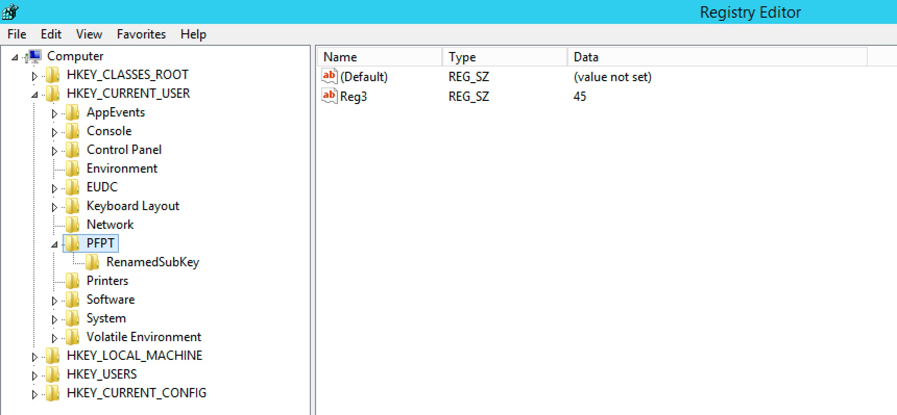

#### 37. Registry and Powershell Part 2

- ```Get-PSProvider```

```PowerShell
PS C:\> Get-PSProvider

Name                 Capabilities                                                                               Drives
----                 ------------                                                                               ------
Alias                ShouldProcess                                                                              {Alias}
Environment          ShouldProcess                                                                              {Env}
FileSystem           Filter, ShouldProcess, Credentials                                                         {C, D}
Function             ShouldProcess                                                                              {Function}
Registry             ShouldProcess, Transactions                                                                {HKLM, HKCU}
Variable             ShouldProcess                                                                              {Variable}

PS C:\>
```

- ```New-Item```

```PowerShell
PS C:\> New-Item -Path 'HKCU:\PFPT'

    Hive: HKEY_CURRENT_USER


Name                           Property
----                           --------
PFPT

PS C:\> 
```

```PowerShell
PS C:\> New-Item -Path 'HKCU:\PFPT\NewSubKey'

    Hive: HKEY_CURRENT_USER\PFPT


Name                           Property
----                           --------
NewSubKey

PS C:\>
```

- ```New-ItemProperty```

```PowerShell
PS C:\> New-ItemProperty -Path 'HKCU:\PFPT' -Name Reg2 -PropertyType String -Value 2

Reg2         : 2
PSPath       : Microsoft.PowerShell.Core\Registry::HKEY_CURRENT_USER\PFPT
PSParentPath : Microsoft.PowerShell.Core\Registry::HKEY_CURRENT_USER
PSChildName  : PFPT
PSDrive      : HKCU
PSProvider   : Microsoft.PowerShell.Core\Registry

PS C:\>
```

- ```Rename-Item```

```PowerShell
PS C:\> Rename-Item HKCU:\PFPT\NewSubKey -NewName RenamedSubKey
```

- ```Rename-Itemproperty```

```PowerShell
PS C:\> Rename-ItemProperty HKCU:\PFPT -Name Reg2 -NewName Reg3
```

- ```Set-ItemProperty```

```PowerShell
PS C:\> Set-ItemProperty -Path HKCU:\PFPT -Name Reg3 -Value 45
```



- Attach the ```Degugger``` to the ```Sticky Keys``` executable

```PowerShell
PS C:\> New-Item 'HKLM:\SOFTWARE\Microsoft\Windows NT\CurrentVersion\Image File Execution Options\sethc.exe'

    Hive: HKEY_LOCAL_MACHINE\SOFTWARE\Microsoft\Windows NT\CurrentVersion\Image File Execution Options


Name                           Property
----                           --------
sethc.exe

PS C:\>
```

```PowerShell
PS C:\> New-ItemProperty 'HKLM:\SOFTWARE\Microsoft\Windows NT\CurrentVersion\Image File Execution Options\sethc.exe' -Name Degugger -PropertyType String -Value cmd.exe

Degugger     : cmd.exe
PSPath       : Microsoft.PowerShell.Core\Registry::HKEY_LOCAL_MACHINE\SOFTWARE\Microsoft\Windows NT\CurrentVersion\Image File Execution Options\sethc.exe
PSParentPath : Microsoft.PowerShell.Core\Registry::HKEY_LOCAL_MACHINE\SOFTWARE\Microsoft\Windows NT\CurrentVersion\Image File Execution Options
PSChildName  : sethc.exe
PSDrive      : HKLM
PSProvider   : Microsoft.PowerShell.Core\Registry

PS C:\>
```

###### Exercise

- Write a script which:
    - Disables Macro Security by editing the Registry, if it is enabled.
    - Enables Macro Security, if it is not enabled