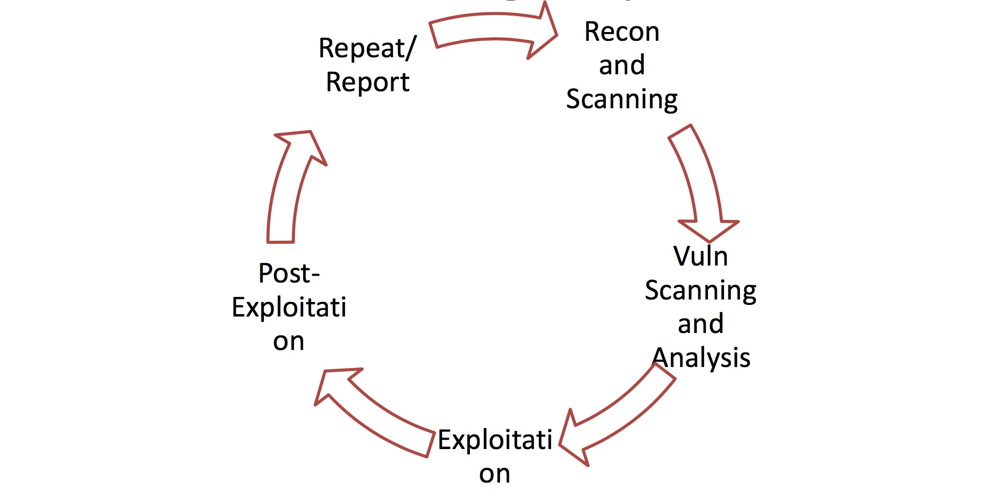
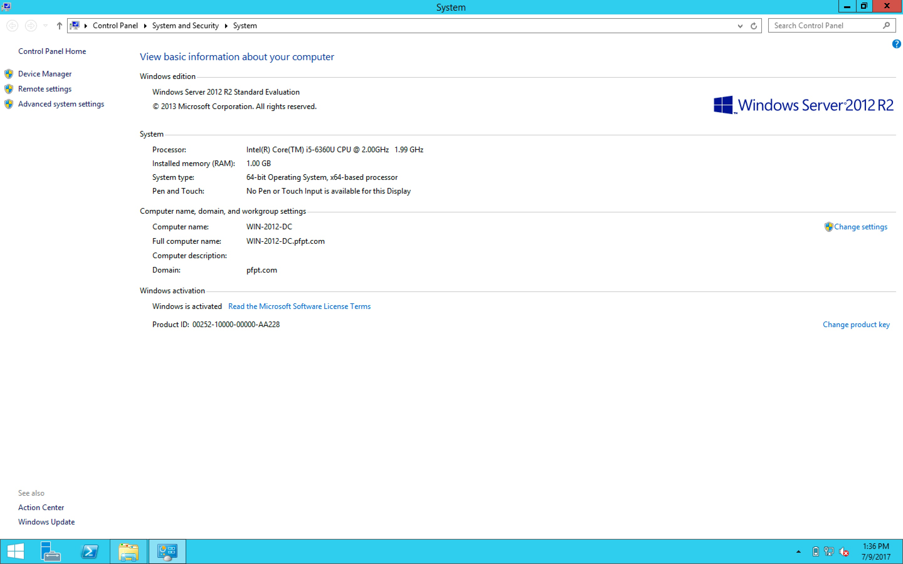
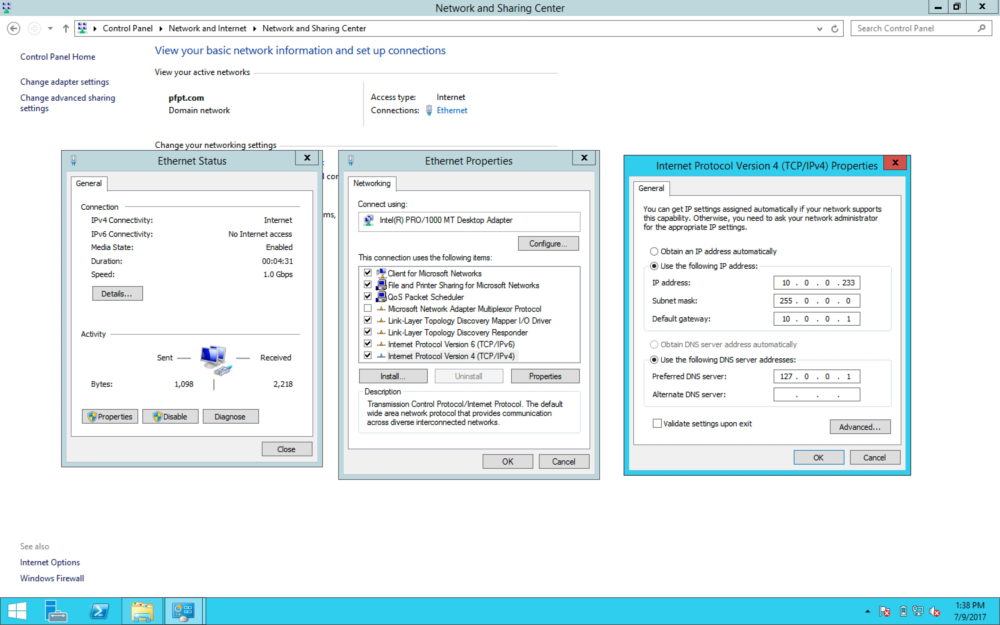
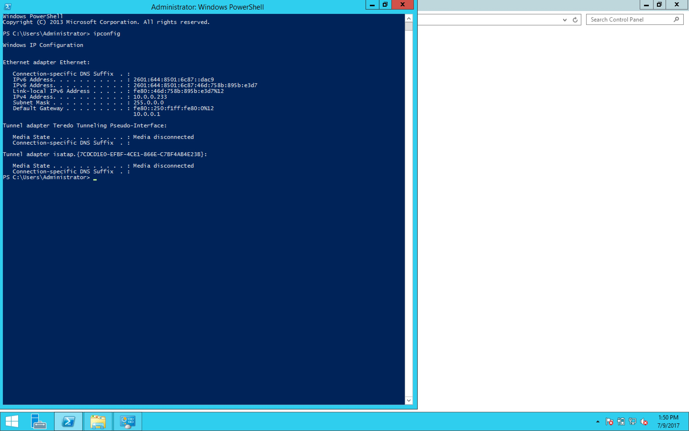
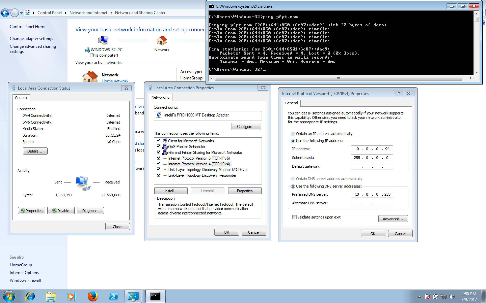
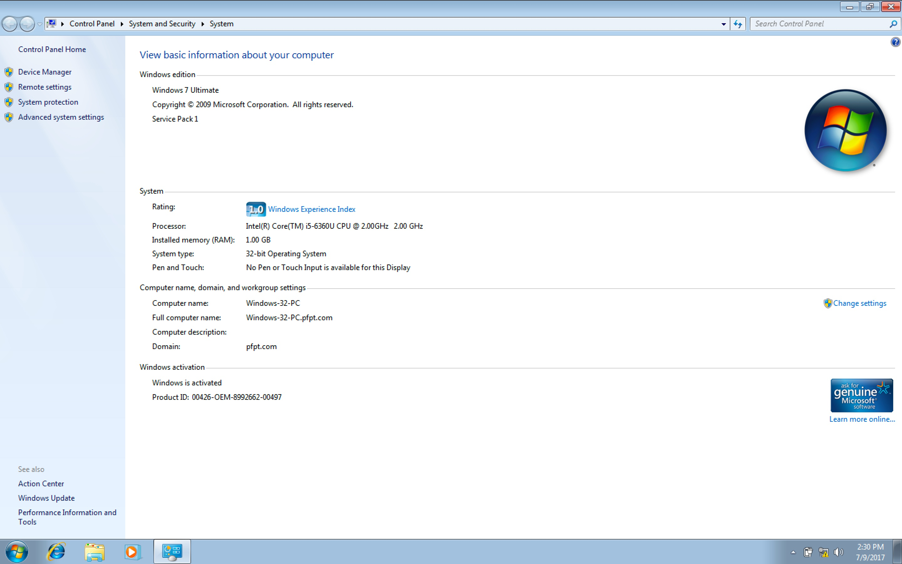

#### 39. Pentest Methodology

###### Penetration Testing is cyclic

###### Lab Setup

- Use (at least) a Windows Domain Controller and couple of domain member computers
- Or use [Amazon’s t1.micro](http://aws.amazon.com/ec2/) Windows instances for free

    - Step 1
        - [How to install Windows Server 2012 R2 Domain Controller (Step By Step guide)](https://www.youtube.com/watch?v=TeB7yJE2plI)
        
        
        
        

    - Step 2
        - [How to Join Client to a Active Directory Domain in Windows Server 2012](https://www.youtube.com/watch?v=w8LRLkdWwc4)
        - [Join Windows 7 Computer to Windows Server 2008 Active Directory Domain](https://www.youtube.com/watch?v=jUUjAkjzV9U)

        
        

###### Tools Required for Offensive PowerShell

- [Nishang](https://github.com/samratashok/nishang)
- [PowerSploit](https://github.com/mattifestation/PowerSploit)
- [PowerTools](https://github.com/Veil-Framework/PowerTools)
- [Posh-SecMod](https://github.com/darkoperator/Posh-SecMod/)