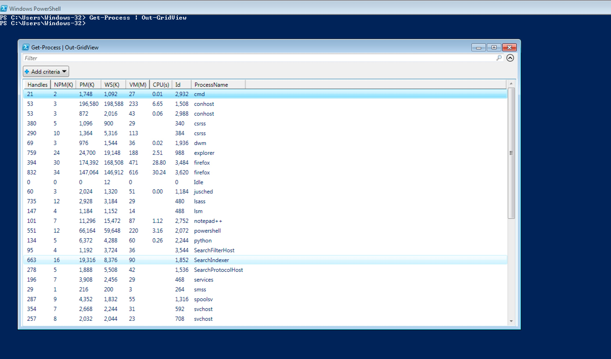

#### 4. Output Formatting

###### Output Formatting

```PowerShell
PS C:\Users\Windows-32> Get-Command -CommandType cmdlet -Name Format*

CommandType     Name
-----------     ----
Cmdlet          Format-Custom
Cmdlet          Format-List
Cmdlet          Format-Table
Cmdlet          Format-Wide


PS C:\Users\Windows-32>
```

- ```Get-ChildItem``` is similar to ```dir``` / ```ls```

```PowerShell
PS C:\Users\Windows-32> Get-ChildItem


    Directory: C: \ Users \ Windows-32


LastWriteTime Length Length
---- ------------- ------ ----
Dr-- 5/28/2017 11:33 AM Contacts
Dr-- 7/4/2017 12:40 PM Desktop
Dr-- 5/28/2017 11:33 AM Documents
Dr-- 7/4/2017 1:53 PM Downloads
Dr-- 5/28/2017 11:57 AM Favorites
Dr-- 5/28/2017 11:33 AM Links
Dr-- 5/28/2017 11:33 AM Music
Dr-- 5/28/2017 11:33 AM
Dr-- 5/28/2017 11:33 AM Saved Games
Dr-- 5/28/2017 11:33 AM Searches
Dr-- 5/28/2017 11:33 AM Videos


PS C:\Users\Windows-32>
```

- ```Get-ChildItem``` with ```Format-Table``` Cmdlet

```PowerShell
PS C:\Users\Windows-32> Get-ChildItem | Format-Table


    Directory: C: \ Users \ Windows-32


LastWriteTime Length Length
---- ------------- ------ ----
Dr-- 5/28/2017 11:33 AM Contacts
Dr-- 7/4/2017 12:40 PM Desktop
Dr-- 5/28/2017 11:33 AM Documents
Dr-- 7/4/2017 1:53 PM Downloads
Dr-- 5/28/2017 11:57 AM Favorites
Dr-- 5/28/2017 11:33 AM Links
Dr-- 5/28/2017 11:33 AM Music
Dr-- 5/28/2017 11:33 AM
Dr-- 5/28/2017 11:33 AM Saved Games
Dr-- 5/28/2017 11:33 AM Searches
Dr-- 5/28/2017 11:33 AM Videos


PS C:\Users\Windows-32>
```

- ```Format-Table``` Cmdlet with the filter ```Name```

```PowerShell
PS C:\Users\Windows-32> Get-ChildItem | Format-Table Name

name
----
contacts
Desktop
Documents
Downloads
Favorite
Links
Music
Pictures
Saved Games
searches
videos


PS C:\Users\Windows-32>
```

- ```Format-Table``` Cmdlet with the filter ```*```

```PowerShell
PS C:\Users\Windows-32> Get-ChildItem | Format-Table *

PSPath
------
Microsoft.PowerShell.Core \ FileSystem :: C: \ Users \ Windows-32 \ Contacts
Microsoft.PowerShell.Core \ FileSystem :: C: \ Users \ Windows-32 \ Desktop
Microsoft.PowerShell.Core \ FileSystem :: C: \ Users \ Windows-32 \ Documents
Microsoft.PowerShell.Core \ FileSystem :: C: \ Users \ Windows-32 \ Downloads
Microsoft.PowerShell.Core \ FileSystem :: C: \ Users \ Windows-32 \ Favorites
Microsoft.PowerShell.Core \ FileSystem :: C: \ Users \ Windows-32 \ Links
Microsoft.PowerShell.Core \ FileSystem :: C: \ Users \ Windows-32 \ Music
Microsoft.PowerShell.Core \ FileSystem :: C: \ Users \ Windows-32 \ Pictures
Microsoft.PowerShell.Core \ FileSystem :: C: \ Users \ Windows-32 \ Saved Games
Microsoft.PowerShell.Core \ FileSystem :: C: \ Users \ Windows-32 \ Searches
Microsoft.PowerShell.Core \ FileSystem :: C: \ Users \ Windows-32 \ Videos


PS C:\Users\Windows-32>
```

- ```Get-ChildItem``` with ```Format-List``` Cmdlet

```PowerShell
PS C:\Users\Windows-32> Get-ChildItem | Format-List


    Directory: C: \ Users \ Windows-32


Name: Contacts
CreationTime: 5/28/2017 11:33:48 AM
LastWriteTime: 5/28/2017 11:33:54 AM
LastAccessTime: 5/28/2017 11:33:48 AM

Name: Desktop
CreationTime: 5/28/2017 11:33:45 AM
LastWriteTime: 7/4/2017 12:40:43 PM
LastAccessTime: 7/4/2017 12:40:43 PM

Name: Documents
CreationTime: 5/28/2017 11:33:45 AM
LastWriteTime: 5/28/2017 11:33:54 AM
LastAccessTime: 5/28/2017 11:33:54 AM

Name: Downloads
CreationTime: 5/28/2017 11:33:45 AM
LastWriteTime: 7/4/2017 1:53:34 PM
LastAccessTime: 7/4/2017 1:53:34 PM

Name: Favorites
CreationTime: 5/28/2017 11:33:45 AM
LastWriteTime: 5/28/2017 11:57:48 AM
LastAccessTime: 5/28/2017 11:57:48 AM

Name: Links
CreationTime: 5/28/2017 11:33:45 AM
LastWriteTime: 5/28/2017 11:33:54 AM
LastAccessTime: 5/28/2017 11:33:54 AM

Name: Music
CreationTime: 5/28/2017 11:33:45 AM
LastWriteTime: 5/28/2017 11:33:54 AM
LastAccessTime: 5/28/2017 11:33:54 AM

Name:
CreationTime: 5/28/2017 11:33:45 AM
LastWriteTime: 5/28/2017 11:33:54 AM
LastAccessTime: 5/28/2017 11:33:54 AM

Name: Saved Games
CreationTime: 5/28/2017 11:33:45 AM
LastWriteTime: 5/28/2017 11:33:54 AM
LastAccessTime: 5/28/2017 11:33:54 AM

Name: Searches
CreationTime: 5/28/2017 11:33:54 AM
LastWriteTime: 5/28/2017 11:33:54 AM
LastAccessTime: 5/28/2017 11:33:54 AM

Name: Videos
CreationTime: 5/28/2017 11:33:45 AM
LastWriteTime: 5/28/2017 11:33:54 AM
LastAccessTime: 5/28/2017 11:33:54 AM


PS C:\Users\Windows-32>
```

- ```Get-ChildItem``` with ```Format-Wide``` Cmdlet

```PowerShell
PS C:\Users\Windows-32> Get-ChildItem | Format-Wide


    Directory: C:\Users\Windows-32


[Contacts]
[Documents]
[Favorites]
[Music]
[Saved Games]
[Videos]


PS C:\Users\Windows-32>
```

###### Output Manipulation

```PowerShell
PS C:\Users\Windows-32> Get-Command -CommandType cmdlet -Name out*

CommandType     Name
-----------     ----
Cmdlet          Out-Default
Cmdlet          Out-File
Cmdlet          Out-GridView
Cmdlet          Out-Host
Cmdlet          Out-Null
Cmdlet          Out-Printer
Cmdlet          Out-String


PS C:\Users\Windows-32>
```

- ```Get-Process``` with ```Out-GridView``` Cmdlet

```PowerShell
PS C:\Users\Windows-32> Get-Process | Out-GridView
```



- ```Get-Process``` with ```Out-File``` Cmdlet

```PowerShell
PS C:\Users\Windows-32> Get-Process | Out-File -FilePath C:\Users\Windows-32\process.txt
```

```PowerShell
PS C:\Users\Windows-32> Get-Content .\process.txt

Handles  NPM(K)    PM(K)      WS(K) VM(M)   CPU(s)     Id ProcessName
-------  ------    -----      ----- -----   ------     -- -----------
     21       2     1748       1068    27     0.01   2932 cmd
     53       3   196652     198600   233     6.71   1508 conhost
     53       3      872       2016    43     0.06   2988 conhost
    374       5     1096       1128    29             340 csrss
    290      10     1364       5240   113             384 csrss
     70       3      976       1496    36     0.02   1936 dwm
    759      24    24516      18864   188     2.57    988 explorer
    394      30   189996     167472   478    35.60   3484 firefox
    813      33   147112     141012   613    30.71   3620 firefox
      0       0        0         12     0               0 Idle
     60       3     2024       1060    51     0.00   1184 jusched
    731      12     2948       2796    29             480 lsass
    146       4     1184       1024    14             488 lsm
    101       6    11280      14632    87     1.20   2752 notepad++
    735      15    77228      80980   283     4.91   2072 powershell
    147       6    15172      12164   122            3188 PresentationFontCache
    134       5     6372       3148    60     0.26   2244 python
    641      16    19312       7924    90            1852 SearchIndexer
    197       7     3852       2748    29             468 services
     29       1      216        200     3             264 smss
    289       9     4352       1668    55            1316 spoolsv
    349       6     2640       2056    31             592 svchost
    251       8     2032       2028    23             708 svchost
    566      14    13356       5244    74             756 svchost
    517      13    31336      29092    95             880 svchost
   1084      29    15168      11728   130             920 svchost
    443      17     5544       4332    46            1116 svchost
    371      13     8436       3480    53            1220 svchost
    307      24     8664       3660    43            1352 svchost
    365      16     5180       3628    73            1452 svchost
    352      23    45304      13420   206            1728 svchost
     96       7     1204        520    22            1912 svchost
    355      13     7972       5472    59            2568 svchost
    567       0       44        112     2               4 System
    184       9     6684       2940    45     0.08   1924 taskhost
    115       5     1488       1796    44             656 VBoxService
    141       5     1300       2400    57     0.09   1520 VBoxTray
     73       5      920        204    29             376 wininit
    114       4     1392        768    35             412 winlogon
    419      15     8024       7256   104             728 wmpnetwk
     91       4     1168       1688    53     0.03   2680 wuauclt


PS C:\Users\Windows-32>
```

###### Output Formatting and Manipulation

```PowerShell
PS C:\Users\Windows-32> Get-ChildItem | Format-List * | Out-File -FilePath process2.txt
```

```PowerShell
PS C:\Users\Windows-32> Get-Content .\process2.txt


PSPath            : Microsoft.PowerShell.Core\FileSystem::C:\Users\Windows-32\Contacts
PSParentPath      : Microsoft.PowerShell.Core\FileSystem::C:\Users\Windows-32
PSChildName       : Contacts
PSDrive           : C
PSProvider        : Microsoft.PowerShell.Core\FileSystem
PSIsContainer     : True
BaseName          : Contacts
Mode              : d-r--
Name              : Contacts
Parent            : Windows-32
Exists            : True
Root              : C:\
FullName          : C:\Users\Windows-32\Contacts
Extension         :
CreationTime      : 5/28/2017 11:33:48 AM
CreationTimeUtc   : 5/28/2017 6:33:48 PM
LastAccessTime    : 5/28/2017 11:33:48 AM
LastAccessTimeUtc : 5/28/2017 6:33:48 PM
LastWriteTime     : 5/28/2017 11:33:54 AM
LastWriteTimeUtc  : 5/28/2017 6:33:54 PM
Attributes        : ReadOnly, Directory

PSPath            : Microsoft.PowerShell.Core\FileSystem::C:\Users\Windows-32\Desktop
PSParentPath      : Microsoft.PowerShell.Core\FileSystem::C:\Users\Windows-32
PSChildName       : Desktop
PSDrive           : C
PSProvider        : Microsoft.PowerShell.Core\FileSystem
PSIsContainer     : True
BaseName          : Desktop
Mode              : d-r--
Name              : Desktop
Parent            : Windows-32
Exists            : True
Root              : C:\
FullName          : C:\Users\Windows-32\Desktop
Extension         :
CreationTime      : 5/28/2017 11:33:45 AM
CreationTimeUtc   : 5/28/2017 6:33:45 PM
LastAccessTime    : 7/4/2017 12:40:43 PM
LastAccessTimeUtc : 7/4/2017 7:40:43 PM
LastWriteTime     : 7/4/2017 12:40:43 PM
LastWriteTimeUtc  : 7/4/2017 7:40:43 PM
Attributes        : ReadOnly, Directory

PSPath            : Microsoft.PowerShell.Core\FileSystem::C:\Users\Windows-32\Documents
PSParentPath      : Microsoft.PowerShell.Core\FileSystem::C:\Users\Windows-32
PSChildName       : Documents
PSDrive           : C
PSProvider        : Microsoft.PowerShell.Core\FileSystem
PSIsContainer     : True
BaseName          : Documents
Mode              : d-r--
Name              : Documents
Parent            : Windows-32
Exists            : True
Root              : C:\
FullName          : C:\Users\Windows-32\Documents
Extension         :
CreationTime      : 5/28/2017 11:33:45 AM
CreationTimeUtc   : 5/28/2017 6:33:45 PM
LastAccessTime    : 5/28/2017 11:33:54 AM
LastAccessTimeUtc : 5/28/2017 6:33:54 PM
LastWriteTime     : 5/28/2017 11:33:54 AM
LastWriteTimeUtc  : 5/28/2017 6:33:54 PM
Attributes        : ReadOnly, Directory

PSPath            : Microsoft.PowerShell.Core\FileSystem::C:\Users\Windows-32\Downloads
PSParentPath      : Microsoft.PowerShell.Core\FileSystem::C:\Users\Windows-32
PSChildName       : Downloads
PSDrive           : C
PSProvider        : Microsoft.PowerShell.Core\FileSystem
PSIsContainer     : True
BaseName          : Downloads
Mode              : d-r--
Name              : Downloads
Parent            : Windows-32
Exists            : True
Root              : C:\
FullName          : C:\Users\Windows-32\Downloads
Extension         :
CreationTime      : 5/28/2017 11:33:45 AM
CreationTimeUtc   : 5/28/2017 6:33:45 PM
LastAccessTime    : 7/4/2017 1:53:34 PM
LastAccessTimeUtc : 7/4/2017 8:53:34 PM
LastWriteTime     : 7/4/2017 1:53:34 PM
LastWriteTimeUtc  : 7/4/2017 8:53:34 PM
Attributes        : ReadOnly, Directory

PSPath            : Microsoft.PowerShell.Core\FileSystem::C:\Users\Windows-32\Favorites
PSParentPath      : Microsoft.PowerShell.Core\FileSystem::C:\Users\Windows-32
PSChildName       : Favorites
PSDrive           : C
PSProvider        : Microsoft.PowerShell.Core\FileSystem
PSIsContainer     : True
BaseName          : Favorites
Mode              : d-r--
Name              : Favorites
Parent            : Windows-32
Exists            : True
Root              : C:\
FullName          : C:\Users\Windows-32\Favorites
Extension         :
CreationTime      : 5/28/2017 11:33:45 AM
CreationTimeUtc   : 5/28/2017 6:33:45 PM
LastAccessTime    : 5/28/2017 11:57:48 AM
LastAccessTimeUtc : 5/28/2017 6:57:48 PM
LastWriteTime     : 5/28/2017 11:57:48 AM
LastWriteTimeUtc  : 5/28/2017 6:57:48 PM
Attributes        : ReadOnly, Directory

PSPath            : Microsoft.PowerShell.Core\FileSystem::C:\Users\Windows-32\Links
PSParentPath      : Microsoft.PowerShell.Core\FileSystem::C:\Users\Windows-32
PSChildName       : Links
PSDrive           : C
PSProvider        : Microsoft.PowerShell.Core\FileSystem
PSIsContainer     : True
BaseName          : Links
Mode              : d-r--
Name              : Links
Parent            : Windows-32
Exists            : True
Root              : C:\
FullName          : C:\Users\Windows-32\Links
Extension         :
CreationTime      : 5/28/2017 11:33:45 AM
CreationTimeUtc   : 5/28/2017 6:33:45 PM
LastAccessTime    : 5/28/2017 11:33:54 AM
LastAccessTimeUtc : 5/28/2017 6:33:54 PM
LastWriteTime     : 5/28/2017 11:33:54 AM
LastWriteTimeUtc  : 5/28/2017 6:33:54 PM
Attributes        : ReadOnly, Directory

PSPath            : Microsoft.PowerShell.Core\FileSystem::C:\Users\Windows-32\Music
PSParentPath      : Microsoft.PowerShell.Core\FileSystem::C:\Users\Windows-32
PSChildName       : Music
PSDrive           : C
PSProvider        : Microsoft.PowerShell.Core\FileSystem
PSIsContainer     : True
BaseName          : Music
Mode              : d-r--
Name              : Music
Parent            : Windows-32
Exists            : True
Root              : C:\
FullName          : C:\Users\Windows-32\Music
Extension         :
CreationTime      : 5/28/2017 11:33:45 AM
CreationTimeUtc   : 5/28/2017 6:33:45 PM
LastAccessTime    : 5/28/2017 11:33:54 AM
LastAccessTimeUtc : 5/28/2017 6:33:54 PM
LastWriteTime     : 5/28/2017 11:33:54 AM
LastWriteTimeUtc  : 5/28/2017 6:33:54 PM
Attributes        : ReadOnly, Directory

PSPath            : Microsoft.PowerShell.Core\FileSystem::C:\Users\Windows-32\Pictures
PSParentPath      : Microsoft.PowerShell.Core\FileSystem::C:\Users\Windows-32
PSChildName       : Pictures
PSDrive           : C
PSProvider        : Microsoft.PowerShell.Core\FileSystem
PSIsContainer     : True
BaseName          : Pictures
Mode              : d-r--
Name              : Pictures
Parent            : Windows-32
Exists            : True
Root              : C:\
FullName          : C:\Users\Windows-32\Pictures
Extension         :
CreationTime      : 5/28/2017 11:33:45 AM
CreationTimeUtc   : 5/28/2017 6:33:45 PM
LastAccessTime    : 5/28/2017 11:33:54 AM
LastAccessTimeUtc : 5/28/2017 6:33:54 PM
LastWriteTime     : 5/28/2017 11:33:54 AM
LastWriteTimeUtc  : 5/28/2017 6:33:54 PM
Attributes        : ReadOnly, Directory

PSPath            : Microsoft.PowerShell.Core\FileSystem::C:\Users\Windows-32\Saved Games
PSParentPath      : Microsoft.PowerShell.Core\FileSystem::C:\Users\Windows-32
PSChildName       : Saved Games
PSDrive           : C
PSProvider        : Microsoft.PowerShell.Core\FileSystem
PSIsContainer     : True
BaseName          : Saved Games
Mode              : d-r--
Name              : Saved Games
Parent            : Windows-32
Exists            : True
Root              : C:\
FullName          : C:\Users\Windows-32\Saved Games
Extension         :
CreationTime      : 5/28/2017 11:33:45 AM
CreationTimeUtc   : 5/28/2017 6:33:45 PM
LastAccessTime    : 5/28/2017 11:33:54 AM
LastAccessTimeUtc : 5/28/2017 6:33:54 PM
LastWriteTime     : 5/28/2017 11:33:54 AM
LastWriteTimeUtc  : 5/28/2017 6:33:54 PM
Attributes        : ReadOnly, Directory

PSPath            : Microsoft.PowerShell.Core\FileSystem::C:\Users\Windows-32\Searches
PSParentPath      : Microsoft.PowerShell.Core\FileSystem::C:\Users\Windows-32
PSChildName       : Searches
PSDrive           : C
PSProvider        : Microsoft.PowerShell.Core\FileSystem
PSIsContainer     : True
BaseName          : Searches
Mode              : d-r--
Name              : Searches
Parent            : Windows-32
Exists            : True
Root              : C:\
FullName          : C:\Users\Windows-32\Searches
Extension         :
CreationTime      : 5/28/2017 11:33:54 AM
CreationTimeUtc   : 5/28/2017 6:33:54 PM
LastAccessTime    : 5/28/2017 11:33:54 AM
LastAccessTimeUtc : 5/28/2017 6:33:54 PM
LastWriteTime     : 5/28/2017 11:33:54 AM
LastWriteTimeUtc  : 5/28/2017 6:33:54 PM
Attributes        : ReadOnly, Directory

PSPath            : Microsoft.PowerShell.Core\FileSystem::C:\Users\Windows-32\Videos
PSParentPath      : Microsoft.PowerShell.Core\FileSystem::C:\Users\Windows-32
PSChildName       : Videos
PSDrive           : C
PSProvider        : Microsoft.PowerShell.Core\FileSystem
PSIsContainer     : True
BaseName          : Videos
Mode              : d-r--
Name              : Videos
Parent            : Windows-32
Exists            : True
Root              : C:\
FullName          : C:\Users\Windows-32\Videos
Extension         :
CreationTime      : 5/28/2017 11:33:45 AM
CreationTimeUtc   : 5/28/2017 6:33:45 PM
LastAccessTime    : 5/28/2017 11:33:54 AM
LastAccessTimeUtc : 5/28/2017 6:33:54 PM
LastWriteTime     : 5/28/2017 11:33:54 AM
LastWriteTimeUtc  : 5/28/2017 6:33:54 PM
Attributes        : ReadOnly, Directory

PSPath            : Microsoft.PowerShell.Core\FileSystem::C:\Users\Windows-32\process.txt
PSParentPath      : Microsoft.PowerShell.Core\FileSystem::C:\Users\Windows-32
PSChildName       : process.txt
PSDrive           : C
PSProvider        : Microsoft.PowerShell.Core\FileSystem
PSIsContainer     : False
VersionInfo       : File:             C:\Users\Windows-32\process.txt
                    InternalName:
                    OriginalFilename:
                    FileVersion:
                    FileDescription:
                    Product:
                    ProductVersion:
                    Debug:            False
                    Patched:          False
                    PreRelease:       False
                    PrivateBuild:     False
                    SpecialBuild:     False
                    Language:

BaseName          : process
Mode              : -a---
Name              : process.txt
Length            : 860014
DirectoryName     : C:\Users\Windows-32
Directory         : C:\Users\Windows-32
IsReadOnly        : False
Exists            : True
FullName          : C:\Users\Windows-32\process.txt
Extension         : .txt
CreationTime      : 7/6/2017 1:43:45 PM
CreationTimeUtc   : 7/6/2017 8:43:45 PM
LastAccessTime    : 7/6/2017 1:43:45 PM
LastAccessTimeUtc : 7/6/2017 8:43:45 PM
LastWriteTime     : 7/6/2017 1:43:45 PM
LastWriteTimeUtc  : 7/6/2017 8:43:45 PM
Attributes        : Archive

PSPath            : Microsoft.PowerShell.Core\FileSystem::C:\Users\Windows-32\process2.txt
PSParentPath      : Microsoft.PowerShell.Core\FileSystem::C:\Users\Windows-32
PSChildName       : process2.txt
PSDrive           : C
PSProvider        : Microsoft.PowerShell.Core\FileSystem
PSIsContainer     : False
VersionInfo       : File:             C:\Users\Windows-32\process2.txt
                    InternalName:
                    OriginalFilename:
                    FileVersion:
                    FileDescription:
                    Product:
                    ProductVersion:
                    Debug:            False
                    Patched:          False
                    PreRelease:       False
                    PrivateBuild:     False
                    SpecialBuild:     False
                    Language:

BaseName          : process2
Mode              : -a---
Name              : process2.txt
Length            : 21562
DirectoryName     : C:\Users\Windows-32
Directory         : C:\Users\Windows-32
IsReadOnly        : False
Exists            : True
FullName          : C:\Users\Windows-32\process2.txt
Extension         : .txt
CreationTime      : 7/6/2017 2:47:38 PM
CreationTimeUtc   : 7/6/2017 9:47:38 PM
LastAccessTime    : 7/6/2017 2:47:38 PM
LastAccessTimeUtc : 7/6/2017 9:47:38 PM
LastWriteTime     : 7/6/2017 2:47:38 PM
LastWriteTimeUtc  : 7/6/2017 9:47:38 PM
Attributes        : Archive


PS C:\Users\Windows-32>
```
